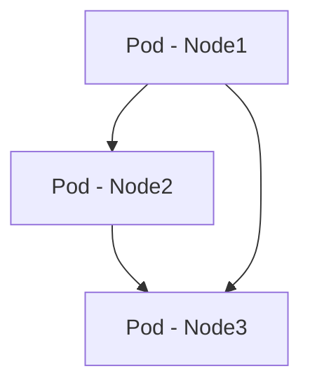
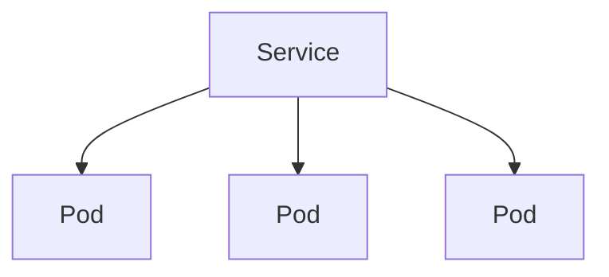
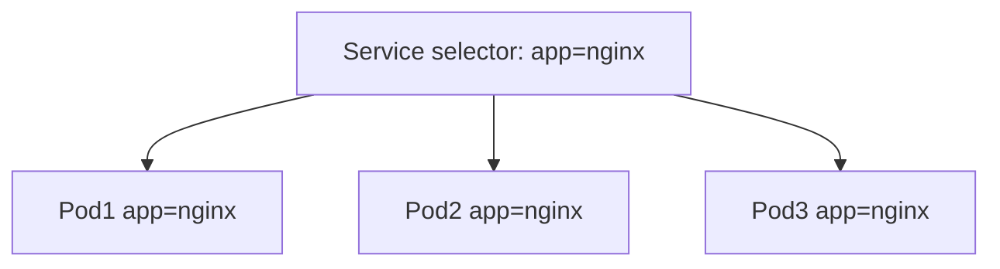
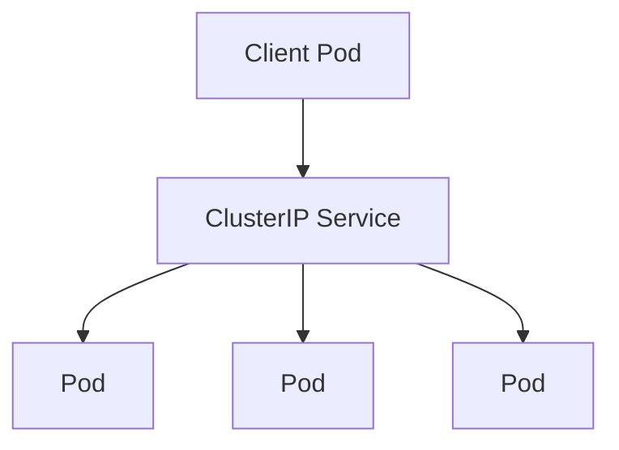
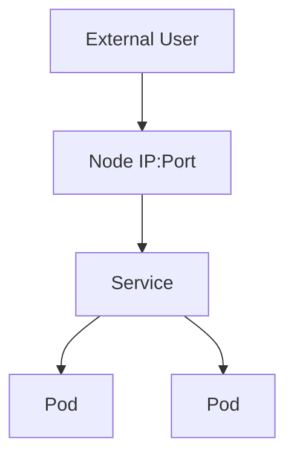
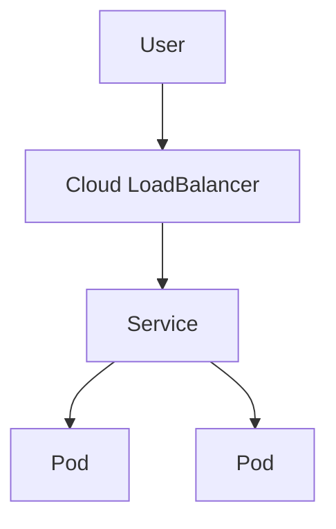
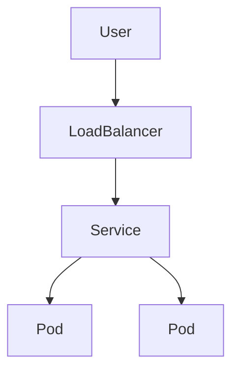

## ☸️ Kubernetes Service & Networking 이해하기

Kubernetes에서 Pod는 애플리케이션을 실행하는 가장 작은 단위입니다.

하지만 Pod에는 한 가지 문제가 있습니다.

**Pod는 생성되고 삭제될 때마다 IP가 변경됩니다.**

즉 Pod에 직접 접근하는 방식은 안정적인 서비스 운영에 적합하지 않습니다.

이 문제를 해결하기 위해 Kubernetes에서는 **Service**라는 리소스를 제공합니다.

---

## Kubernetes Networking 기본 구조

Kubernetes 네트워크의 핵심 원칙은 다음과 같습니다.

- 모든 Pod는 고유한 IP를 가진다
- Pod 간에는 NAT 없이 통신 가능
- Node가 달라도 Pod 간 통신 가능

아키텍처 구조는 다음과 같습니다.



즉 Kubernetes에서는 **Pod 간 직접 통신이 가능하도록 네트워크가 구성됩니다.**

---

## Service란 무엇인가

Service는 **Pod 집합에 대한 안정적인 네트워크 엔드포인트**를 제공합니다.

Pod는 계속 변경되지만 Service는 **고정된 접근 지점** 역할을 합니다.

구조를 보면 다음과 같습니다.



Service는 내부적으로 **Pod를 로드밸런싱**합니다.

---

## Service 동작 방식

Service는 **Label Selector**를 이용해 Pod를 찾습니다.

예를 들어 다음과 같은 구조입니다.

```yaml
labels:
  app: nginx
```

Service가 이 label을 기준으로 Pod를 연결합니다.



---

## Kubernetes Service 종류

Kubernetes Service는 크게 4가지 타입이 있습니다.

| Type         | 설명                 |
| ------------ | ------------------ |
| ClusterIP    | 클러스터 내부 접근         |
| NodePort     | Node 포트를 통해 접근     |
| LoadBalancer | 외부 LoadBalancer 사용 |
| ExternalName | 외부 DNS 연결          |

---

## ClusterIP

ClusterIP는 **기본 Service 타입**입니다.

클러스터 내부에서만 접근 가능합니다.



특징

* 기본 Service 타입
* 내부 통신에 사용
* 외부 접근 불가

---

## NodePort

NodePort는 Node의 특정 포트를 통해 Service에 접근하는 방식입니다.



예시

```
http://NodeIP:30007
```

특징

* 외부 접근 가능
* 테스트 환경에서 자주 사용

---

## LoadBalancer

LoadBalancer 타입은 클라우드 환경에서 많이 사용됩니다.

클라우드 LoadBalancer가 생성되어 외부 트래픽을 처리합니다.



대표 사용 환경

* AWS
* GCP
* Azure

---

## Service YAML 예시

```yaml
apiVersion: v1
kind: Service
metadata:
  name: nginx-service

spec:
  selector:
    app: nginx

  ports:
  - protocol: TCP
    port: 80
    targetPort: 8080

  type: ClusterIP
```

핵심 필드

| Field      | 설명            |
| ---------- | ------------- |
| selector   | 연결할 Pod label |
| port       | Service 포트    |
| targetPort | Pod 포트        |
| type       | Service 타입    |

---

## Kubernetes 트래픽 흐름

외부에서 Kubernetes 애플리케이션으로 접근하는 전체 흐름은 다음과 같습니다.



이 구조 덕분에 Kubernetes는 **자동 로드밸런싱과 확장성**을 제공합니다.

---

## 정리

Kubernetes Networking 핵심

### Pod

* 고유 IP 보유
* Pod 간 직접 통신

### Service

* Pod 접근용 엔드포인트
* 로드밸런싱 제공

### Service 타입

* ClusterIP
* NodePort
* LoadBalancer
