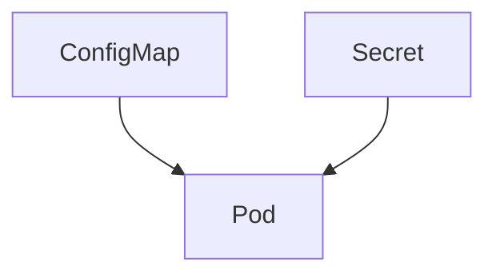
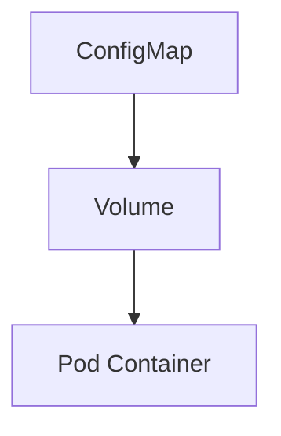
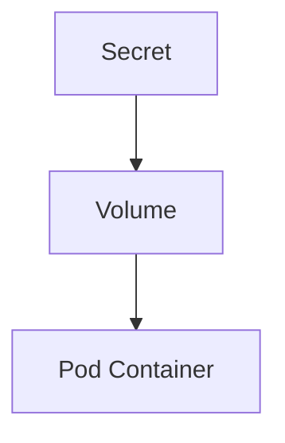
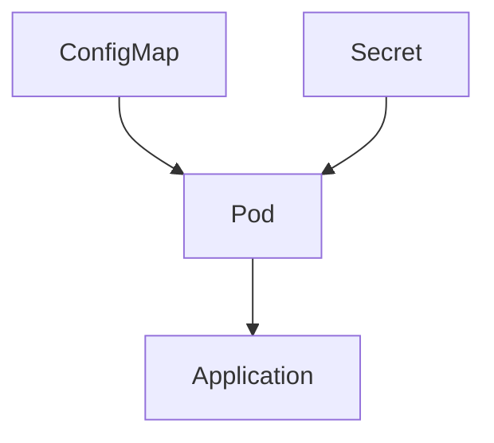

## ☸️ Kubernetes ConfigMap & Secret 이해하기

컨테이너 기반 애플리케이션을 운영하다 보면  
애플리케이션 코드와 **설정(Configuration)**을 분리해야 하는 상황이 자주 발생합니다.

예를 들어 다음과 같은 설정들이 있습니다.

- 데이터베이스 주소
- API Endpoint
- 환경 변수
- 인증 키

이러한 설정을 이미지에 포함시키면 문제가 발생합니다.

- 환경별 설정 관리 어려움
- 이미지 재빌드 필요
- 보안 문제 발생

Kubernetes에서는 이 문제를 해결하기 위해 **ConfigMap**과 **Secret**을 제공합니다.

---

## Kubernetes 설정 관리 구조

ConfigMap과 Secret은 **Pod 외부에서 설정을 관리하는 리소스**입니다.



Pod는 실행될 때 ConfigMap과 Secret 값을 **주입받아 사용**합니다.

---

## ConfigMap

ConfigMap은 **일반적인 설정 데이터를 저장하는 Kubernetes 리소스**입니다.

예를 들어

* 환경 변수
* 설정 파일
* application.yml

등을 저장할 수 있습니다.

---

## ConfigMap 생성 방법

### CLI 방식

```bash
kubectl create configmap app-config \
  --from-literal=APP_ENV=production
```

---

### YAML 방식

```yaml
apiVersion: v1
kind: ConfigMap
metadata:
  name: app-config

data:
  APP_ENV: production
  LOG_LEVEL: info
```

---

## ConfigMap 사용 방법

ConfigMap은 Pod에서 다음 방식으로 사용할 수 있습니다.

* 환경 변수
* 파일 마운트

---

## 환경 변수로 사용

```yaml
apiVersion: v1
kind: Pod
metadata:
  name: example-pod

spec:
  containers:
  - name: app
    image: nginx

    env:
    - name: APP_ENV
      valueFrom:
        configMapKeyRef:
          name: app-config
          key: APP_ENV
```

Pod 실행 시 다음 환경 변수가 생성됩니다.

```
APP_ENV=production
```

---

## ConfigMap 파일 마운트

ConfigMap을 **파일 형태로 마운트**할 수도 있습니다.



YAML 예시

```yaml
volumes:
- name: config-volume
  configMap:
    name: app-config
```

---

## Secret

Secret은 **민감한 정보를 저장하는 Kubernetes 리소스**입니다.

대표적인 예

* DB Password
* API Key
* TLS Certificate
* OAuth Token

---

## ConfigMap vs Secret 차이

| 항목  | ConfigMap | Secret   |
| --- | --------- | -------- |
| 데이터 | 일반 설정     | 민감 정보    |
| 인코딩 | 평문        | Base64   |
| 보안  | 낮음        | 상대적으로 높음 |

---

## Secret 생성 방법

### CLI 방식

```bash
kubectl create secret generic db-secret \
  --from-literal=password=mysecretpassword
```

---

### YAML 방식

Secret은 **Base64 인코딩**을 사용합니다.

예시

```bash
echo -n "mypassword" | base64
```

결과

```
bXlwYXNzd29yZA==
```

YAML 예시

```yaml
apiVersion: v1
kind: Secret
metadata:
  name: db-secret

type: Opaque

data:
  password: bXlwYXNzd29yZA==
```

---

## Secret 사용 방법

Secret도 ConfigMap과 동일하게 Pod에 주입할 수 있습니다.

```yaml
env:
- name: DB_PASSWORD

  valueFrom:
    secretKeyRef:
      name: db-secret
      key: password
```

---

## Secret 파일 마운트

Secret을 파일 형태로도 사용할 수 있습니다.



대표적인 사용 사례

* TLS 인증서
* SSH Key

---

## Kubernetes 설정 관리 흐름

전체 구조는 다음과 같습니다.



즉 애플리케이션은 **Pod 환경 변수나 파일을 통해 설정을 읽습니다.**

---

## 정리

Kubernetes 설정 관리 핵심

### ConfigMap

* 일반 설정 데이터 저장
* 환경 변수 / 파일 형태 사용

### Secret

* 민감 정보 저장
* Base64 인코딩 사용

### 사용 목적

* 애플리케이션 설정 분리
* 보안 관리
* 환경별 설정 관리
