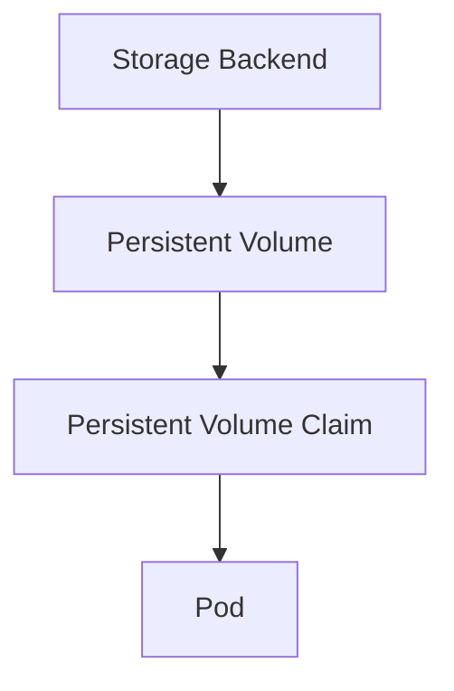
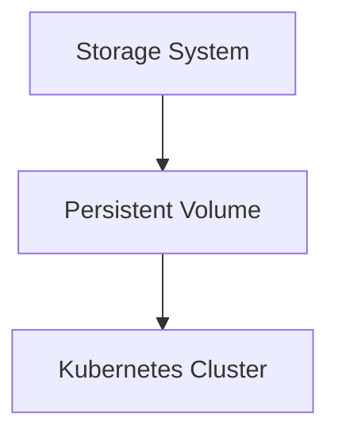
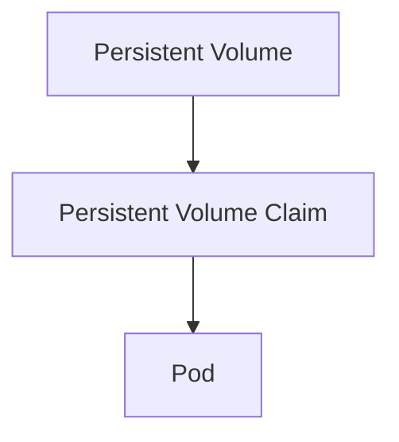
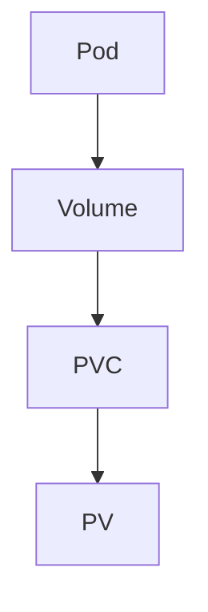
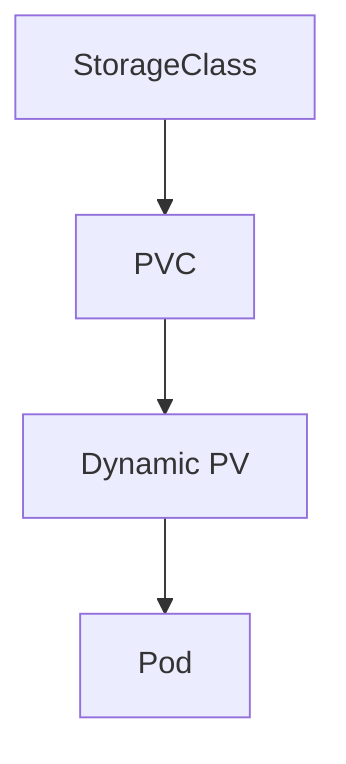
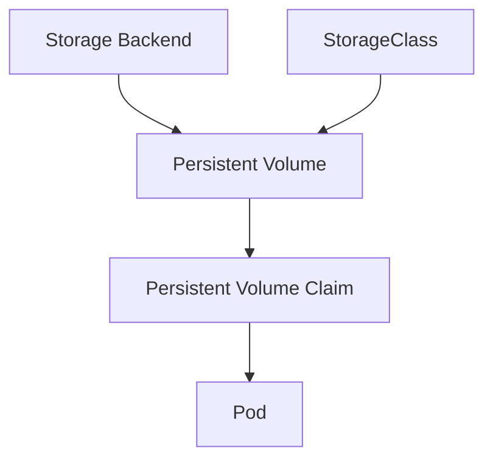

## ☸️ Kubernetes Storage 이해하기

컨테이너 기반 애플리케이션을 운영할 때 가장 많이 발생하는 문제 중 하나는 **데이터 저장(Storage)** 입니다.

컨테이너는 기본적으로 **Ephemeral Storage(휘발성 스토리지)** 를 사용합니다.

즉 컨테이너가 종료되면 데이터도 함께 사라집니다.

예를 들어 다음과 같은 경우 문제가 발생합니다.

- 데이터베이스
- 로그 파일
- 업로드 파일
- 캐시 데이터

이 문제를 해결하기 위해 Kubernetes에서는 **Persistent Volume(PV)** 과 **Persistent Volume Claim(PVC)** 을 제공합니다.

---

## Kubernetes Storage 구조

Kubernetes 스토리지 구조는 다음과 같이 동작합니다.



즉 흐름은 다음과 같습니다.

```
Storage
 → PV
 → PVC
 → Pod
```

---

## Persistent Volume (PV)

Persistent Volume은 **클러스터에서 사용할 수 있는 스토리지 리소스**입니다.

예를 들어 다음과 같은 스토리지를 사용할 수 있습니다.

* AWS EBS
* GCP Persistent Disk
* NFS
* Ceph
* Local Disk

PV는 **Cluster 관리자가 생성**합니다.

---

## PV 구조



PV는 실제 스토리지를 Kubernetes에서 사용할 수 있도록 **추상화한 리소스**입니다.

---

## PV YAML 예시

```yaml
apiVersion: v1
kind: PersistentVolume
metadata:
  name: pv-example

spec:
  capacity:
    storage: 10Gi

  accessModes:
    - ReadWriteOnce

  hostPath:
    path: /data/storage
```

주요 필드

| Field       | 설명        |
| ----------- | --------- |
| capacity    | 스토리지 크기   |
| accessModes | 접근 방식     |
| hostPath    | 로컬 디스크 경로 |

---

## Persistent Volume Claim (PVC)

PVC는 **사용자가 요청하는 스토리지 리소스**입니다.

Pod는 PV를 직접 사용하는 것이 아니라 **PVC를 통해 스토리지를 요청합니다.**

---

## PVC 구조



PVC는 다음 정보를 요청합니다.

* 스토리지 크기
* access mode
* storage class

---

## PVC YAML 예시

```yaml
apiVersion: v1
kind: PersistentVolumeClaim

metadata:
  name: pvc-example

spec:
  accessModes:
    - ReadWriteOnce

  resources:
    requests:
      storage: 5Gi
```

이 PVC가 생성되면 Kubernetes는 **조건에 맞는 PV를 자동으로 연결합니다.**

---

## Pod에서 PVC 사용

Pod는 Volume을 통해 PVC를 사용합니다.



---

## Pod YAML 예시

```yaml
apiVersion: v1
kind: Pod

metadata:
  name: storage-pod

spec:
  containers:
  - name: app
    image: nginx

    volumeMounts:
    - mountPath: "/data"
      name: storage-volume

  volumes:
  - name: storage-volume

    persistentVolumeClaim:
      claimName: pvc-example
```

이렇게 하면 `/data` 경로에 스토리지가 마운트됩니다.

---

## Access Mode

PV는 여러 접근 방식을 지원합니다.

| Mode          | 설명               |
| ------------- | ---------------- |
| ReadWriteOnce | 하나의 Node에서 읽기/쓰기 |
| ReadOnlyMany  | 여러 Node에서 읽기     |
| ReadWriteMany | 여러 Node에서 읽기/쓰기  |

---

## StorageClass

StorageClass는 **동적 스토리지 생성 기능**을 제공합니다.

기존 방식

```
관리자 → PV 생성
사용자 → PVC 요청
```

StorageClass를 사용하면

```
PVC 생성
→ 자동으로 PV 생성
```

---

## StorageClass 구조



즉 스토리지가 **자동으로 프로비저닝**됩니다.

---

## Kubernetes Storage 전체 구조



---

## 정리

Kubernetes Storage 핵심

### PV

* 클러스터 스토리지 리소스

### PVC

* 사용자 스토리지 요청

### StorageClass

* 동적 스토리지 생성

### Pod

* Volume을 통해 스토리지 사용
