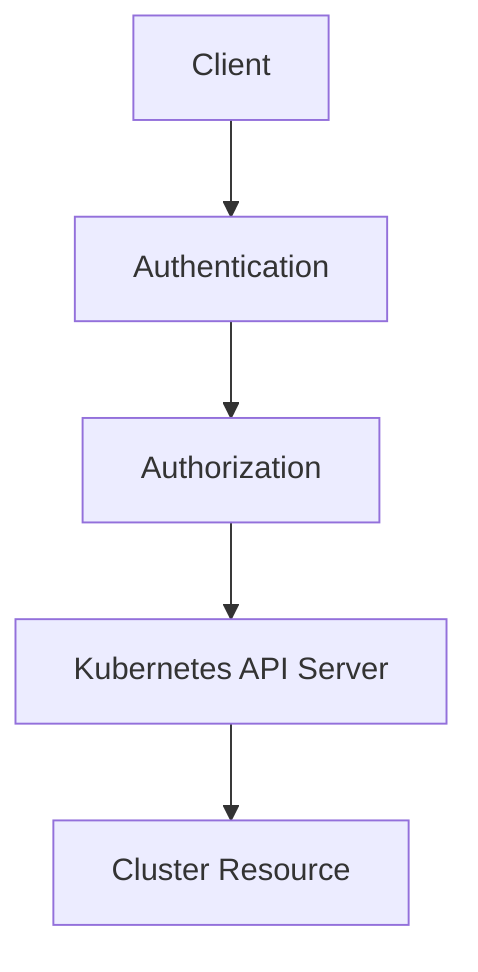
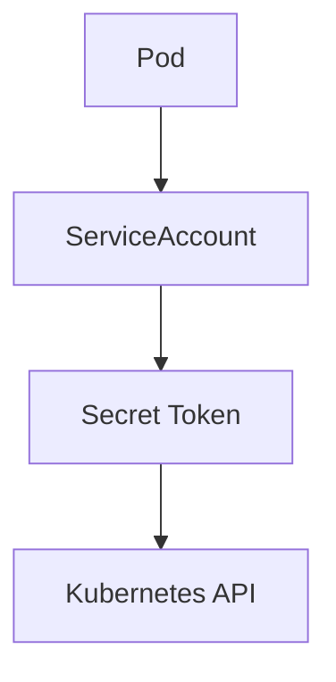
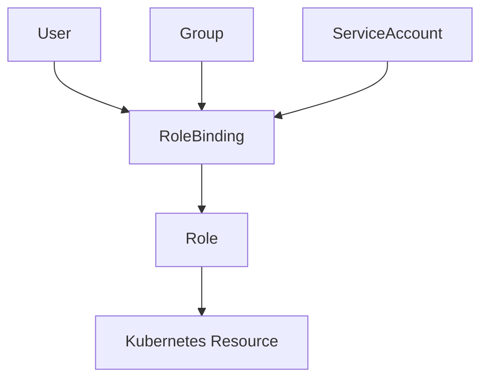
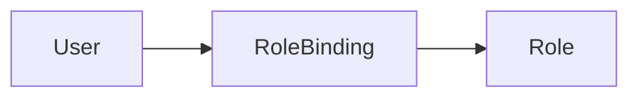
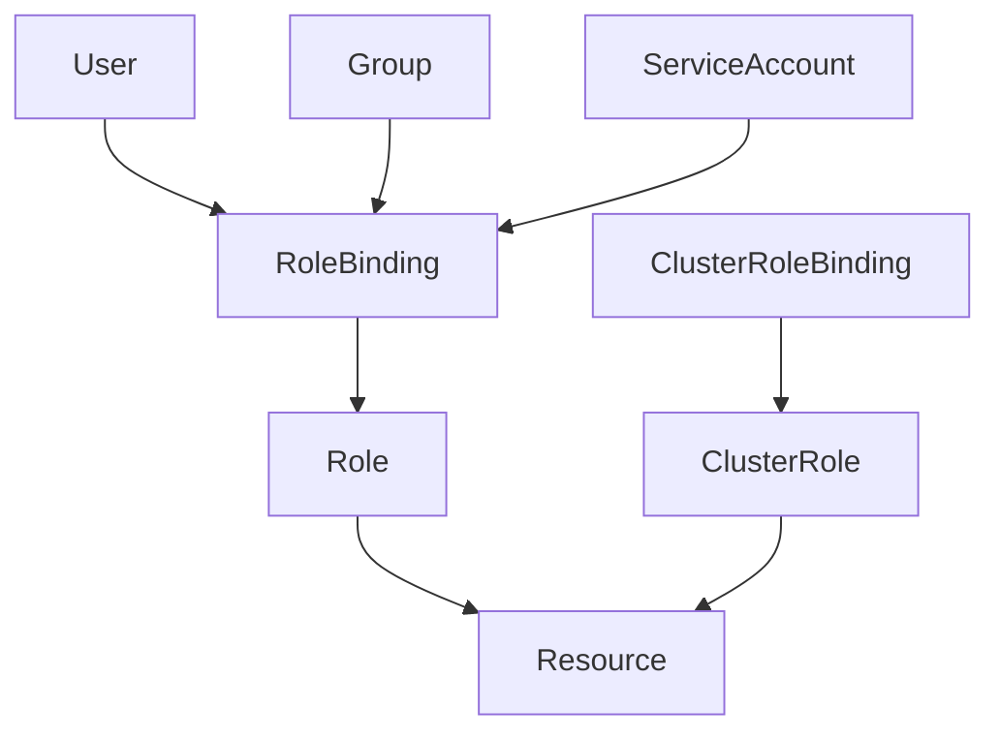

## ☸️ Kubernetes 보안 개요

Kubernetes는 **클러스터 기반 인프라**이기 때문에 보안이 매우 중요합니다.  
특히 다음 영역이 핵심입니다.

- 사용자 인증 (Authentication)
- 권한 인가 (Authorization)
- 네트워크 보안
- Secret 관리

이 글에서는 그 중에서도 **사용자 인증과 권한 인가**를 중심으로 정리합니다.

---

## Authentication vs Authorization

보안 시스템에서 가장 먼저 이해해야 하는 개념은 **인증(Authentication)** 과 **인가(Authorization)** 입니다.

| 개념 | 설명 |
|---|---|
| Authentication | 사용자가 누구인지 확인 |
| Authorization | 해당 사용자가 어떤 권한을 가지는지 확인 |

예를 들어

```

로그인 → Authentication
권한 체크 → Authorization

```

---

## Kubernetes 보안 구조



흐름

1️⃣ Client 요청
2️⃣ 인증(Authentication)
3️⃣ 권한 확인(Authorization)
4️⃣ API Server 처리

---

## Kubernetes 계정 종류

Kubernetes에서는 두 가지 계정을 사용합니다.

| 계정              | 설명                   |
| --------------- | -------------------- |
| User Account    | 사람이 사용하는 계정          |
| Service Account | 시스템 또는 Pod에서 사용하는 계정 |

---

### User Account

일반적인 사용자 계정입니다.

특징

* Kubernetes 내부에서 직접 관리하지 않음
* 외부 인증 시스템과 연동

대표적인 인증 방식

* OAuth
* Webhook
* LDAP
* OIDC

---

### Service Account

Service Account는 **Pod나 애플리케이션이 Kubernetes API를 사용할 때 사용하는 계정**입니다.

예를 들어

* Controller
* Operator
* 내부 애플리케이션

---

#### ServiceAccount 생성

```bash
kubectl create sa my-service-account
```

---

#### ServiceAccount 구조



ServiceAccount는 **API 인증을 위한 Token을 Secret에 저장합니다.**

---

## Kubernetes 인증 방식

Kubernetes는 다양한 인증 방식을 지원합니다.

| 인증 방식              | 설명              |
| ------------------ | --------------- |
| Basic Auth         | HTTP 인증         |
| Bearer Token       | API Token 기반 인증 |
| Client Certificate | 인증서 기반 인증       |
| Webhook            | 외부 인증 시스템       |

---

### Bearer Token 인증

가장 많이 사용하는 방식입니다.

```
Authorization: Bearer {TOKEN}
```

ServiceAccount Token을 이용하여 API 호출이 가능합니다.

---

#### Token 조회

```bash
kubectl describe sa default
```

또는

```bash
kubectl describe secret {secret-name}
```

---

### API 호출 예시

```bash
curl https://APISERVER/api \
 --header "Authorization: Bearer $TOKEN" \
 --insecure
```

---

## kubectl proxy를 이용한 인증

직접 Token을 사용하는 대신 **kubectl proxy**를 사용할 수도 있습니다.

```bash
kubectl proxy --port=8080
```

이후 API 호출

```
curl localhost:8080/api
```

proxy가 자동으로 인증 정보를 추가합니다.

---

## Authorization (권한 관리)

인증 이후에는 **권한 검사**가 진행됩니다.

Kubernetes는 기본적으로 **RBAC(Role Based Access Control)** 을 사용합니다.

---

### RBAC 구조



핵심 구성

* Role
* RoleBinding
* ClusterRole
* ClusterRoleBinding

---

## Role

Role은 **특정 리소스에 대한 권한 정의**입니다.

예

* Pod 조회
* Deployment 생성
* Service 삭제

---

### Role 예시

```yaml
apiVersion: rbac.authorization.k8s.io/v1
kind: Role
metadata:
  name: pod-reader

rules:
- apiGroups: [""]
  resources: ["pods"]
  verbs: ["get", "watch", "list"]
```

---

## RoleBinding

Role을 사용자 또는 서비스 계정에 연결합니다.



---

### RoleBinding 예시

```yaml
kind: RoleBinding
apiVersion: rbac.authorization.k8s.io/v1

metadata:
  name: read-pods

subjects:
- kind: User
  name: jane

roleRef:
  kind: Role
  name: pod-reader
  apiGroup: rbac.authorization.k8s.io
```

---

## Role vs ClusterRole

| 구분          | 범위           |
| ----------- | ------------ |
| Role        | 특정 Namespace |
| ClusterRole | Cluster 전체   |

ClusterRole은 다음과 같은 리소스에 사용됩니다.

* Node
* PersistentVolume
* Cluster 설정

---

## 기본 제공 Role

Kubernetes는 기본 Role을 제공합니다.

| Role          | 설명         |
| ------------- | ---------- |
| cluster-admin | 전체 관리자     |
| admin         | 네임스페이스 관리자 |
| edit          | 리소스 수정 가능  |
| view          | 읽기 전용      |

---

## RBAC 전체 아키텍처



---

## ServiceAccount + RBAC 예제

먼저 ServiceAccount 생성

```yaml
apiVersion: v1
kind: ServiceAccount
metadata:
  name: sa-viewer
```

---

ClusterRoleBinding 생성

```yaml
kind: ClusterRoleBinding
apiVersion: rbac.authorization.k8s.io/v1

metadata:
  name: default-view

subjects:
- kind: ServiceAccount
  name: sa-viewer
  namespace: default

roleRef:
  kind: ClusterRole
  name: view
  apiGroup: rbac.authorization.k8s.io
```

---

Pod에서 ServiceAccount 사용

```yaml
apiVersion: v1
kind: Pod
metadata:
  name: pod-reader

spec:
  serviceAccountName: sa-viewer

  containers:
  - name: reader
    image: gcr.io/terrycho-sandbox/pod-reader:v1
```

이렇게 하면 Pod 내부에서 Kubernetes API를 호출할 수 있습니다.

---

## 정리

Kubernetes 보안 핵심

### Authentication

사용자를 식별

대표 방식

* Bearer Token
* Client Certificate
* OAuth

---

### Authorization

권한 관리

대표 방식

* RBAC

---

### 계정 종류

| 계정              | 사용        |
| --------------- | --------- |
| User Account    | 사용자       |
| Service Account | Pod / 시스템 |
