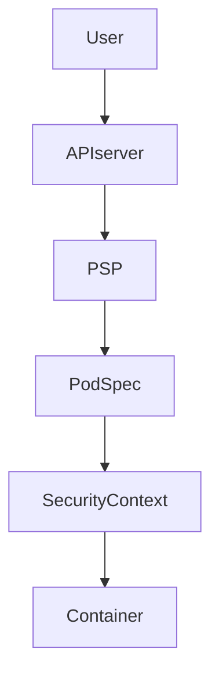
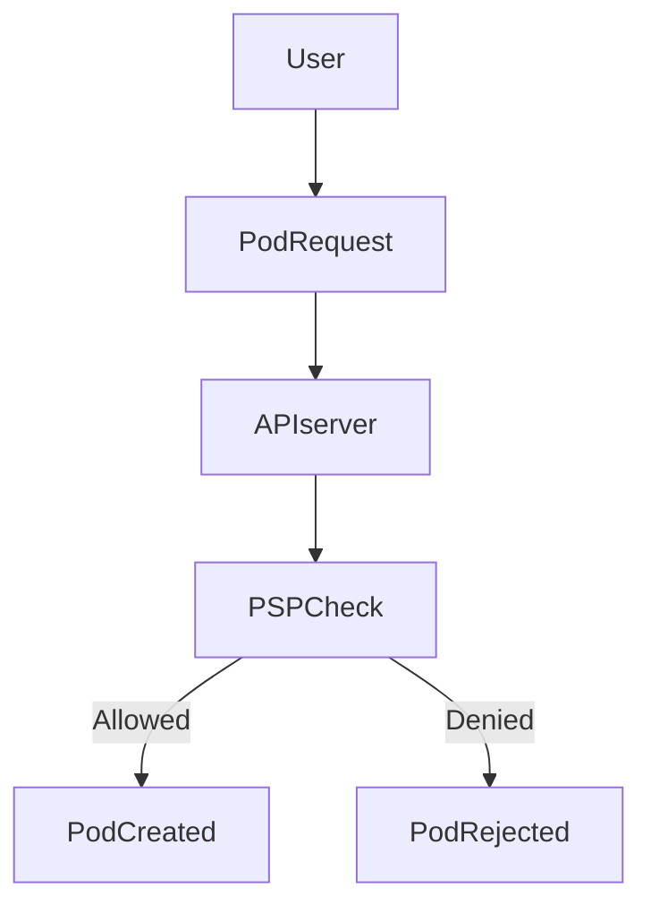
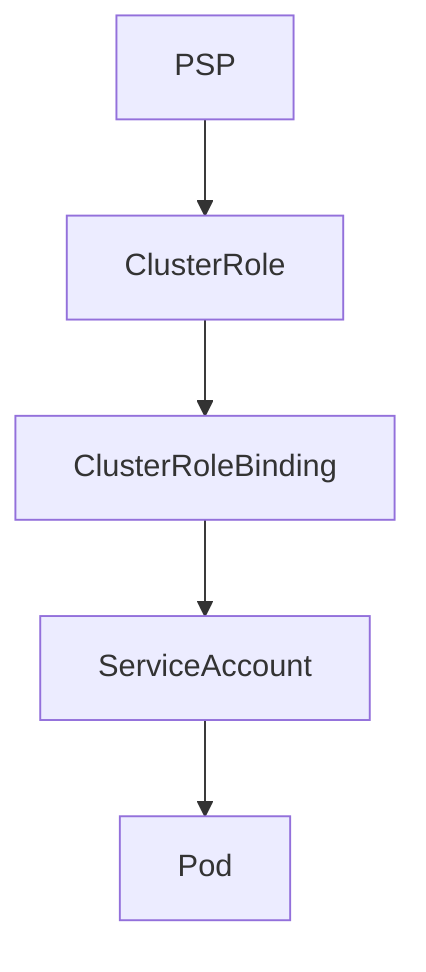
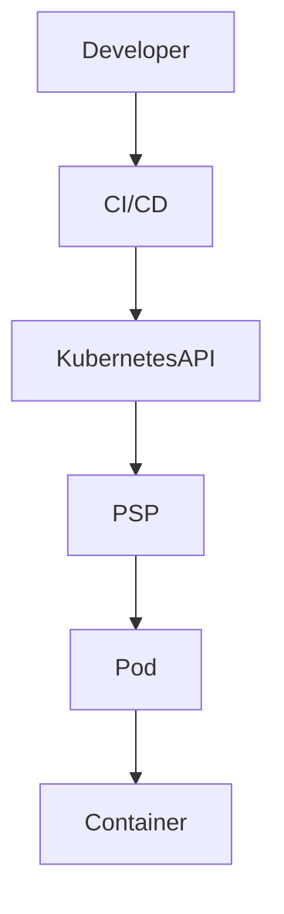

## ☸️ Kubernetes Pod Security Policy (PSP)

Kubernetes에서 컨테이너 보안을 강화하려면 **Pod의 실행 방식 자체를 제한**할 필요가 있습니다.

예를 들어 다음과 같은 정책이 필요할 수 있습니다.

- 컨테이너는 **root 권한 사용 금지**
- **privileged 컨테이너 실행 금지**
- **host network 사용 금지**

이러한 **Pod 보안 정책을 정의하는 기능**이 바로 **Pod Security Policy (PSP)** 입니다. 

Security Context가 **Pod 내부 설정**이라면  
PSP는 **클러스터 수준에서 강제하는 보안 정책**이라고 이해하면 됩니다.

---

## Kubernetes 보안 구조



Pod 생성 과정

1️⃣ 사용자가 Pod 생성 요청
2️⃣ API Server가 PSP 정책 확인
3️⃣ Pod 설정이 정책을 만족하면 생성
4️⃣ 정책 위반 시 생성 실패

---

## Security Context vs PSP

| 항목    | Security Context | Pod Security Policy |
| ----- | ---------------- | ------------------- |
| 적용 범위 | Pod / Container  | Cluster             |
| 역할    | Pod 보안 설정        | 보안 정책 강제            |
| 설정 위치 | Pod YAML         | Cluster Resource    |
| 목적    | 실행 권한 설정         | 정책 통제               |

즉

* **Security Context → Pod 설정**
* **PSP → 정책 enforcement**

---

## Pod Security Policy 동작 방식



Pod 생성 시

✔ PSP 정책을 만족하면 생성
❌ 정책 위반 시 생성 실패

---

## PSP에서 제어 가능한 보안 항목

Pod Security Policy는 다양한 보안 항목을 제어할 수 있습니다.

대표적인 정책

| 정책           | 설명                         |
| ------------ | -------------------------- |
| privileged   | privileged container 허용 여부 |
| hostNetwork  | host 네트워크 사용               |
| hostPID      | host PID namespace 사용      |
| hostIPC      | host IPC 사용                |
| runAsUser    | 컨테이너 사용자                   |
| fsGroup      | 파일 시스템 그룹                  |
| volumes      | 볼륨 타입                      |
| capabilities | Linux capability           |

---

## Pod Security Policy 예제

root 사용자 실행을 금지하는 PSP 예제입니다.

```yaml
apiVersion: policy/v1beta1
kind: PodSecurityPolicy

metadata:
  name: nonroot-psp

spec:

  runAsUser:
    rule: MustRunAsNonRoot

  seLinux:
    rule: RunAsAny

  supplementalGroups:
    rule: RunAsAny

  fsGroup:
    rule: RunAsAny

  volumes:
  - '*'
```

이 정책의 핵심

```
runAsUser: MustRunAsNonRoot
```

즉

**컨테이너가 root로 실행되는 것을 금지합니다.**

---

## PSP 적용 구조

PSP는 **RBAC을 통해 사용자에게 연결해야 합니다.**



즉 흐름은

```
PSP
 → ClusterRole
 → ClusterRoleBinding
 → ServiceAccount
 → Pod
```

---

## ServiceAccount 생성

```yaml
apiVersion: v1
kind: ServiceAccount

metadata:
  name: nonroot-sa
```

---

## ClusterRole 생성

PSP를 사용할 수 있는 권한을 정의합니다.

```yaml
apiVersion: rbac.authorization.k8s.io/v1
kind: ClusterRole

metadata:
  name: nonroot-clusterrole

rules:
- apiGroups:
  - policy
  resources:
  - podsecuritypolicies
  resourceNames:
  - nonroot-psp
  verbs:
  - use
```

---

## ClusterRoleBinding 생성

서비스 계정과 ClusterRole을 연결합니다.

```yaml
apiVersion: rbac.authorization.k8s.io/v1
kind: ClusterRoleBinding

metadata:
  name: nonroot-clusterrole-binding

subjects:
- kind: ServiceAccount
  name: nonroot-sa
  namespace: default

roleRef:
  apiGroup: rbac.authorization.k8s.io
  kind: ClusterRole
  name: nonroot-clusterrole
```

---

## Deployment 적용 예제

이제 PSP 정책을 사용하는 Deployment를 생성합니다.

```yaml
apiVersion: apps/v1
kind: Deployment

metadata:
  name: nonroot-deploy

spec:
  replicas: 3

  selector:
    matchLabels:
      app: nonroot

  template:
    metadata:
      labels:
        app: nonroot

    spec:
      serviceAccountName: nonroot-sa

      securityContext:
        runAsUser: 1001
        fsGroup: 2001

      containers:
      - name: app
        image: example/app:v1
        ports:
        - containerPort: 8080
```

여기서 중요한 설정

```
runAsUser: 1001
```

PSP 정책에서 요구한 **non-root 실행 조건**을 만족합니다.

---

## 정책 위반 테스트

만약 다음과 같이 **root 사용자로 실행되는 Pod**를 생성하면

```yaml
containers:
- name: root-app
  image: example/app:v1
```

Pod 생성 시 다음과 같은 결과가 발생합니다.

```
Pod 생성 실패
PSP 정책 위반
```

즉 **보안 정책이 강제로 적용됩니다.**

---

## PSP 활성화

PSP는 기본적으로 비활성화되어 있으며
**Admission Controller**를 통해 활성화해야 합니다.

예: Minikube

```bash
minikube start \
--extra-config=apiserver.enable-admission-plugins=PodSecurityPolicy
```

---

## 운영 환경 Best Practice

실무에서는 다음과 같은 정책을 많이 사용합니다.

### 1️⃣ Root 실행 금지

```
MustRunAsNonRoot
```

---

### 2️⃣ Privileged Container 금지

```
privileged: false
```

---

### 3️⃣ Host Network 차단

```
hostNetwork: false
```

---

### 4️⃣ Volume 타입 제한

```
hostPath 사용 제한
```

---

## Kubernetes 보안 아키텍처



PSP는 **클러스터 레벨 보안 게이트 역할**을 합니다.

---

## 정리

Kubernetes 보안 구조

### Security Context

* Pod 실행 권한 설정

---

### Pod Security Policy

* 클러스터 보안 정책
* Pod 생성 정책 검사

---

### RBAC

* PSP 사용 권한 제어

---

즉

```
SecurityContext → 설정
PSP → 정책
RBAC → 접근 제어
```
