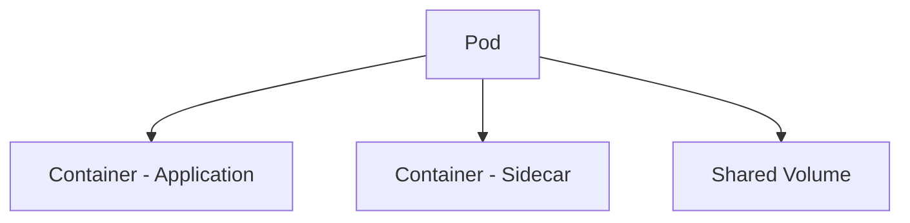
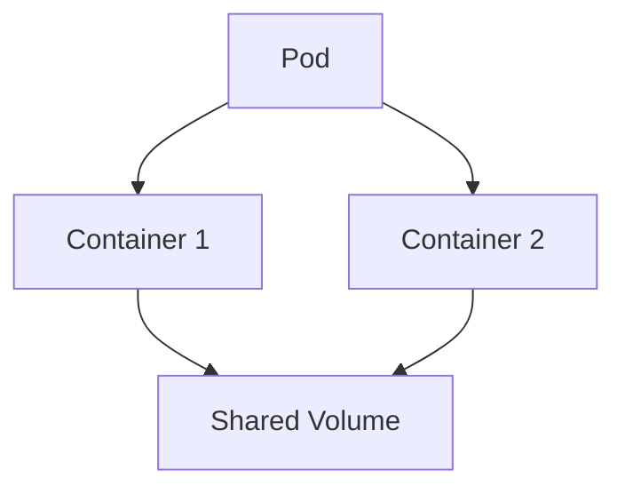
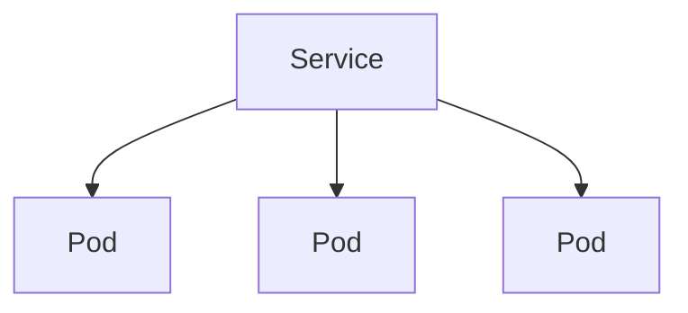
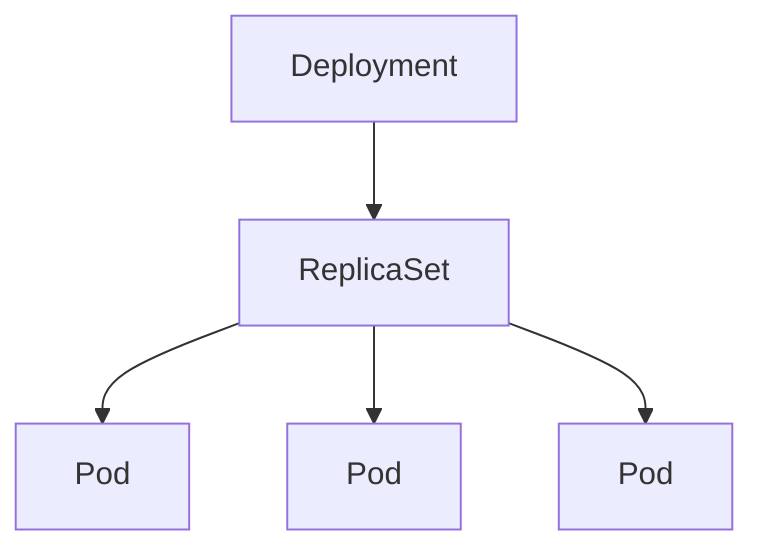
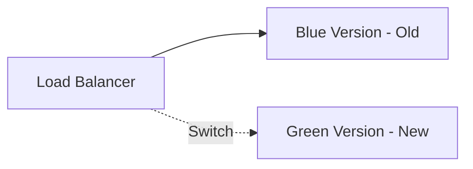
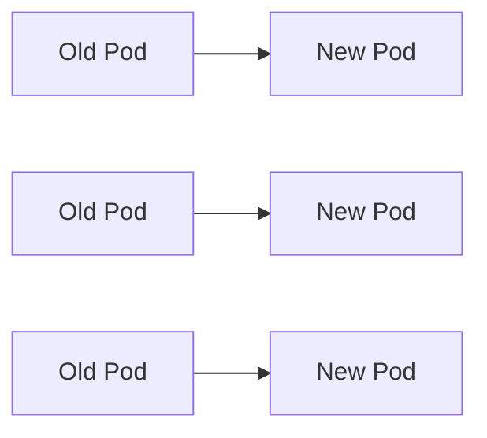

# ☸️ Kubernetes 핵심 개념 정리

쿠버네티스를 처음 접하면 가장 먼저 부딪히는 문제가 **용어의 복잡함**입니다.

Pod, Service, Deployment, ReplicaSet 등 다양한 개념이 등장하면서  
전체 구조를 이해하기 어려워지는 경우가 많습니다.

하지만 Kubernetes는 몇 가지 **핵심 구성요소만 이해하면 전체 구조가 자연스럽게 연결됩니다.**

이 글에서는 Kubernetes를 이해하기 위한 가장 기본적인 개념들을 정리합니다.

---

# 🏗 Kubernetes Cluster 구조

Kubernetes는 **Cluster 구조**로 동작합니다.

클러스터는 크게 두 가지 영역으로 나뉩니다.

- Control Plane (Master)
- Worker Node

```mermaid
graph TD

A[Kubernetes Cluster]

A --> B[Control Plane]
A --> C[Worker Node 1]
A --> D[Worker Node 2]

B --> E[API Server]
B --> F[Scheduler]
B --> G[Controller Manager]
B --> H[etcd]

C --> I[Pod]
C --> J[Pod]

D --> K[Pod]
````

---

## 🧠 Control Plane (Master)

Control Plane은 클러스터 전체를 관리하는 영역입니다.

주요 역할은 다음과 같습니다.

* 클러스터 상태 관리
* 스케줄링
* API 제공
* 컨테이너 배치 관리

대표적인 컴포넌트

| Component          | 역할                    |
| ------------------ | --------------------- |
| API Server         | Kubernetes API 제공     |
| Scheduler          | Pod를 어느 Node에 배치할지 결정 |
| Controller Manager | 클러스터 상태 유지            |
| etcd               | 클러스터 상태 저장            |

---

## 🖥 Worker Node

Worker Node는 **실제로 컨테이너가 실행되는 서버**입니다.

각 Node에는 다음 구성요소가 포함됩니다.

* kubelet
* kube-proxy
* container runtime (Docker / containerd)

Node는 다음 환경에서 실행될 수 있습니다.

* 물리 서버
* 가상 머신
* 클라우드 인스턴스

---

# 📦 Kubernetes Object

Kubernetes에서는 모든 리소스를 **Object 형태로 관리합니다.**

예를 들어

* Pod
* Service
* Deployment
* ConfigMap

모두 Kubernetes Object입니다.

Object는 보통 **YAML 파일로 정의**합니다.

예시 구조

```yaml
apiVersion: v1
kind: Pod
metadata:
  name: example
spec:
  containers:
  - name: app
    image: nginx
```

Object에는 크게 두 가지 정보가 포함됩니다.

* **Metadata** → 이름, label 등
* **Spec** → 원하는 상태 (Desired State)

---

# 🐳 Pod

Pod는 Kubernetes에서 **가장 작은 배포 단위**입니다.

중요한 점은 Kubernetes가 **컨테이너를 직접 배포하지 않는다는 것**입니다.

대신 컨테이너를 **Pod 안에서 실행합니다.**

### Pod 특징

* 하나 이상의 컨테이너 포함
* 동일한 네트워크 사용
* 동일한 스토리지 공유 가능

Pod 구조



이 구조를 이용하면 다음과 같은 패턴이 가능합니다.

예시

* Application Container
* Log Collector Container

애플리케이션이 생성한 로그를 **Sidecar Container가 수집**하는 방식입니다.

---

# 💾 Volume

컨테이너의 파일 시스템은 기본적으로 **휘발성(Ephemeral)** 입니다.

즉 컨테이너가 재시작되면 데이터가 사라집니다.

이 문제를 해결하기 위해 사용하는 것이 **Volume**입니다.

Volume 특징

* Pod에 마운트되어 사용
* 컨테이너 간 공유 가능
* 데이터 유지 가능

예시 구조



대표적인 Volume 타입

* emptyDir
* hostPath
* Persistent Volume (PV)

---

# 🌐 Service

Pod는 생성되고 삭제될 때마다 **IP가 변경됩니다.**

따라서 Pod에 직접 접근하는 방식은 안정적이지 않습니다.

이 문제를 해결하는 것이 **Service**입니다.

Service는

* Pod 그룹에 대한 **고정된 네트워크 엔드포인트**
* 내부 **로드밸런싱 기능**

을 제공합니다.



즉 Service는 **Pod 앞단에서 트래픽을 분산하는 역할**을 합니다.

---

# 🚀 Deployment

Pod는 직접 생성해서 사용할 수도 있지만
실무에서는 보통 **Deployment**를 사용합니다.

Deployment는 다음 기능을 제공합니다.

* Pod 자동 생성
* Replica 관리
* Rolling Update
* Rollback

Deployment 구조



Deployment는 내부적으로 **ReplicaSet을 생성하고 Pod를 관리합니다.**

---

# 🔄 Kubernetes 배포 전략

Kubernetes에서는 다양한 배포 전략을 사용할 수 있습니다.

대표적인 방식 두 가지를 살펴보겠습니다.

---

# 🔵🟢 Blue-Green Deployment

Blue-Green 배포는 **두 개의 환경을 동시에 운영하는 방식**입니다.



배포 과정

1. 새로운 버전(Green) 배포
2. 트래픽을 Blue → Green으로 전환
3. 문제 없으면 Blue 제거

장점

* 롤백이 매우 빠름
* 안정적인 배포 가능

---

# 🔁 Rolling Update

Rolling Update는 Pod를 **하나씩 교체하는 방식**입니다.



특징

* 서비스 중단 없이 배포 가능
* 점진적 업데이트
* 문제 발생 시 롤백 가능

Deployment의 기본 배포 방식이기도 합니다.

---

# 🧠 정리

Kubernetes를 이해하기 위해 가장 중요한 개념은 다음과 같습니다.

### Cluster 구조

* Control Plane
* Worker Node

### 핵심 Object

* Pod
* Service
* Volume
* Deployment

### 배포 전략

* Blue-Green
* Rolling Update
