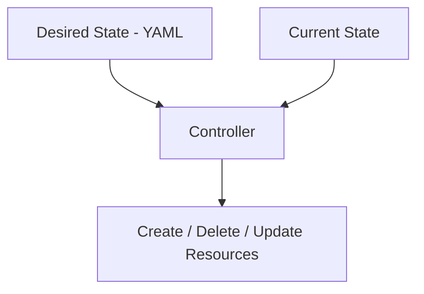
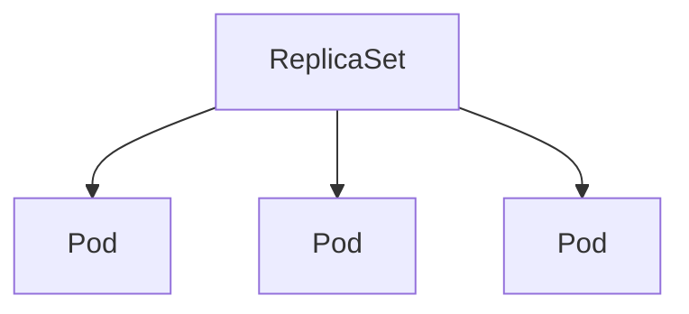
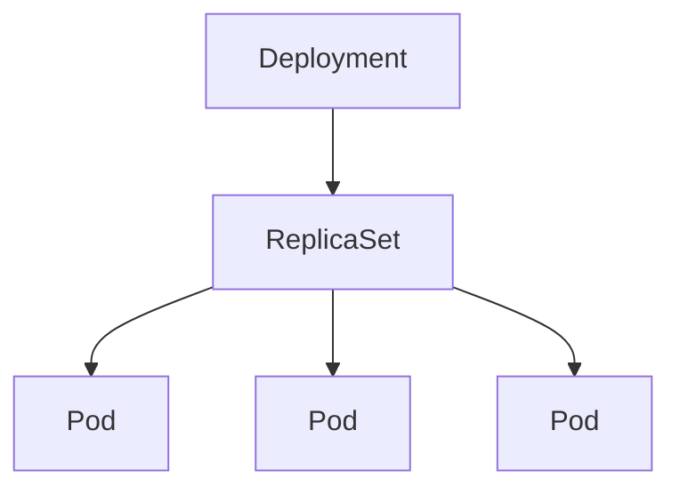
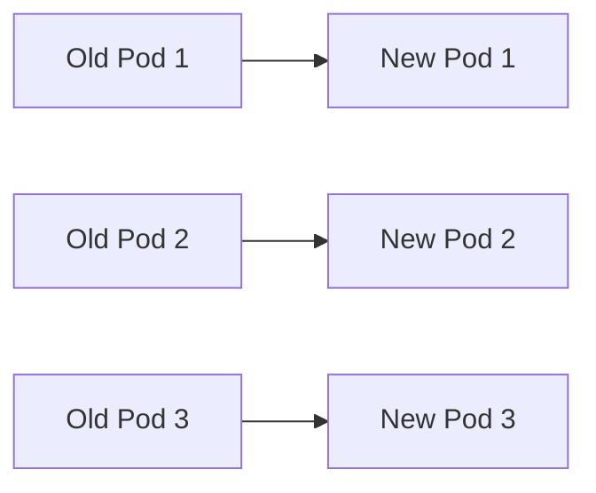

## ☸️ Kubernetes Controller 구조 이해하기

이전 글에서는 Kubernetes의 기본 구성요소인  

- Cluster
- Pod
- Service
- Volume
- Deployment

등의 개념을 정리했습니다.

Kubernetes를 조금 더 깊게 이해하려면 **Controller 개념**을 알아야 합니다.

Kubernetes의 대부분 기능은 **Controller 패턴**으로 동작합니다.

---

## Controller란 무엇인가

Controller는 Kubernetes에서 **클러스터 상태를 원하는 상태(Desired State)로 유지하는 컴포넌트**입니다.

즉 Kubernetes는 다음 방식으로 동작합니다.

```

사용자가 원하는 상태 선언
→ Kubernetes가 실제 상태를 확인
→ 차이가 있으면 자동 수정

```

이를 **Reconciliation Loop**라고 합니다.

---

## Controller 동작 방식



Controller는 다음 작업을 수행합니다.

* 리소스 생성
* 리소스 삭제
* 리소스 업데이트

---

## Kubernetes 주요 Controller

Kubernetes에는 다양한 Controller가 존재합니다.

대표적인 Controller는 다음과 같습니다.

| Controller  | 역할            |
| ----------- | ------------- |
| Deployment  | Pod 배포 관리     |
| ReplicaSet  | Pod 개수 유지     |
| StatefulSet | 상태 기반 애플리케이션  |
| DaemonSet   | Node마다 Pod 실행 |
| Job         | 배치 작업 실행      |

---

## ReplicaSet

ReplicaSet은 **Pod의 개수를 유지하는 Controller**입니다.

예를 들어 다음과 같은 상황을 생각해볼 수 있습니다.

```
Pod 3개 실행
→ Pod 1개 장애 발생
→ ReplicaSet이 자동으로 새 Pod 생성
```

즉 ReplicaSet의 역할은

**항상 지정된 개수의 Pod가 실행되도록 유지하는 것**입니다.

---

## ReplicaSet 아키텍처



ReplicaSet이 관리하는 핵심 값은 다음입니다.

```
replicas: 3
```

이 값이 유지되도록 Kubernetes가 자동으로 Pod를 생성합니다.

---

## ReplicaSet YAML 예시

```yaml
apiVersion: apps/v1
kind: ReplicaSet
metadata:
  name: nginx-rs

spec:
  replicas: 3

  selector:
    matchLabels:
      app: nginx

  template:
    metadata:
      labels:
        app: nginx

    spec:
      containers:
      - name: nginx
        image: nginx
```

중요한 부분은 **selector**입니다.

ReplicaSet은 **label을 기준으로 Pod를 관리합니다.**

---

## Deployment

실제 Kubernetes 환경에서는 ReplicaSet을 직접 사용하는 경우는 많지 않습니다.

대신 **Deployment**를 사용합니다.

Deployment는 다음 기능을 제공합니다.

* ReplicaSet 관리
* Rolling Update
* Rollback
* 배포 전략 관리

---

## Deployment 구조



즉 구조는 다음과 같습니다.

```
Deployment
  ↓
ReplicaSet
  ↓
Pod
```

Deployment가 새로운 버전을 배포하면
**새로운 ReplicaSet이 생성됩니다.**

---

## Rolling Update 동작 과정

Deployment는 기본적으로 **Rolling Update 방식**을 사용합니다.



업데이트 과정

1️⃣ 새로운 Pod 생성
2️⃣ 기존 Pod 삭제
3️⃣ 점진적으로 교체

이 방식 덕분에 **서비스 중단 없이 배포가 가능합니다.**

---

## Deployment YAML 예시

```yaml
apiVersion: apps/v1
kind: Deployment
metadata:
  name: nginx-deployment

spec:
  replicas: 3

  selector:
    matchLabels:
      app: nginx

  template:
    metadata:
      labels:
        app: nginx

    spec:
      containers:
      - name: nginx
        image: nginx:1.25
```

Deployment를 생성하면 내부적으로

```
Deployment
→ ReplicaSet 생성
→ Pod 생성
```

이 과정이 자동으로 진행됩니다.
