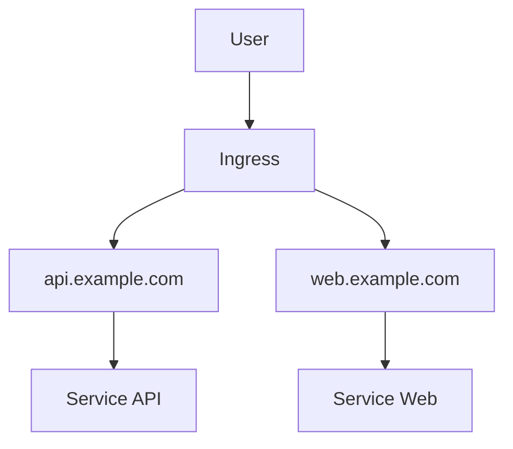
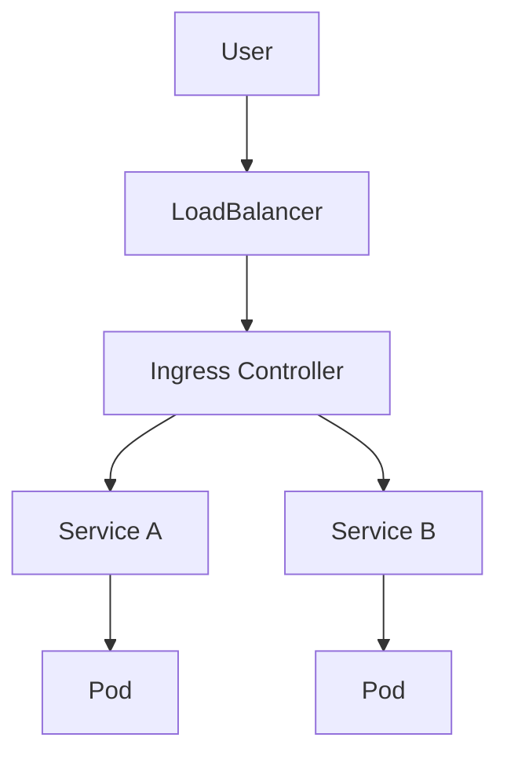
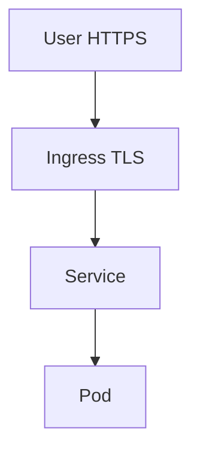
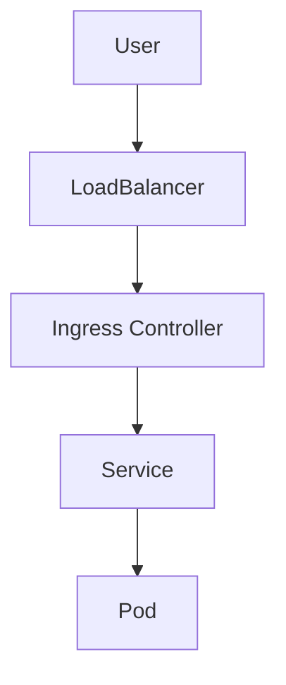

## ☸️ Kubernetes Ingress 이해하기

이전 글에서는 Kubernetes Service와 Networking 구조를 살펴봤습니다.

Service를 사용하면 Pod에 접근할 수 있지만  
외부 트래픽을 처리하기에는 몇 가지 한계가 있습니다.

예를 들어

- 여러 서비스에 대해 **HTTP 라우팅**
- **도메인 기반 접근**
- **HTTPS/TLS 처리**

이런 기능은 Service만으로는 처리하기 어렵습니다.

이 문제를 해결하는 것이 **Ingress**입니다.

---

## Kubernetes 시리즈

1️⃣ Kubernetes 핵심 개념 정리  
2️⃣ Controller / ReplicaSet / Deployment  
3️⃣ Service와 Networking  
4️⃣ Ingress 구조  
5️⃣ ConfigMap / Secret

---

## Kubernetes 외부 트래픽 흐름

외부에서 Kubernetes 서비스로 접근하는 기본 흐름은 다음과 같습니다.

```mermaid
graph TD

A[User]

A --> B[LoadBalancer]

B --> C[Service]

C --> D[Pod]
C --> E[Pod]
````

하지만 서비스가 여러 개라면 문제가 생깁니다.

* 서비스마다 LoadBalancer 필요
* 비용 증가
* 관리 복잡

이를 해결하기 위해 **Ingress**가 등장합니다.

---

## Ingress 개념

Ingress는 **외부 HTTP/HTTPS 트래픽을 내부 서비스로 라우팅하는 리소스**입니다.

```mermaid
graph TD

A[User]

A --> B[Ingress]

B --> C[Service A]
B --> D[Service B]

C --> E[Pod]
D --> F[Pod]
```

즉 Ingress는 **HTTP 라우터 역할**을 합니다.

---

## Ingress 주요 기능

Ingress는 다음 기능을 제공합니다.

* HTTP Routing
* Domain 기반 Routing
* TLS / HTTPS 지원
* Load Balancing

---

## Host 기반 Routing

도메인에 따라 서비스로 트래픽을 분리할 수 있습니다.



예시

```
api.example.com → API Service
web.example.com → Web Service
```

---

## Path 기반 Routing

URL 경로에 따라 서비스 분리도 가능합니다.

```mermaid
graph TD

A[User]

A --> B[Ingress]

B --> C[/api]

B --> D[/web]

C --> E[API Service]

D --> F[Web Service]
```

예시

```
example.com/api → API Service
example.com/web → Web Service
```

---

## Ingress Controller

중요한 점은 **Ingress는 실제 트래픽을 처리하지 않는다는 것**입니다.

Ingress는 **설정 정보만 가진 리소스**입니다.

실제 트래픽 처리는 **Ingress Controller**가 수행합니다.

대표적인 Controller

* Nginx Ingress Controller
* Traefik
* HAProxy
* Kong

---

## Ingress Controller 아키텍처



즉 전체 흐름은 다음과 같습니다.

```
User
 → LoadBalancer
 → Ingress Controller
 → Service
 → Pod
```

---

## Ingress YAML 예시

```yaml
apiVersion: networking.k8s.io/v1
kind: Ingress
metadata:
  name: example-ingress

spec:
  rules:
  - host: example.com

    http:
      paths:
      - path: /api
        pathType: Prefix

        backend:
          service:
            name: api-service
            port:
              number: 80
```

이 설정은 다음 의미를 가집니다.

```
example.com/api → api-service
```

---

## TLS / HTTPS 설정

Ingress는 TLS 인증서를 통해 HTTPS를 지원합니다.



YAML 예시

```yaml
spec:
  tls:
  - hosts:
    - example.com

    secretName: tls-secret
```

---

## Ingress를 사용하는 이유

Ingress의 장점

### 1️⃣ 비용 절감

LoadBalancer를 서비스마다 만들 필요 없음

### 2️⃣ 중앙 라우팅

모든 HTTP 트래픽을 한 곳에서 관리

### 3️⃣ HTTPS 처리

TLS 인증서 관리 가능

---

## 정리

Kubernetes Networking 구조

### Service

* Pod 접근 엔드포인트

### Ingress

* HTTP/HTTPS 라우팅

### Ingress Controller

* 실제 트래픽 처리

---

## 전체 트래픽 흐름


