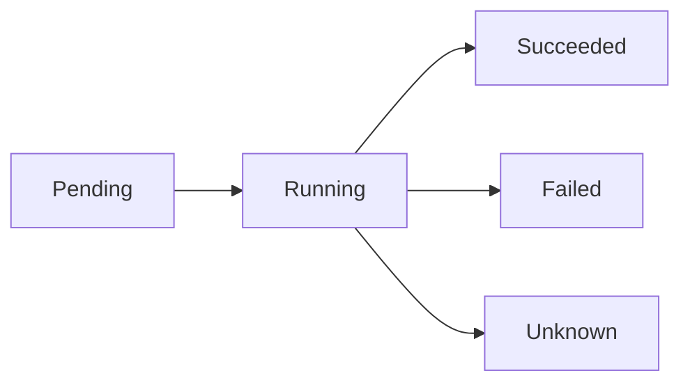
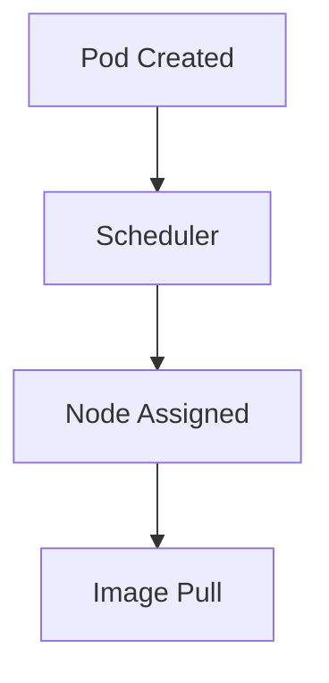
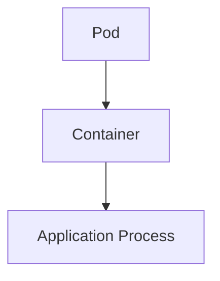
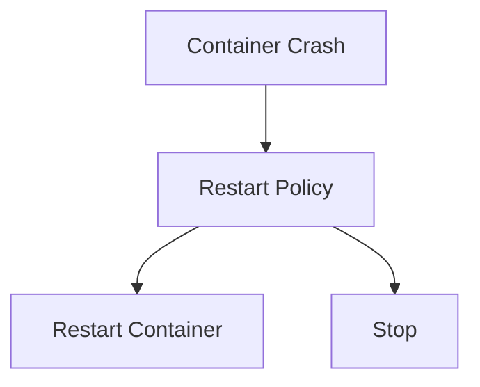
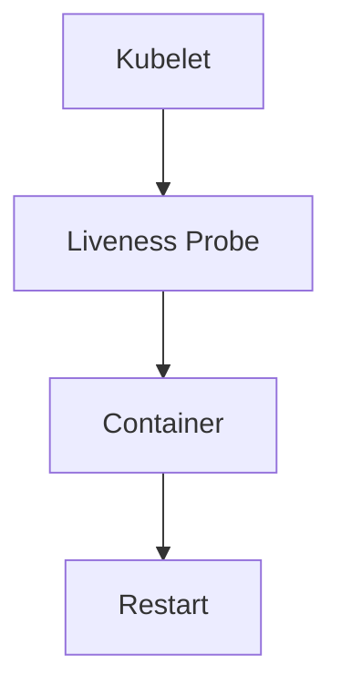
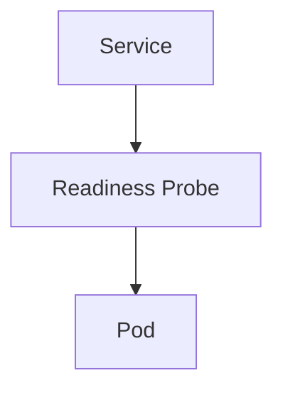
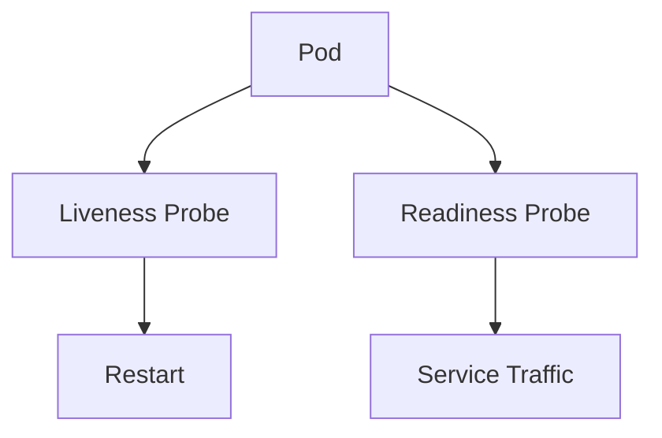
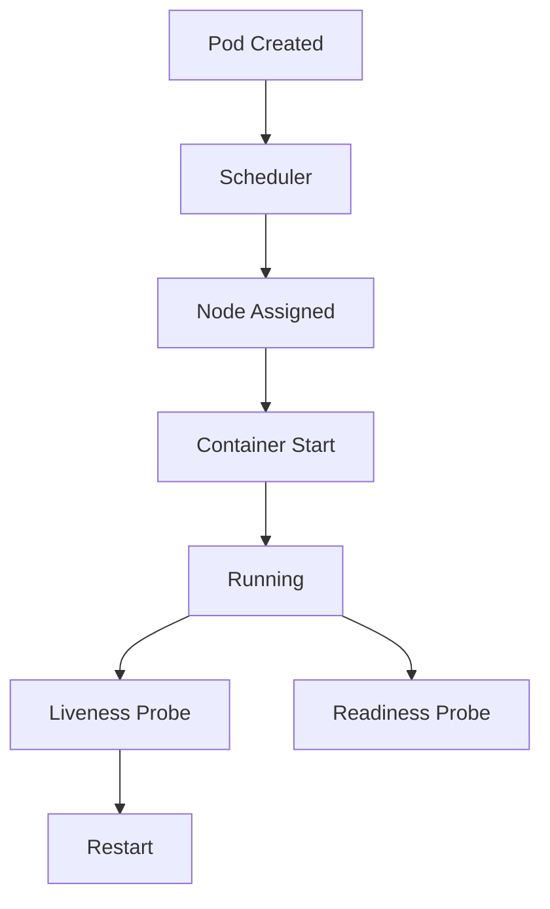

## ☸️ Kubernetes Pod Lifecycle 이해하기

Kubernetes에서 **Pod는 가장 작은 배포 단위**입니다.

하지만 Pod는 단순히 생성되고 종료되는 것이 아니라 **여러 상태를 거치며 생명주기(Lifecycle)** 를 가지게 됩니다.

Pod Lifecycle을 이해하면 다음과 같은 문제를 해결할 수 있습니다.

- Pod가 왜 재시작되는지
- Pod가 Pending 상태에서 멈춘 이유
- 서비스가 트래픽을 받지 못하는 이유
- Health Check 설정 방법

---

# Pod Lifecycle 전체 흐름

Pod는 다음과 같은 상태를 거칩니다.



---

# Pod Phase

Pod 상태는 **Pod Phase**로 표현됩니다.

대표적으로 5가지 상태가 있습니다.

| Phase     | 설명                  |
| --------- | ------------------- |
| Pending   | Pod가 생성되었지만 실행 준비 중 |
| Running   | Pod가 정상 실행 중        |
| Succeeded | 작업이 성공적으로 완료        |
| Failed    | 실행 실패               |
| Unknown   | 상태 확인 불가            |

---

# Pending 상태

Pod가 생성되었지만 아직 실행되지 않은 상태입니다.

주요 원인

* Node 스케줄링 실패
* 이미지 다운로드 중
* 볼륨 마운트 문제
* 리소스 부족

구조



---

# Running 상태

Pod가 정상적으로 실행되고 있는 상태입니다.

조건

* 최소 하나의 컨테이너가 실행 중
* 컨테이너 프로세스가 정상 작동



---

# Succeeded 상태

Pod의 작업이 정상적으로 완료된 상태입니다.

주로 **Batch 작업**에서 발생합니다.

예

* 데이터 처리
* ETL 작업
* CronJob

---

# Failed 상태

컨테이너가 오류로 종료된 경우입니다.

대표적인 원인

* 애플리케이션 오류
* 메모리 부족(OOM)
* CrashLoop

---

# Pod 상태 확인

Pod 상태는 다음 명령어로 확인할 수 있습니다.

```bash
kubectl get pods
```

예시

```bash
NAME        READY   STATUS    RESTARTS
web-pod     1/1     Running   0
batch-job   0/1     Completed 0
api-pod     0/1     CrashLoopBackOff 3
```

---

# Restart Policy

Pod는 컨테이너가 종료되면 **Restart Policy**에 따라 재시작됩니다.

| Policy    | 설명       |
| --------- | -------- |
| Always    | 항상 재시작   |
| OnFailure | 실패 시 재시작 |
| Never     | 재시작하지 않음 |

---

## Restart 구조



---

# Liveness Probe

Liveness Probe는 **컨테이너가 살아있는지 확인**하는 기능입니다.

애플리케이션이 **deadlock 상태**가 되면 자동으로 재시작합니다.

---

## Liveness 구조



---

## Liveness Probe 예시

```yaml
livenessProbe:
  httpGet:
    path: /health
    port: 8080

  initialDelaySeconds: 10
  periodSeconds: 5
```

---

# Readiness Probe

Readiness Probe는 **Pod가 트래픽을 받을 준비가 되었는지 확인**합니다.

준비되지 않은 경우 Service에서 제외됩니다.

---

## Readiness 구조



---

## Readiness Probe 예시

```yaml
readinessProbe:
  httpGet:
    path: /ready
    port: 8080

  initialDelaySeconds: 5
  periodSeconds: 3
```

---

# Liveness vs Readiness

두 Probe는 목적이 다릅니다.

| Probe     | 역할       |
| --------- | -------- |
| Liveness  | 컨테이너 재시작 |
| Readiness | 트래픽 제어   |

---

## Probe 구조



---

# Pod Lifecycle 전체 아키텍처



---

# 정리

Pod Lifecycle 핵심

### Pod Phase

* Pending
* Running
* Succeeded
* Failed
* Unknown

### Restart Policy

* Always
* OnFailure
* Never

### Health Check

* Liveness Probe
* Readiness Probe
