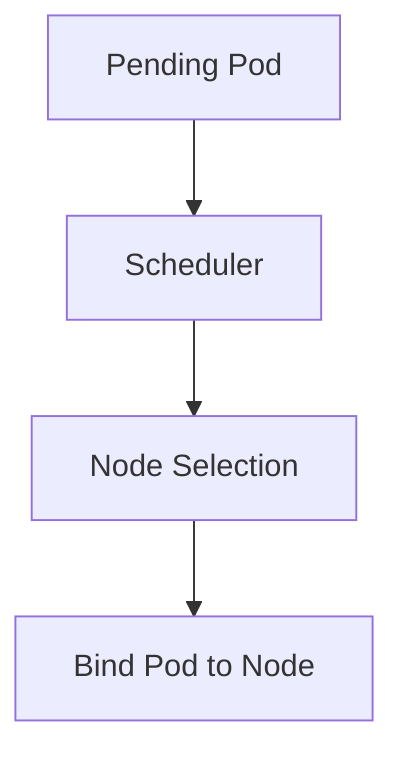
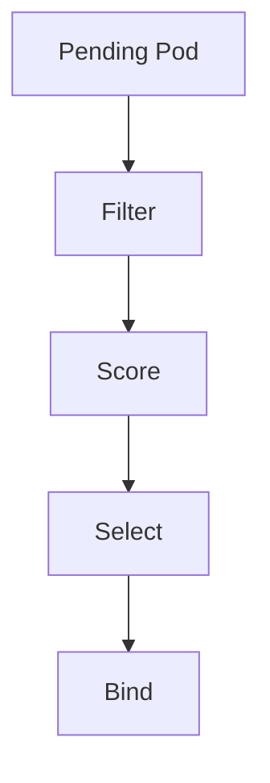
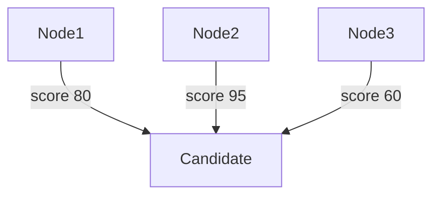
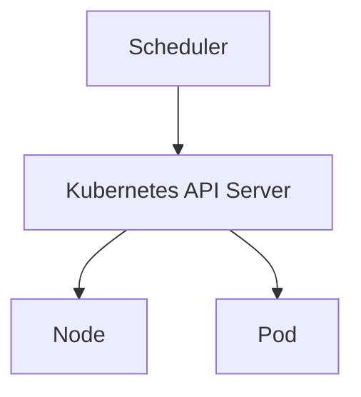
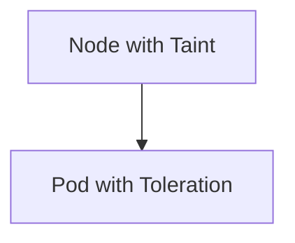
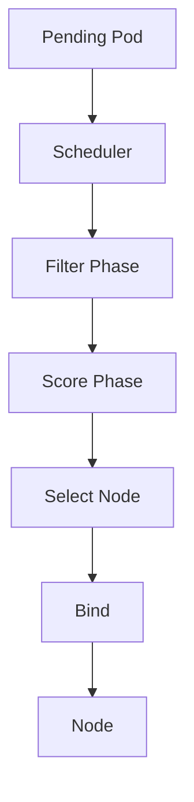

## ☸️ Kubernetes Scheduler 이해하기

Kubernetes에서 **Scheduler는 Pod를 어떤 Node에서 실행할지 결정하는 핵심 컴포넌트**입니다.

Scheduler를 이해하면 다음을 알 수 있습니다.

- Pod가 Pending 상태로 멈춘 이유  
- 특정 Node에 Pod를 배치하는 방법  
- Taints/Tolerations와 Node Affinity 활용법  
- 리소스 활용 최적화 방법  

---

## Scheduler 동작 개요

Scheduler는 **Pending 상태 Pod를 감지**하고 Node를 선택합니다.



---

## Node Selection 과정

Scheduler는 다음 단계를 거쳐 Node를 선택합니다.

1️⃣ **Filter** - 스케줄 가능한 Node 후보 선별
2️⃣ **Score** - 후보 Node 점수 계산
3️⃣ **Select** - 최종 Node 선택
4️⃣ **Bind** - Pod와 Node 연결



---

## Filter 단계

Filter 단계에서는 다음 조건을 확인합니다.

* Node 리소스 충분 여부(CPU, Memory)
* Taints/Tolerations 일치 여부
* Node Affinity/Anti-affinity 조건
* Pod Affinity/Anti-affinity 조건

---

## Score 단계

Score 단계에서는 후보 Node에 **점수 계산**을 합니다.

* 리소스 사용률 균형
* Pod 배치 최적화
* Node 선호도 반영



---

## Bind 단계

최종 Node를 선택한 후 Scheduler는 **API Server를 통해 Pod와 Node를 바인딩**합니다.



---

## Taints / Tolerations

**Taints**: Node에 표시, Pod가 배치되지 않도록 함
**Tolerations**: Pod가 Taint를 허용하도록 설정



### 예시

```yaml
# Node Taint
kubectl taint nodes node1 key=value:NoSchedule

# Pod Toleration
tolerations:
- key: "key"
  operator: "Equal"
  value: "value"
  effect: "NoSchedule"
```

---

## Node Affinity

Node Affinity를 통해 특정 Node에 Pod를 배치할 수 있습니다.

```yaml
affinity:
  nodeAffinity:
    requiredDuringSchedulingIgnoredDuringExecution:
      nodeSelectorTerms:
      - matchExpressions:
        - key: kubernetes.io/region
          operator: In
          values:
          - us-east-1
```

---

## Scheduler 전체 아키텍처



---

## 정리

Scheduler 핵심

### 역할

* Pending Pod 감지
* Node 선택
* Pod 바인딩

### 스케줄링 과정

* Filter → Score → Select → Bind

### 고급 기능

* Taints / Tolerations
* Node Affinity / Anti-affinity
* Resource 기반 스케줄링
