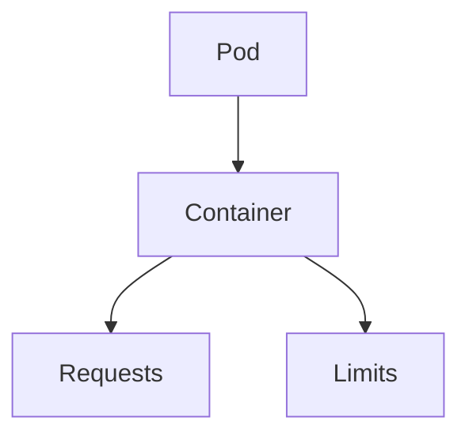
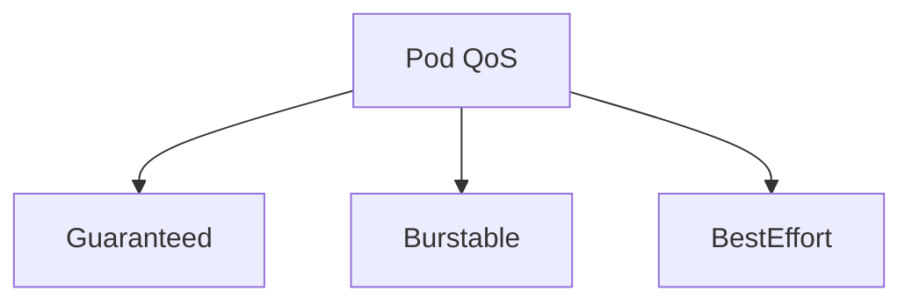
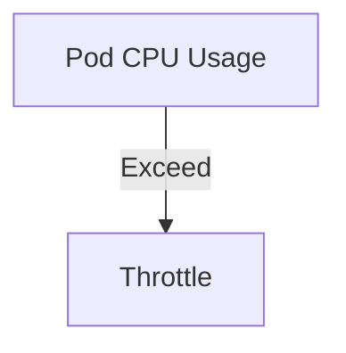
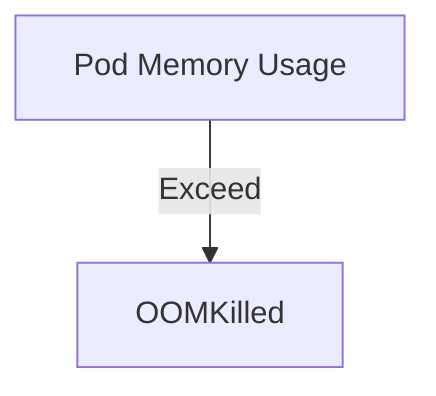
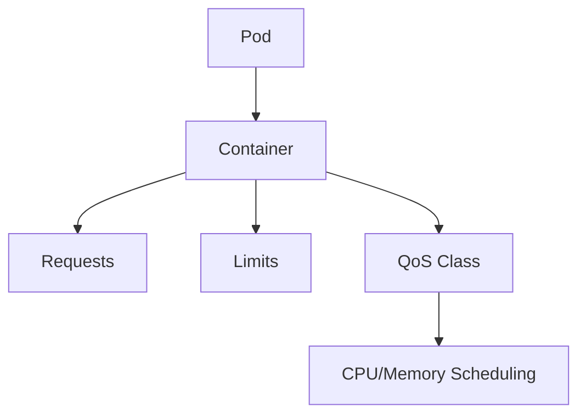

## ☸️ Kubernetes Resource Management 이해하기

Kubernetes에서 **리소스 관리(Resource Management)**는 안정적인 클러스터 운영과 애플리케이션 성능 보장을 위해 필수적입니다.

리소스를 관리하지 않으면 다음 문제가 발생할 수 있습니다.

- Pod가 OOMKilled로 종료됨  
- 노드 리소스 부족으로 스케줄링 실패  
- 특정 Pod가 다른 Pod를 독점하여 클러스터 불균형 발생  

Kubernetes는 **CPU, Memory 요청(Requests)과 제한(Limits), QoS Class**를 통해 이를 관리합니다.

---

## Pod 리소스 요청(Request)과 제한(Limit)

Pod/Container 리소스는 **Requests**와 **Limits**로 정의합니다.

| 항목 | 설명 |
|---|---|
| Requests | Pod가 필요로 하는 최소 리소스 |
| Limits | Pod가 사용할 수 있는 최대 리소스 |

```yaml id="1gkpse"
resources:
  requests:
    cpu: "500m"
    memory: "256Mi"
  limits:
    cpu: "1"
    memory: "512Mi"
````

---

## CPU와 Memory 단위

* CPU: 1 = 1 Core, 500m = 0.5 Core
* Memory: Mi = Mebibyte, Gi = Gibibyte

---

## Resource Management 구조



Pod는 Requests 만큼 리소스를 보장받고, Limits를 넘으면 제한됩니다.

---

## QoS Class

Kubernetes는 리소스 설정에 따라 Pod를 3가지 QoS Class로 분류합니다.

| QoS Class  | 설명        | 조건                        |
| ---------- | --------- | ------------------------- |
| Guaranteed | 요청 = 제한   | 모든 컨테이너 Requests = Limits |
| Burstable  | 요청 < 제한   | 일부 컨테이너 Requests < Limits |
| BestEffort | 리소스 요청 없음 | Requests, Limits 설정 없음    |



---

## QoS Class 활용

* Guaranteed: 안정성 최우선, 리소스 보장
* Burstable: 유연성 제공, 여유 자원 사용
* BestEffort: 최소 보장, 클러스터가 여유 있을 때만 사용

---

## 리소스 관리 동작 예시

### 1️⃣ CPU 초과



CPU Limit를 초과하면 컨테이너가 **Throttle(제한)** 됩니다.

---

### 2️⃣ Memory 초과



Memory Limit를 초과하면 컨테이너가 **OOMKilled** 됩니다.

---

## Resource Management 전체 아키텍처



---

## 정리

Kubernetes Resource Management 핵심

### Requests

* Pod/Container 최소 리소스 보장

### Limits

* Pod/Container 최대 리소스 제한

### QoS Class

* Guaranteed / Burstable / BestEffort

### 관리 효과

* 안정적인 클러스터 운영
* Pod 재시작 최소화
* 리소스 균형 최적화
