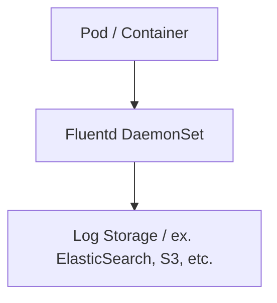
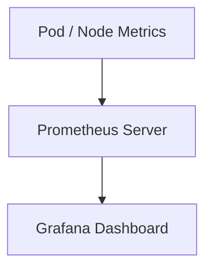
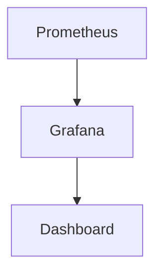
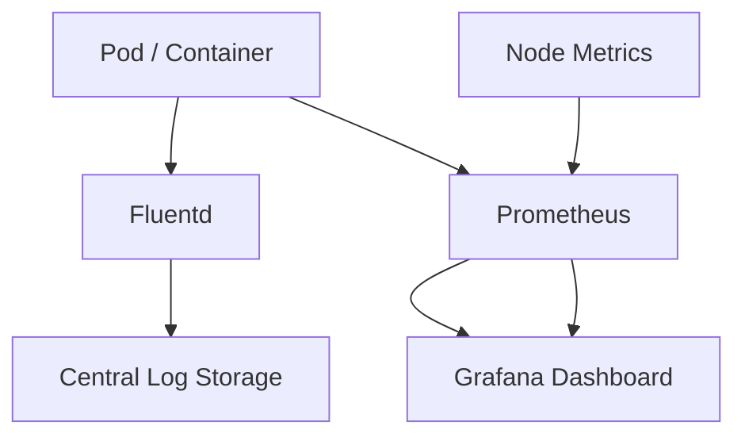

## ☸️ Kubernetes Logging & Monitoring 이해하기

Kubernetes 클러스터를 운영하다 보면 **로그 수집과 모니터링**이 필수입니다.

목적

- Pod / Cluster 상태 확인  
- 문제 발생 시 빠른 원인 파악  
- 운영 효율성 향상  

이를 위해 많이 사용되는 도구

- **Fluentd**: 로그 수집/전송  
- **Prometheus**: 모니터링, 메트릭 수집  
- **Grafana**: 시각화  

---

## 클러스터 로그 수집 구조



* Fluentd는 **각 Node에 DaemonSet으로 배포**
* Pod 로그를 수집하고 중앙 저장소로 전송

---

## 모니터링 구조



* Prometheus: 메트릭 수집, 저장
* Grafana: 시각화 및 알람 설정

---

## Fluentd 예시

```yaml
apiVersion: apps/v1
kind: DaemonSet
metadata:
  name: fluentd
spec:
  template:
    spec:
      containers:
      - name: fluentd
        image: fluent/fluentd:v1.14
        volumeMounts:
        - name: varlog
          mountPath: /var/log
```

* Pod 로그를 수집 후 중앙 저장소로 전송 가능
* Elasticsearch, S3, Kafka 등 연동 가능

---

## Prometheus 설정 예시

```yaml
apiVersion: monitoring.coreos.com/v1
kind: ServiceMonitor
metadata:
  name: pod-monitor
spec:
  selector:
    matchLabels:
      app: myapp
  endpoints:
  - port: http
    path: /metrics
```

* Pod / Node 메트릭 수집
* AlertManager와 연동 가능

---

## Grafana 대시보드 예시



* Pod 상태, Node 리소스, 클러스터 이벤트 시각화
* 알람(Alert) 설정 가능

---

## Logging & Monitoring 전체 아키텍처



* 로그와 메트릭을 중앙화
* 운영자가 쉽게 모니터링 가능

---

## 실무 운영 팁

1️⃣ Pod 이름 / Namespace 기준으로 로그 분리
2️⃣ 중요한 이벤트는 Alert 설정 (CPU, Memory, CrashLoop)
3️⃣ 장기 로그는 S3 등 외부 스토리지로 아카이브
4️⃣ Grafana Dashboard를 팀별/서비스별로 구성

---

## 정리

Kubernetes Logging & Monitoring 핵심

### Logging

* Fluentd DaemonSet으로 Pod 로그 수집
* 중앙 저장소로 전송
* 필터링/분류 가능

### Monitoring

* Prometheus로 메트릭 수집
* Grafana로 시각화, 알람 설정
* Pod / Node 상태 모니터링

### 운영 팁

* Alert 설정
* 로그 장기 보관
* Dashboard 관리
