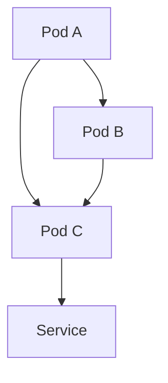
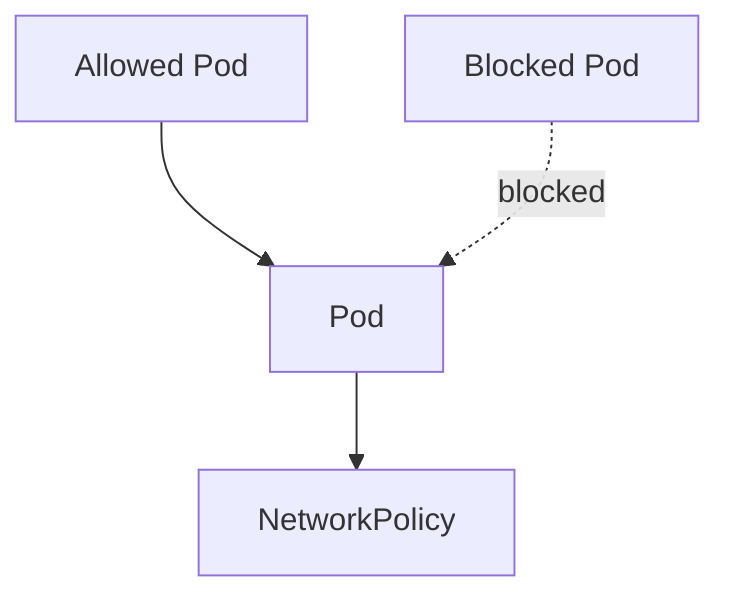
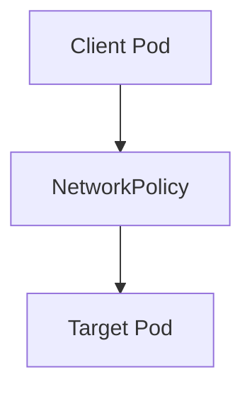
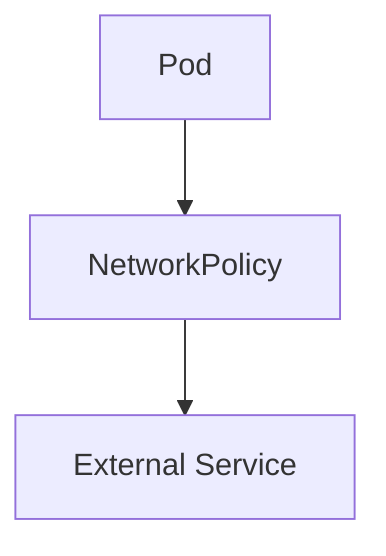
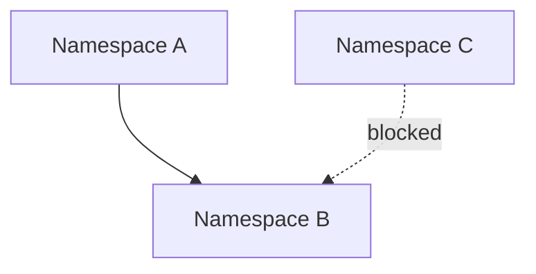
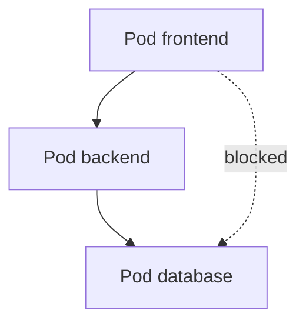
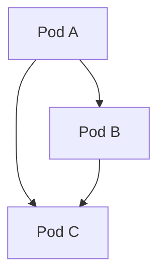
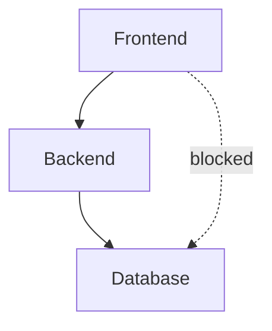
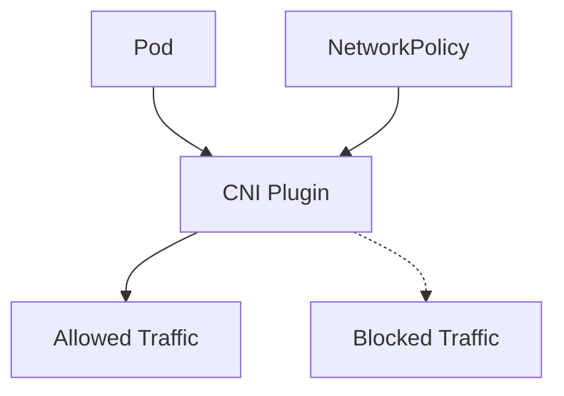
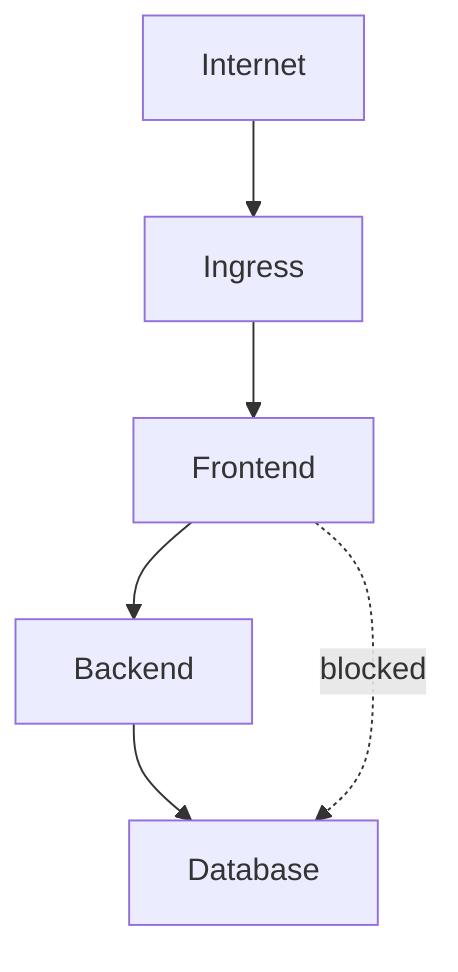

## ☸️ Kubernetes Network Security

Kubernetes 클러스터에서는 기본적으로 **모든 Pod가 서로 통신할 수 있습니다.**

즉 아무 설정이 없다면

```

Pod ↔ Pod
Pod ↔ Service
Pod ↔ Node

```

모든 네트워크가 허용됩니다.

하지만 실제 운영 환경에서는 **보안 문제**가 발생할 수 있습니다.

예

- 내부 서비스 접근 제한 필요
- 특정 Namespace 통신 차단
- 데이터베이스 접근 제한

이 문제를 해결하기 위해 **NetworkPolicy**를 사용합니다.

---

## Kubernetes 네트워크 구조

Kubernetes는 기본적으로 **Flat Network 구조**를 사용합니다.



특징

* Pod 간 직접 통신 가능
* NAT 없이 IP 통신
* 모든 Pod가 서로 접근 가능

---

## NetworkPolicy란?

NetworkPolicy는 **Pod 간 네트워크 통신을 제어하는 정책**입니다.

주요 기능

* 특정 Pod만 접근 허용
* 특정 Namespace 허용
* 특정 Port 허용
* Ingress / Egress 제어

---

### NetworkPolicy 구조



---

## Ingress Policy

Ingress Policy는 **Pod로 들어오는 트래픽**을 제어합니다.



---

### Ingress Policy 예시

```yaml
apiVersion: networking.k8s.io/v1
kind: NetworkPolicy

metadata:
  name: allow-nginx

spec:
  podSelector:
    matchLabels:
      app: nginx

  policyTypes:
  - Ingress

  ingress:
  - from:
    - podSelector:
        matchLabels:
          app: frontend
```

설명

* nginx Pod로 들어오는 트래픽 허용
* frontend Pod만 접근 가능

---

## Egress Policy

Egress Policy는 **Pod에서 나가는 트래픽**을 제어합니다.



---

### Egress Policy 예시

```yaml
apiVersion: networking.k8s.io/v1
kind: NetworkPolicy

metadata:
  name: allow-dns

spec:
  podSelector: {}

  policyTypes:
  - Egress

  egress:
  - to:
    - namespaceSelector: {}
```

---

## Namespace 기반 접근 제어

NetworkPolicy는 **Namespace 단위 제어**도 가능합니다.



예

* frontend → backend 허용
* 외부 namespace 차단

---

## Label 기반 접근 제어

Kubernetes는 **Label 기반 정책**을 사용합니다.



예

* frontend → backend 허용
* database 직접 접근 차단

---

## NetworkPolicy 적용 전후

### 정책 없음



### 정책 적용



---

## CNI 플러그인

NetworkPolicy는 **CNI 플러그인**이 지원해야 동작합니다.

대표적인 CNI

| CNI     | 특징       |
| ------- | -------- |
| Calico  | 가장 널리 사용 |
| Cilium  | eBPF 기반  |
| Weave   | 간단한 설정   |
| Flannel | 기본 네트워크  |

---

## NetworkPolicy 아키텍처



---

## 실무 보안 설계 예시

일반적인 서비스 구조



보안 원칙

* Frontend → Backend만 허용
* Backend → DB만 허용
* Frontend → DB 차단

---

## 정리

Kubernetes Network Security 핵심

### 기본 네트워크

* 모든 Pod 간 통신 가능

---

### NetworkPolicy

* Pod 통신 제어
* Ingress / Egress 지원
* Label 기반 정책

---

### 지원 조건

* CNI 플러그인 필요
* Kubernetes 네트워크 정책 활성화
