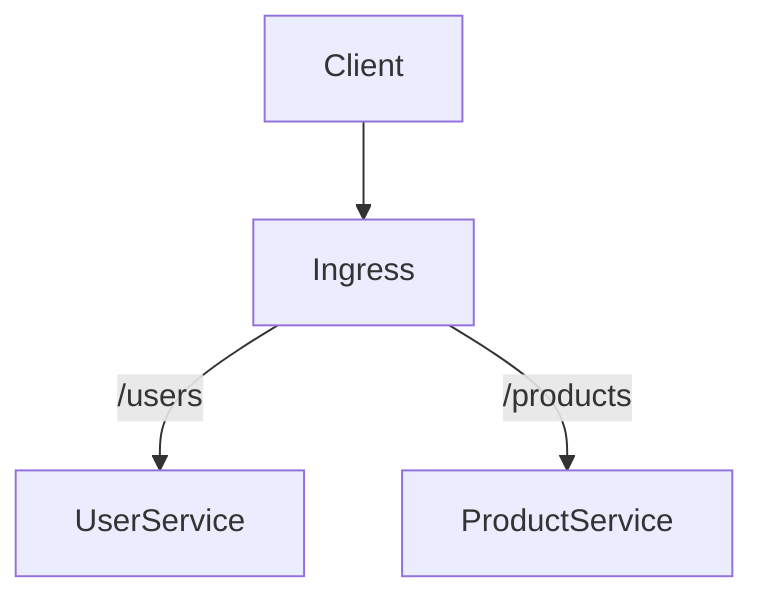
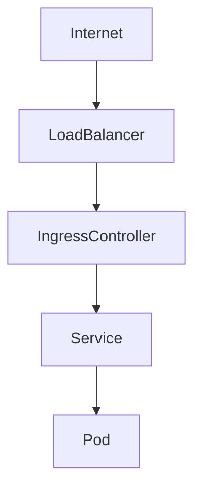
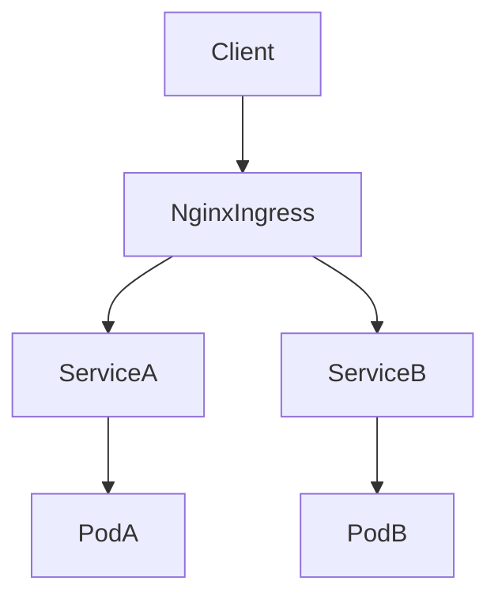
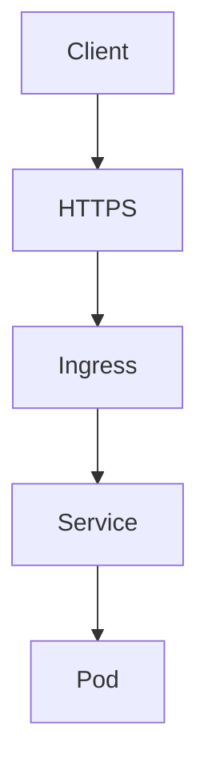
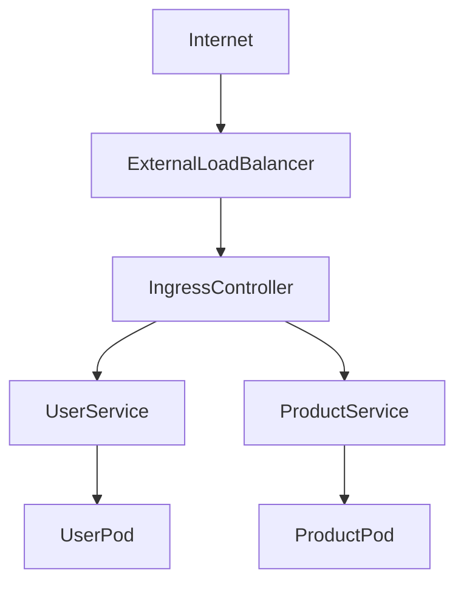
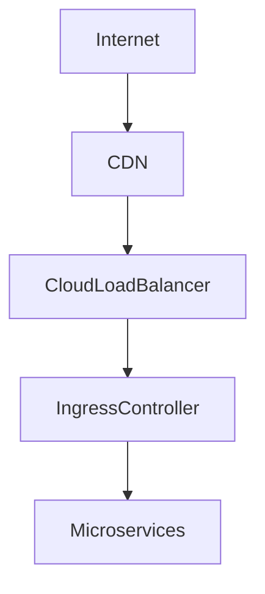

## ☸️ Kubernetes Ingress 완벽 가이드

Kubernetes에서 서비스를 외부에 노출하는 가장 기본적인 방법은 **Service** 입니다.

대표적인 Service 타입

- ClusterIP
- NodePort
- LoadBalancer

하지만 Service만으로는 다음과 같은 기능이 부족합니다.

- URL 기반 라우팅
- 여러 도메인 관리
- TLS 처리
- L7 Load Balancing

이 문제를 해결하는 컴포넌트가 바로 **Ingress**입니다.

---

## Kubernetes Network Exposure

기본적인 Service 노출 구조입니다.

```mermaid
graph TD

Client --> NodePort
NodePort --> Service
Service --> Pod1
Service --> Pod2
````

문제점

* 서비스마다 LoadBalancer 필요
* URL 기반 라우팅 불가능
* TLS 관리 어려움

---

## Ingress란?

Ingress는 **Kubernetes의 L7 Load Balancer** 입니다.

주요 역할

* HTTP / HTTPS 라우팅
* URL 기반 트래픽 분배
* Host 기반 라우팅
* TLS 처리

---

## Ingress Architecture

```mermaid
graph TD

A[Client]

B[Ingress Controller]

C[Service - Users]

D[Service - Products]

E[Pod]

A --> B
B --> C
B --> D

C --> E
D --> E
```

Ingress는 **클러스터 외부 요청을 내부 서비스로 라우팅**합니다.

---

## URL Path Routing

MSA 환경에서는 서비스가 다음과 같이 나뉩니다.

```
/users
/products
/orders
```

Ingress는 URL Path를 기반으로 트래픽을 라우팅합니다.



---

## Ingress YAML 예제

```yaml
apiVersion: networking.k8s.io/v1
kind: Ingress

metadata:
  name: hello-ingress

spec:
  rules:
  - http:
      paths:
      - path: /users
        pathType: Prefix
        backend:
          service:
            name: users-service
            port:
              number: 80

      - path: /products
        pathType: Prefix
        backend:
          service:
            name: products-service
            port:
              number: 80
```

---

## 실제 트래픽 흐름

Ingress가 적용되면 트래픽 흐름은 다음과 같습니다.



---

## Ingress Controller

Ingress는 **컨트롤러가 있어야 실제로 동작합니다.**

대표적인 Controller

| Controller    | 특징             |
| ------------- | -------------- |
| NGINX Ingress | 가장 널리 사용       |
| Traefik       | 간단한 설정         |
| HAProxy       | 고성능            |
| Kong          | API Gateway 기능 |

---

## NGINX Ingress Architecture



---

## TLS (HTTPS) 설정

Ingress는 TLS를 쉽게 적용할 수 있습니다.

구조



---

### TLS Secret 생성

```
kubectl create secret tls ingress-cert \
--key tls.key \
--cert tls.crt
```

---

### TLS Ingress 설정

```yaml
apiVersion: networking.k8s.io/v1
kind: Ingress

metadata:
  name: tls-ingress

spec:

  tls:
  - hosts:
    - example.com
    secretName: ingress-cert

  rules:
  - host: example.com
    http:
      paths:
      - path: /
        pathType: Prefix
        backend:
          service:
            name: web-service
            port:
              number: 80
```

---

## Static IP 사용

클라우드 환경에서는 Ingress에 **Static IP**를 설정할 수 있습니다.

장점

* DNS 안정성
* 서비스 재배포 시 IP 유지
* CDN 연결 용이

---

## 전체 Ingress 아키텍처



---

## Ingress vs LoadBalancer

| 기능          | LoadBalancer | Ingress |
| ----------- | ------------ | ------- |
| L4          | 가능           | 가능      |
| L7          | 불가능          | 가능      |
| URL Routing | 불가능          | 가능      |
| TLS         | 제한적          | 가능      |
| 비용          | 높음           | 낮음      |

---

## 운영 환경 Best Practice

운영 환경에서는 다음 구조가 일반적입니다.



---

## 정리

Kubernetes Ingress 핵심

### 역할

* L7 Load Balancer
* HTTP / HTTPS 라우팅
* URL 기반 서비스 분배

---

### 구성요소

* Ingress Resource
* Ingress Controller
* Backend Service

---

### 사용 이유

* API Gateway 역할
* TLS 관리
* 트래픽 분배
