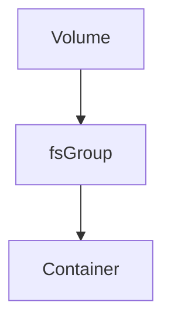
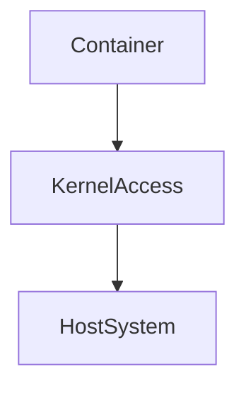
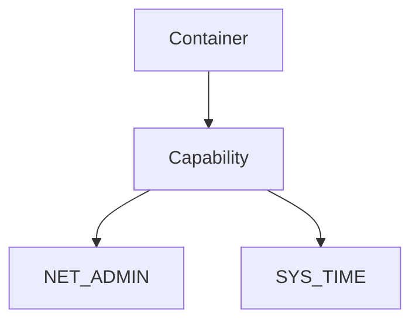
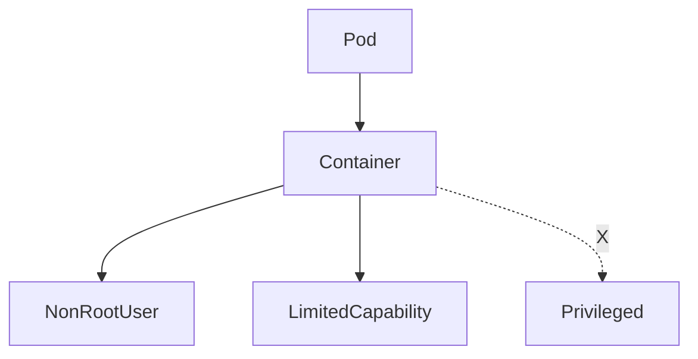

## ☸️ Kubernetes Security Context

Kubernetes에서 컨테이너는 기본적으로 **root 권한으로 실행됩니다.**

이 경우 다음과 같은 보안 문제가 발생할 수 있습니다.

- 컨테이너 취약점 발생 시 시스템 장악 가능
- 호스트 커널 접근 위험
- 파일 권한 문제

이를 제어하기 위한 기능이 **Security Context** 입니다.

Security Context는 **Pod 또는 Container 수준에서 보안 설정을 정의**할 수 있습니다.

---

## Security Context Architecture

```mermaid
graph TD

A[Pod]

B[Security Context]

C[Container]

D[Process User]

E[Kernel Access]

B --> C
C --> D
C --> E
````

Security Context는 다음을 제어합니다.

* 사용자 UID / GID
* 파일 권한
* Linux Capability
* Privileged 모드

---

## 컨테이너 기본 권한 문제

기본적으로 컨테이너는 **root 권한으로 실행됩니다.**

```mermaid
graph TD

Container --> RootProcess
RootProcess --> SystemAccess
```

이 경우 컨테이너 취약점이 발생하면

* 파일 시스템 접근
* 네트워크 설정 변경
* 커널 기능 접근

등이 가능해집니다.

---

## runAsUser

`runAsUser`는 **컨테이너 프로세스의 UID를 지정**합니다.

예

```yaml
apiVersion: v1
kind: Pod

metadata:
  name: runas-demo

spec:
  securityContext:
    runAsUser: 1000
    fsGroup: 1000

  containers:
  - name: app
    image: node:18
```

이 설정은

* 컨테이너 프로세스를 **UID 1000 사용자로 실행**
* 파일 권한도 해당 사용자로 생성

---

## Security Context 적용 범위

Security Context는 두 가지 범위에서 적용할 수 있습니다.

| 적용 위치     | 설명          |
| --------- | ----------- |
| Pod       | 모든 컨테이너에 적용 |
| Container | 특정 컨테이너만 적용 |

---

### Pod Level

```yaml
spec:
  securityContext:
    runAsUser: 1000
    fsGroup: 1000
```

Pod 전체에 적용됩니다.

---

### Container Level

```yaml
containers:
- name: app
  image: nginx

  securityContext:
    runAsUser: 1000
```

특정 컨테이너에만 적용됩니다.

---

## fsGroup

`fsGroup`은 **Volume 파일 권한 그룹을 지정**합니다.



예

```yaml
securityContext:
  runAsUser: 1000
  fsGroup: 1000
```

Volume에 생성되는 파일은 해당 그룹으로 설정됩니다.

---

## Privileged Mode

일부 애플리케이션은 **호스트 커널 기능 접근이 필요합니다.**

예

* NFS mount
* Network monitoring
* Device access

이 경우 **Privileged Mode**를 사용할 수 있습니다.

```yaml
securityContext:
  privileged: true
```



하지만 privileged 모드는

⚠️ **보안 위험이 매우 큽니다**

가능하면 사용하지 않는 것이 좋습니다.

---

## Linux Capabilities

Privileged 모드 대신 **Linux Capability**를 사용할 수 있습니다.

Linux Capability는 **필요한 권한만 선택적으로 부여**합니다.

예

```yaml
securityContext:
  capabilities:
    add:
      - NET_ADMIN
      - SYS_TIME
```



대표 Capability

| Capability | 설명        |
| ---------- | --------- |
| NET_ADMIN  | 네트워크 설정   |
| SYS_TIME   | 시스템 시간 변경 |
| SYS_ADMIN  | 시스템 관리    |

---

## Security Context 실무 구조

실제 운영 환경에서는 다음과 같이 설정합니다.



보안 권장 사항

* root 실행 금지
* capability 최소화
* privileged 사용 최소화

---

## Best Practice

운영 환경에서 권장되는 보안 설정

### 1️⃣ Non-root Container

```yaml
securityContext:
  runAsUser: 1000
```

---

### 2️⃣ Privileged 금지

가능하면 privileged 사용하지 않기

---

### 3️⃣ Capability 최소화

필요한 capability만 추가

---

### 4️⃣ Pod Security 정책 적용

* PodSecurity
* OPA Gatekeeper

---

## 정리

Security Context는 Kubernetes 컨테이너 보안을 위한 핵심 기능입니다.

주요 기능

* runAsUser → 컨테이너 사용자 지정
* fsGroup → 파일 권한 설정
* privileged → 커널 권한
* capabilities → 최소 권한 설정

운영 환경에서는

✔ root 사용 금지
✔ privileged 최소화
✔ capability 최소화

전략이 중요합니다.
