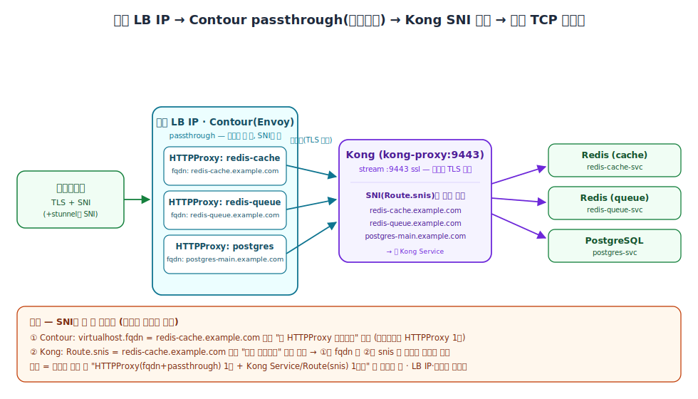

LoadBalancer IP를 하나밖에 못 쓰는 제약에서 여러 TCP 서비스를 도메인으로 노출하는 방법입니다. 핵심은 **Contour(Envoy)가 TLS를 복호화하지 않고(passthrough) SNI만 보고 Kong으로 통째로 넘기고**, 실제 TLS 종단과 세부 라우팅은 Kong이 맡는 구조입니다. 이렇게 하면 **도메인(SNI)이 사실상 "가상 포트" 역할**을 해서, 고정된 IP·포트 하나 위에서 백엔드를 계속 늘릴 수 있습니다.

> 전제: Envoy LoadBalancer IP가 제한적(예: 최대 2개)이라 **단일 IP로 운용**해야 하고, 사용자는 **도메인으로 Redis·DB 같은 TCP 서비스**에 접속하려는 상황입니다.

---

## 🧅 TLS passthrough란?

**TLS passthrough는 게이트웨이가 TLS를 복호화하지 않고, 암호화된 채로 뒤 백엔드에 그대로 흘려보내는 방식**입니다. 봉투에 비유하면 이렇습니다.

- **TLS termination(종단)**: 게이트웨이가 봉투를 **뜯어서** 복호화합니다 → 게이트웨이에 인증서가 필요합니다.
- **TLS passthrough**: 봉투를 **안 뜯고**, 겉면의 수신인 이름(**SNI**)만 보고 봉인된 채로 뒤로 넘깁니다.

즉 Contour(Envoy)는 복호화하지 않고 **SNI만 보고 "이건 Kong으로"** 흘려보내며, **실제 TLS 종단은 뒤의 Kong**이 담당합니다.

### 왜 termination이 아니라 passthrough여야 하나?

**SNI는 봉투 겉면(TLS 핸드셰이크의 ClientHello)에 실려 있기 때문**입니다. 만약 Contour가 봉투를 뜯어(termination) 버리면 그 **SNI 정보가 Kong까지 도달하지 못하고**, Kong의 SNI 기반 라우팅이 깨집니다. passthrough여야 **원본 SNI가 Kong까지 살아서 도착**해, Kong이 그 값으로 백엔드를 고를 수 있습니다.

---

## 🔧 단일 구성 (실제로 쓴 형태)

**Contour의 `HTTPProxy`에 `passthrough: true`와 `tcpproxy`를 함께 지정**하면 됩니다. `virtualhost.fqdn`이 SNI 매칭 기준이 되고, 매칭된 연결은 봉투째 `kong-proxy`로 넘어갑니다.

```yaml
apiVersion: projectcontour.io/v1
kind: HTTPProxy
metadata:
  name: redis-cache
spec:
  virtualhost:
    fqdn: redis-cache.example.com      # SNI 매칭 기준
    tls:
      passthrough: true                # 봉투 안 뜯음 (인증서 불필요)
  tcpproxy:
    services:
      - name: kong-proxy               # 봉투째 Kong으로 전달
        port: 9443
```

### 왜 `routes`가 아니라 `tcpproxy`인가?

**passthrough면 복호화를 안 하므로 HTTP 경로·헤더를 볼 수 없기 때문**입니다. 경로 기반 `routes`는 복호화가 전제라 쓸 수 없고, "SNI만 보고 통째로 TCP 전달"하는 `tcpproxy`를 씁니다. 그래서 **`tls.passthrough: true` ↔ `tcpproxy`는 항상 짝**으로 갑니다(둘 중 하나만 있으면 동작하지 않습니다).

Kong 쪽은 stream 리스너 `:9443 ssl`을 열고 Route에 `protocols: [tls]` + `snis`를 설정해 TLS를 종단한 뒤 백엔드로 분배합니다 — 이 부분은 [Kong으로 TCP/TLS 서비스 외부 노출하기](/kubernetes/networking/kong-gateway-tcp-tls-sni-loadbalancer/) 글을 참고하세요.

---

## 📈 확장 구조 — 넓히는 건 양쪽 끝, 가운데는 고정

**핵심은 "가운데(LB IP·포트)는 고정하고, 양쪽 끝(도메인)만 늘린다"** 입니다. 도메인마다 Contour `HTTPProxy` 1개와 Kong `Service`+`Route` 1세트를 더할 뿐, LB IP와 포트(9443)는 건드리지 않습니다.



- **Contour**: 도메인마다 `HTTPProxy` 1개(각 `fqdn` + `passthrough` + `tcpproxy` → `kong-proxy`). 전부 같은 `kong-proxy`로 모읍니다.
- **Kong**: 봉투째 받아 TLS를 종단한 뒤 **`Route.snis`로 최종 분배**합니다. 도메인마다 `Service`+`Route` 1세트를 둡니다.

예시 매핑은 이렇습니다.

| 도메인(SNI) | Contour HTTPProxy | Kong Service |
|---|---|---|
| `redis-cache.example.com` | `redis-cache` | `redis-cache-svc` |
| `redis-queue.example.com` | `redis-queue` | `redis-queue-svc` |
| `postgres-main.example.com` | `postgres` | `postgres-svc` |

이 구조에서 **도메인(SNI)이 곧 "가상 포트"** 역할을 합니다. 물리 포트는 9443 하나지만, SNI로 사실상 무한히 많은 서비스를 구분할 수 있습니다.

---

## ⚠️ 가장 중요한 함정 — SNI가 두 번 쓰인다

**이 구조에서 SNI(도메인)는 서로 다른 두 지점에서 각각 매칭에 쓰입니다.** 이 둘이 어긋나면 연결이 끊깁니다.

1. **Contour**가 `virtualhost.fqdn`으로 **1차 매칭** — "이 연결이 이 HTTPProxy 담당인가"
2. **Kong**이 `Route.snis`로 **2차 분배** — "복호화했더니 어느 백엔드로 보내야 하나"

즉 **①의 `fqdn`과 ②의 `snis`가 같은 도메인**이어야 클라이언트부터 백엔드까지 끝까지 연결됩니다. 하나라도 오타나 불일치가 있으면 **"Contour는 넘겼는데 Kong이 못 가르는"** 증상이 나옵니다 — Contour 로그엔 정상 전달로 보이는데 Kong에서 매칭 실패로 끊기므로 원인 파악이 헷갈립니다.

---

## ➕ 백엔드 추가 절차

백엔드 하나를 추가할 때 하는 일은 **도메인 한 쌍을 양 끝에 더하는 것뿐**입니다.

1. **Contour**: `HTTPProxy` 1개 추가 (`fqdn: redis-c.example.com`, `passthrough: true`, `tcpproxy` → `kong-proxy`)
2. **Kong**: `Service` + `Route`(`snis: redis-c.example.com`) 1세트 추가
3. **LB IP·포트(9443)는 그대로** — 도메인만 늘어납니다.

---

## 🧯 실무 주의점

- **passthrough 리스너 공존**: `HTTPProxy`가 여러 개여도 같은 passthrough 리스너를 공유합니다(SNI로 갈리니 서로 충돌하지 않습니다). 다만 같은 IP에서 **HTTP termination 서비스와 포트를 함께 쓰면** 부딪힐 수 있으니 포트 설계를 확인하세요.
- **클라이언트가 SNI를 못 보낼 때**: Redis 같은 평문 TCP 클라이언트가 TLS SNI를 실어 보내지 못하면, 여전히 **`stunnel` 등으로 클라이언트 쪽에서 SNI를 부여**해야 합니다. 이건 Contour·Kong과 무관한 클라이언트 측 한계입니다.
- **YAML은 반드시 버전 관리**: `fqdn` ↔ `snis` 짝이 늘어날수록 관리 부담이 커집니다. 네이밍 규칙(도메인·리소스명 일관성)을 정하고 Git으로 관리하세요. 특히 Kong CRD는 삭제 시 커스텀 리소스가 연쇄 삭제될 수 있으니 백업·검토 후 반영합니다.

---

## ❓ 자주 묻는 질문

**Q. Contour에 인증서를 넣어야 하나요?**
아니요. passthrough는 복호화를 안 하므로 **Contour에는 인증서가 필요 없습니다.** TLS 종단은 뒤의 Kong이 하니 인증서는 Kong 쪽에 둡니다.

**Q. 왜 `tcpproxy`를 쓰고 `routes`는 못 쓰나요?**
passthrough면 암호문을 그대로 넘기므로 HTTP 경로·헤더를 볼 수 없습니다. 경로 기반 `routes`는 불가능하고, SNI만 보고 통째로 넘기는 `tcpproxy`만 됩니다.

**Q. 서비스가 늘어나면 LB IP나 포트도 늘려야 하나요?**
아니요. **IP·포트는 9443 하나로 고정**이고, 도메인(SNI)만 추가합니다. SNI가 가상 포트 역할을 하기 때문입니다.

**Q. 연결이 안 되는데 어디부터 봐야 하나요?**
먼저 **Contour의 `fqdn`과 Kong의 `Route.snis`가 완전히 같은 도메인인지** 확인하세요. 가장 흔한 원인입니다. 그다음 Kong stream 리스너(`:9443 ssl`)와 SNI 라우팅을 점검합니다.

---

## 📚 참고

- [Contour 공식 문서 — TLS passthrough / TCPProxy](https://projectcontour.io/docs/)
- [Kong — TCP/TLS proxying & stream_listen](https://developer.konghq.com/gateway/traffic-control/proxying/)
- [Kong — Route 엔티티(protocols·snis)](https://developer.konghq.com/gateway/entities/route/)
- [Kong — SNI 엔티티(인증서-호스트네임 매핑)](https://developer.konghq.com/gateway/entities/sni/)
- [KIC 튜토리얼 — Proxy TCP traffic over TLS by SNI](https://developer.konghq.com/kubernetes-ingress-controller/routing/tcp-by-sni/)
- [Kong charts values.yaml — proxy.stream(ssl)](https://github.com/Kong/charts/blob/main/charts/kong/values.yaml)
- 관련 글: [Kong으로 TCP/TLS 서비스 외부 노출하기 (LoadBalancer + SNI)](/kubernetes/networking/kong-gateway-tcp-tls-sni-loadbalancer/) · [Ingress에서 Gateway API HTTPRoute로](/kubernetes/networking/kubernetes-ingress-to-gateway-api-httproute/)
