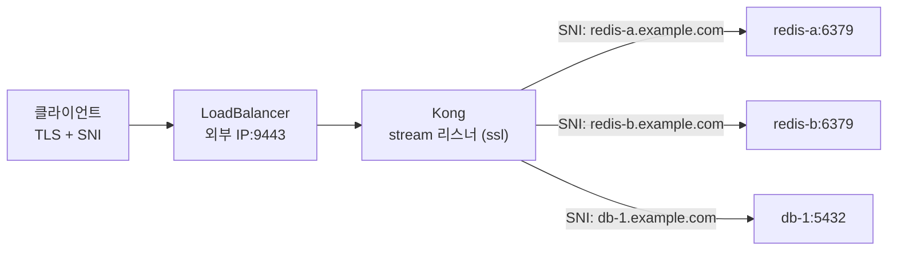
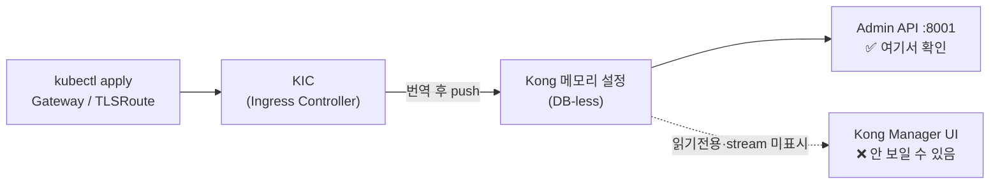
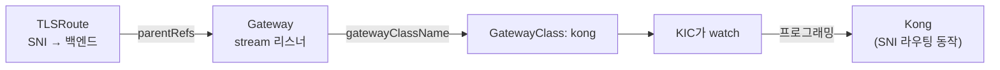
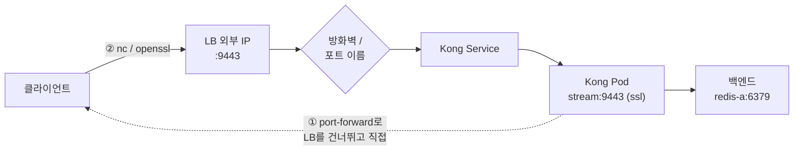

Kubernetes에서 Redis·DB 같은 **순수 TCP 서비스를 도메인으로 외부 노출**하려면, Kong의 **stream 리스너 + SNI**를 쓰면 됩니다. 이 글에서는 **LoadBalancer로 받은 포트 하나(예: 9443)에서 SNI(도메인)로 여러 TCP/TLS 백엔드를 분배**하는 구성을, Helm values부터 Gateway API(TLSRoute) 매니페스트, 그리고 **에러 메시지가 바뀌며 원인을 좁혀가는 디버깅 과정**까지 실무 관점으로 다룹니다.

핵심 아이디어 한 줄: **"포트 하나로 다 받고, SNI로 백엔드를 가른다."** LB에 노출된 포트가 몇 개뿐이어도 백엔드는 수십 개가 가능합니다.



---

## 🧭 무엇을 하려는가

**목표는 "HTTP가 아닌 TCP 서비스"를 도메인 기반으로 외부에 여는 것**입니다. Ingress·HTTPRoute는 HTTP(L7) 전용이라 Redis·PostgreSQL 같은 raw TCP에는 쓸 수 없습니다. 대신 Kong의 **stream(L4) 리스너**에 TLS를 얹고, **TLS ClientHello의 SNI**로 어느 백엔드인지 가릅니다.

- **입력**: 클라이언트가 `redis-a.example.com:9443`으로 TLS 접속(SNI에 도메인 실림).
- **Kong**: 9443 stream 리스너에서 TLS를 처리하고, **SNI를 보고** `redis-a` 서비스로 연결.
- **결과**: LB 포트 하나(9443)로 **여러 백엔드를 도메인별 분배**.

> 💡 전제: **외부 IP를 자동 할당하는 LoadBalancer**가 이미 제공되는 환경(클라우드 LB, MetalLB 등). 없으면 NodePort로도 되지만 이 글은 LoadBalancer 기준입니다.

---

## 🆚 tls 리스너 vs stream 리스너 (가장 헷갈리는 지점)

**Kong values에서 `proxy.tls`와 `proxy.stream`은 완전히 다른 계층**입니다. 이걸 혼동하면 raw TCP를 HTTPS 리스너에 물리는 실수를 합니다.

| 구분 | `proxy.tls` | `proxy.stream` |
|---|---|---|
| 계층 | **L7 (HTTP over TLS = HTTPS)** | **L4 (raw TCP/UDP)** |
| 하는 일 | TLS 해제 후 **HTTP 요청**을 호스트·경로로 라우팅 | HTTP가 아닌 **바이트 스트림**을 그대로 전달 |
| 라우팅 기준 | Host 헤더·경로 | **SNI**(또는 포트) |
| 용도 | 웹 API, 웹사이트 | **Redis·DB·gRPC-raw 등 TCP** |
| Gateway API 라우트 | HTTPRoute | **TLSRoute / TCPRoute** |

**Redis·DB를 외부로 낼 때 필요한 건 `stream` 쪽**입니다. 그리고 stream 포트에 `ssl`을 얹어야 **SNI 기반 TLS 스트림 라우팅**이 됩니다.

> HTTP(S) 서비스라면 이 글이 아니라 [Ingress → Gateway API HTTPRoute 전환](/kubernetes/networking/gateway-api/kubernetes-ingress-to-gateway-api-httproute/)이나 [Gateway API HTTP→HTTPS 리다이렉트](/kubernetes/networking/gateway-api/kubernetes-gateway-api-http-to-https-redirect/)를 참고하세요.

---

## 🔀 Gateway API 버전: TCPRoute·TLSRoute는 지금 어디에?

**이 영역은 빠르게 바뀝니다.** L4 라우트(TLSRoute·TCPRoute·UDPRoute)는 오랫동안 experimental이었고, 최근에야 단계적으로 GA로 승격됐습니다.

| 리소스 | Standard(GA) 채널 승격 | 비고 |
|---|---|---|
| **TLSRoute** | **Gateway API v1.5** (2026-02) | `v1`로 안정화 |
| **TCPRoute / UDPRoute** | **Gateway API v1.6** | 그 전(v1.5 포함)까진 experimental |

> ⚠️ **핵심 함정**: 업스트림 스펙이 GA여도 **Kong(KIC)이 그 버전을 따라왔는지가 관건**입니다. 현재 Kong Ingress Controller는 TLSRoute·TCPRoute·UDPRoute를 **`v1alpha2` API 그룹 + `GatewayAlpha` 피처 게이트 + experimental CRD**로 다룹니다. 즉 **스펙상 Standard여도 Kong에서는 여전히 experimental 채널이 필요**할 수 있습니다.

### 지금 내 클러스터는 어떤 상태인가? (확인 명령)

```bash
# 설치된 Gateway API 번들 버전
kubectl get crd gateways.gateway.networking.k8s.io \
  -o jsonpath='{.metadata.annotations.gateway\.networking\.k8s\.io/bundle-version}'

# TLSRoute/TCPRoute CRD가 제공하는 버전 (v1이 보이면 GA본, v1alpha2뿐이면 experimental)
kubectl get crd tlsroutes.gateway.networking.k8s.io -o jsonpath='{.spec.versions[*].name}'
kubectl get crd tcproutes.gateway.networking.k8s.io -o jsonpath='{.spec.versions[*].name}'
```

experimental 리소스를 쓰려면 **experimental 번들 설치 + 컨트롤러 피처 게이트**가 필요합니다.

```bash
# experimental 채널 CRD 설치 (TCPRoute/UDPRoute/TLSRoute 포함)
kubectl apply -f https://github.com/kubernetes-sigs/gateway-api/releases/download/v1.6.0/experimental-install.yaml
```

```yaml
# KIC values 발췌 — 컨트롤러에 GatewayAlpha 피처 게이트 활성화
controller:
  ingressController:
    env:
      feature_gates: "GatewayAlpha=true"
```

> ⚠️ **업그레이드 주의**: v1.4 이하의 experimental TLSRoute가 있는 상태에서 v1.5 standard를 덮어 설치하면, 기존 리소스가 `v1alpha2`로 저장돼 못 쓰게 될 수 있습니다. 기존 클러스터를 올릴 땐 마이그레이션 경로를 먼저 확인하세요.

Kong 설치 자체가 처음이라면 [Kong Ingress Controller 설치 (Gateway API)](/kubernetes/networking/gateway-api/kubernetes-install-kong-ingress-controller/)를 먼저 보고 오세요.

---

## 🛠️ Kong 설치 (Helm): NodePort → LoadBalancer + stream 리스너

**LoadBalancer 타입으로 바꾸고, stream 리스너를 추가하고, TLS 포트에 `ssl`을 얹는 것**이 핵심입니다. 예전 NodePort 흔적(`nodePort: 30054` 등)은 걷어냅니다.

```yaml
# kong values.yaml 발췌
proxy:
  type: LoadBalancer          # NodePort → LoadBalancer (외부 IP 자동 할당)
  http:
    enabled: true
    servicePort: 80
    containerPort: 8000
  tls:                        # = HTTPS(L7) 리스너
    enabled: true
    servicePort: 443
    containerPort: 8443
  stream:                     # = raw TCP/TLS(L4) 스트림 리스너
    - containerPort: 9000
      servicePort: 9000
      protocol: TCP           # 평문 TCP
    - containerPort: 9443
      servicePort: 9443
      protocol: TCP
      parameters:
        - "ssl"               # ★ 이 포트를 TLS 리스너로 → SNI 라우팅의 필수 조건
```

포인트를 정리하면:

- **`nodePort` 삭제** → LoadBalancer가 포트를 자동 할당. 클라이언트는 `LB외부IP:9443`으로 접속.
- **`servicePort`** = 외부 접속 포트. `containerPort` = Kong 파드 내부 포트.
- **`parameters: ["ssl"]`** = 그 stream 포트를 TLS로 처리(SNI를 읽을 수 있게 됨). **이게 빠지면 Kong이 그 포트를 평문 TCP로 취급**해 TLS 클라이언트와 미스매치가 납니다.

> 💡 `parameters`에는 `ssl` 외에 `proxy_protocol`, `reuseport`, `backlog=N` 등도 넣을 수 있고, Kong 내부의 `KONG_STREAM_LISTEN`에 자동 반영됩니다. 환경변수를 `kubectl set env`로 직접 넣으면 **다음 helm 배포 때 덮여 사라지므로**, 반드시 values의 `parameters`를 쓰세요.

배포:

```bash
helm upgrade --install kong kong/kong -n kong --create-namespace -f values.yaml
```

---

## 🚪 Gateway + TLSRoute로 SNI 분배 구성

**Gateway에 stream 리스너를 선언하고, TLSRoute로 SNI(도메인) → 백엔드를 매핑**합니다. 리스너 프로토콜은 TLS입니다.

### 1️⃣ GatewayClass & Gateway

```yaml
apiVersion: gateway.networking.k8s.io/v1
kind: Gateway
metadata:
  name: kong
  namespace: kong
spec:
  gatewayClassName: kong
  listeners:
    - name: stream9443           # ★ 이 이름이 Service 포트 이름과 정렬돼야 함(함정 ②)
      port: 9443
      protocol: TLS
      hostname: "*.example.com"  # SNI 와일드카드
      tls:
        mode: Terminate          # Kong이 TLS 종료 후 SNI로 백엔드 분배
        certificateRefs:
          - kind: Secret
            name: wildcard-example-com-tls
      allowedRoutes:
        kinds:
          - kind: TLSRoute
        namespaces:
          from: All
```

- **`mode: Terminate`** — Kong이 TLS를 풀고(인증서 필요) SNI로 백엔드를 고른 뒤 평문으로 전달.
- **`mode: Passthrough`** — Kong은 복호화하지 않고 SNI만 보고 그대로 백엔드로 흘림(백엔드가 TLS를 직접 처리). 백엔드 TLS를 유지해야 하면 이쪽.
- 인증서 Secret은 [cert-manager](/kubernetes/networking/gateway-api/kubernetes-cert-manager-pki-tls/)로 발급·관리하면 편합니다.

### 2️⃣ TLSRoute (SNI → 백엔드)

```yaml
apiVersion: gateway.networking.k8s.io/v1alpha2   # Kong은 아직 v1alpha2 (버전 확인!)
kind: TLSRoute
metadata:
  name: redis-a
  namespace: kong
spec:
  parentRefs:
    - name: kong
      sectionName: stream9443     # 위 Gateway 리스너 이름과 일치
  hostnames:
    - "redis-a.example.com"       # 이 SNI로 온 트래픽만
  rules:
    - backendRefs:
        - name: redis-a           # 대상 Service
          port: 6379
```

**백엔드를 하나 더 늘리려면 TLSRoute만 추가**하면 됩니다(같은 리스너에 `redis-b.example.com` → `redis-b:6379`). 포트는 그대로 9443 하나입니다.

> 평문 TCP(포트별 분배, SNI 불필요)만 필요하면 `protocol: TCP` 리스너 + **TCPRoute**를 씁니다. 이땐 도메인이 아니라 **포트로만** 구분됩니다.

---

## 🖥️ 적용은 됐는데 Kong Manager UI엔 안 보일 때

**결론부터: Gateway·GatewayClass 리소스는 반드시 필요합니다.** TLSRoute·TCPRoute가 SNI로 실제 동작한다는 것 자체가 **Gateway가 존재하고 KIC가 그 설정을 Kong에 반영했다는 증거**입니다. Kong Manager UI에서 조회되지 않는 건 "Gateway가 안 쓰여서"가 아니라, **KIC의 DB-less 구조상 Manager가 설정을 제대로 보여주지 못하기 때문**입니다. 즉 **"조회 안 됨 ≠ 설정 안 됨"** 입니다.

### 왜 Manager UI엔 안 보이나? — DB-less 표시 한계

**Kong Ingress Controller(KIC)는 Kong을 DB-less 모드로 운영**합니다. 이 모드에서 Kong Manager는:

- **읽기 전용** — 엔티티 생성/수정/삭제 불가, 개요(Summary) 화면의 엔티티 카운터도 정상 동작하지 않습니다.
- 설정이 **데이터베이스가 아니라 메모리**에 있고, KIC가 K8s 리소스(TLSRoute·Gateway 등)를 Kong 엔티티로 **번역해 런타임에 push**합니다.
- 특히 **stream(TCP/TLS) 라우트**는 UI가 잘 시각화하지 못합니다.

그래서 **Manager UI는 "진실의 소스"가 아닙니다.** 실제 반영 여부는 아래처럼 **Admin API**로 확인해야 합니다.



### 그럼 Gateway CRD는 왜 필요한가? — "붙을 곳"이 있어야 함

**TLSRoute는 혼자 존재할 수 없습니다.** `parentRefs`로 **반드시 어떤 Gateway에 붙고**, 그 Gateway가 `kong` GatewayClass를 가리켜야 KIC가 집어서 Kong에 프로그래밍합니다. **Gateway가 없으면 라우트는 고아(orphan)** 가 되어 아무 일도 일어나지 않습니다. 지금 SNI가 동작한다면, 이미 `kubectl get gateway`에 무언가 잡혀 있을 것입니다.



### 실제로 반영됐는지 확인하기 (Admin API)

Manager UI 대신 **리소스 상태 + Admin API** 로 확인합니다.

```bash
# 1) Gateway/GatewayClass가 실제로 있는지 — 있으면 이미 Gateway를 쓰는 중
kubectl get gatewayclass
kubectl get gateway,tlsroute,tcproute -A

# 2) 라우트가 Gateway에 정상 attach 됐는지 (status.parents의 conditions)
kubectl get tlsroute redis-a -n kong -o yaml | yq '.status.parents'
#   Accepted=True, ResolvedRefs=True 면 정상 반영 (Programmed/Attached 확인)

# 3) Kong에 실제로 들어갔는지 — Manager UI가 아니라 Admin API(:8001)로
kubectl exec -n kong deploy/kong-kong -c proxy -- \
  curl -s localhost:8001/routes | jq '.data[] | {name, protocols, snis}'
#   → protocols가 ["tls"] 또는 ["tcp"], snis에 redis-a.example.com 이 보이면 정상

kubectl exec -n kong deploy/kong-kong -c proxy -- \
  curl -s localhost:8001/services | jq '.data[] | {name, protocol, host, port}'
#   → 백엔드 Service가 Kong Service로 번역돼 있는지 확인
```

> 💡 파드·컨테이너 이름은 차트 버전에 따라 다릅니다(`kong-kong` / 컨테이너 `proxy` 등). `kubectl get pods -n kong`으로 실제 이름을 먼저 확인하세요. Admin API는 보안상 `localhost`에만 바인딩되는 경우가 많아 **`kubectl exec`로 파드 내부에서** 호출하는 게 안전합니다.

### 예외: Gateway 없이 TCP를 여는 유일한 길 — TCPIngress

Gateway API CRD 없이 TCP/TLS를 노출하는 방법이 딱 하나 있는데, Kong 네이티브 **`TCPIngress` CRD**(Gateway API가 아닌 Kong 전용 리소스)입니다. 이걸 쓰면 GatewayClass·Gateway가 필요 없습니다. 다만 **Kong에 종속적**이라 이식성이 떨어지므로, 표준 Gateway API(TLSRoute·TCPRoute)를 쓰는 이 글 구성에서는 **Gateway가 필수**입니다.

---

## ⚠️ 핵심 함정 3가지 (직접 겪은 것)

### ① stream 리스너에 `ssl`이 없으면 → TLS 미스매치

클라이언트는 TLS로 접속하는데 Kong이 그 포트를 평문으로 받으면, "봉투를 엽서로 읽으려다" 깨집니다. 대표 증상은 **`ssl: packet length too long`**. → stream 리스너에 **`parameters: ["ssl"]`** 로 해결.

### ② Gateway 리스너 이름 ↔ Service 포트 이름 불일치

- Gateway listener 이름: `stream9443`
- Helm이 만든 Service 포트 이름: `stream-9443`

이 둘이 **어긋나면 Gateway가 리스너를 실제 포트에 못 묶어** 연결이 성립하지 않습니다. 이름을 맞춰야 합니다(필요 시 Service/Deployment를 patch해 포트 이름 정렬).

```bash
# Service의 실제 포트 이름 확인
kubectl get svc -n kong kong-kong-proxy -o jsonpath='{.spec.ports[*].name}'; echo
```

### ③ LoadBalancer IP 접속은 방화벽/보안그룹을 넘어야 함

포트포워딩(Pod 직접)은 되는데 **LB IP로만 안 되면**, 십중팔구 경로상의 방화벽입니다. 해당 포트(9443)의 **인바운드 허용**을 확인하세요. (실제 사례의 최종 원인이 이것이었습니다.)

---

## 🔎 디버깅: 에러가 바뀌면 한 단계 전진한 것

**이 문제의 핵심 교훈은 "에러 메시지가 바뀐다는 건 한 홉 앞으로 갔다는 신호"** 라는 점입니다. 실제로 겪은 순서:

| 단계 | 증상 | 의미 | 조치 |
|---|---|---|---|
| 1 | `ssl_connect: ... connection abort` | 연결이 **도달조차 못 함** | 방화벽/포트 인바운드 열기 |
| 2 | `ssl: packet length too long` | 연결은 됨, **프로토콜 미스매치**(평문 vs TLS) | stream `parameters: ["ssl"]` |
| 3 | `timeout` | 응답 없음, **대상/경로 어긋남** | Gateway↔Service **포트 이름 정렬**, 백엔드 endpoints 확인 |
| ✅ | 연결 성공 | — | 방화벽 + ssl + 포트 이름, **셋 다** 맞아야 |

### 홉 단위로 격리해 좁히기

**"어느 홉에서 깨졌나"를 격리로 좁히는 것**이 가장 빠릅니다. 아래 경로에서 **한 홉씩 끊어 테스트**합니다.



```bash
# (1) Kong 자체가 정상인지 — LB를 건너뛰고 Pod에 직접
kubectl port-forward -n kong <kong-pod> 9443:9443
openssl s_client -connect 127.0.0.1:9443 -servername redis-a.example.com
#  → 되면 Kong은 정상, 문제는 LB 경로

# (2) LB IP로 TCP부터 (TLS 이전 단계)
nc -vz <LB_IP> 9443
#  → 안 되면 방화벽/포트 미노출, 되면 TLS 단계 문제

# (3) LB IP로 TLS 핸드셰이크 + SNI
openssl s_client -connect <LB_IP>:9443 -servername redis-a.example.com
```

**포트포워딩은 되는데 LB만 안 되면**, 문제는 항상 **LB ↔ Kong 사이**(방화벽 / 포트 이름 / PROXY protocol)로 좁혀집니다.

> 💡 클라이언트가 SNI를 못 보내는 도구라면(일부 DB 클라이언트), 로컬에 **stunnel** 등을 두고 SNI를 부여해 Kong으로 보낼 수 있습니다.

---

## ✅ 검증 체크리스트

```bash
# 외부 IP·포트가 제대로 노출됐는지 (EXTERNAL-IP 실제 값, PORT(S)에 9443)
kubectl get svc -n kong

# 백엔드 Pod가 실제로 잡혀 있는지 (비어 있으면 timeout의 흔한 원인)
kubectl get endpoints -n kong

# 리스너 반영됐는지 (patch 후 롤아웃)
kubectl rollout status deploy/kong-kong -n kong
```

- [ ] `proxy.type: LoadBalancer`, `nodePort` 제거, `servicePort` 지정
- [ ] stream 리스너에 `parameters: ["ssl"]` (SNI용 TLS)
- [ ] Gateway 리스너 이름 ↔ Service 포트 이름 일치
- [ ] LB IP의 해당 포트 방화벽 인바운드 허용
- [ ] (클라이언트가 SNI 못 보내면) stunnel 등으로 SNI 부여
- [ ] Gateway API CRD 채널/버전과 **Kong 지원 버전**(GatewayAlpha·v1alpha2) 확인

---

## 📐 규모별 변형

규모에 따라 달라지는 지점만 모으면 다음과 같습니다. 기본 전제는 **LoadBalancer가 제공되는 환경**입니다.

| 구분 | 대규모(기본) | 소규모/개인 |
|---|---|---|
| 외부 노출 | 클라우드 LB / MetalLB | NodePort로도 가능 |
| 리스너 | stream 포트 하나 + SNI 다중 백엔드 | 포트 몇 개면 TCPRoute 포트 분배도 무방 |
| 인증서 | cert-manager 자동 발급·갱신 | 수동 Secret도 가능 |
| Gateway API | experimental 관리·버전 고정 운영 | 최신 실험 채널 그대로 |

> 💡 소규모에서 백엔드가 2~3개뿐이고 도메인 구분이 필요 없으면, **SNI 없이 포트별 TCPRoute**가 더 단순합니다. SNI 분배는 "포트는 아끼고 백엔드는 많이"가 필요할 때 빛납니다.

---

## 🤔 언제 무엇을 쓰나

**"HTTP냐 아니냐", "도메인으로 가르냐 포트로 가르냐"** 두 축으로 결정됩니다.

| 상황 | 선택 |
|---|---|
| HTTP/HTTPS API·웹 | **HTTPRoute** (이 글 아님 → [HTTPRoute 전환 글](/kubernetes/networking/gateway-api/kubernetes-ingress-to-gateway-api-httproute/)) |
| TCP 서비스를 **도메인별로** 한 포트에서 분배 | **stream(ssl) + TLSRoute + SNI** (이 글) |
| TCP 서비스를 **포트별로** 분배(도메인 불필요) | **stream(TCP) + TCPRoute** |
| 백엔드 TLS를 그대로 유지(종단간 암호화) | TLSRoute **Passthrough** |
| Kong이 TLS 종료 후 평문 전달 | TLSRoute **Terminate** |
| gRPC의 L4/L7 로드밸런싱이 고민 | [gRPC L4/L7 로드밸런싱 글](/kubernetes/networking/grpc/kubernetes-grpc-l4-l7-load-balancing/) |

---

## ❓ 자주 묻는 질문

**Q. Ingress로 Redis·DB를 외부에 못 여나요?**
Ingress·HTTPRoute는 HTTP(L7) 전용이라 raw TCP는 안 됩니다. TCP는 stream 리스너 + TCPRoute/TLSRoute를 써야 합니다.

**Q. `packet length too long` 에러는 왜 나나요?**
클라이언트는 TLS인데 Kong stream 포트가 평문(ssl 없음)이라 생기는 프로토콜 미스매치입니다. `parameters: ["ssl"]`을 추가하세요.

**Q. 포트포워딩은 되는데 LB IP로만 안 됩니다.**
문제는 LB↔Kong 사이입니다. 대개 **방화벽/보안그룹 인바운드**(해당 포트 미개방)나 **포트 이름 불일치**입니다.

**Q. 왜 포트 하나(9443)에서 여러 백엔드가 되나요?**
TLS ClientHello의 **SNI(도메인)** 로 Kong이 백엔드를 고르기 때문입니다. 백엔드를 늘려도 LB 포트는 그대로입니다.

**Q. Terminate와 Passthrough 중 뭘 쓰나요?**
Kong에서 TLS를 풀고 평문으로 전달하면 **Terminate**, 백엔드까지 암호화를 유지하려면 **Passthrough**입니다.

**Q. TLSRoute를 apply했는데 인식이 안 됩니다.**
Kong은 아직 `v1alpha2` + `GatewayAlpha` 피처 게이트 + experimental CRD가 필요할 수 있습니다. CRD 버전과 컨트롤러 피처 게이트를 확인하세요.

**Q. kubectl로 TLSRoute를 적용했고 동작도 하는데 Kong Manager UI엔 안 보입니다. Gateway가 필요 없는 건가요?**
아닙니다. KIC는 Kong을 **DB-less**로 운영해 Manager UI가 읽기 전용이고 stream 라우트를 잘 표시하지 못할 뿐, 설정은 정상 반영돼 있습니다. TLSRoute가 붙을 대상인 **Gateway·GatewayClass는 반드시 필요**합니다(없으면 라우트가 고아가 되어 동작 자체가 안 됩니다). 확인은 Manager가 아니라 `kubectl get gateway,tlsroute`와 Kong **Admin API(`:8001`)** 로 하세요. 자세한 내용은 [적용은 됐는데 Manager UI엔 안 보일 때](#-적용은-됐는데-kong-manager-ui엔-안-보일-때) 참고.

**Q. 클라이언트가 SNI를 못 보냅니다.**
로컬에 stunnel 등을 두고 SNI를 부여해 Kong으로 전달하면 됩니다.

---

## 📚 참고

- [Kong 차트 values.yaml (`stream[].parameters`)](https://github.com/Kong/charts/blob/main/charts/kong/values.yaml)
- [Kong Ingress Controller — Gateway API](https://developer.konghq.com/kubernetes-ingress-controller/gateway-api/)
- [Kong Gateway 설정 레퍼런스 (`stream_listen`)](https://developer.konghq.com/gateway/configuration/)
- [Gateway API — Getting started (릴리스 채널)](https://gateway-api.sigs.k8s.io/guides/getting-started/introduction/)
- [Gateway API v1.5: Moving features to Stable (TLSRoute → Standard)](https://kubernetes.io/blog/2026/04/21/gateway-api-v1-5/)
- [Gateway API — TCP routing 가이드](https://gateway-api.sigs.k8s.io/guides/user-guides/tcp/)
- 관련 글: [Kong Ingress Controller 설치 (Gateway API)](/kubernetes/networking/gateway-api/kubernetes-install-kong-ingress-controller/)
- 관련 글: [Ingress → Gateway API HTTPRoute 전환](/kubernetes/networking/gateway-api/kubernetes-ingress-to-gateway-api-httproute/)
- 관련 글: [Gateway API로 HTTP→HTTPS 리다이렉트](/kubernetes/networking/gateway-api/kubernetes-gateway-api-http-to-https-redirect/)
- 관련 글: [Kubernetes cert-manager로 PKI·TLS 인증서 관리](/kubernetes/networking/gateway-api/kubernetes-cert-manager-pki-tls/)
