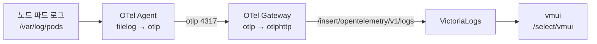

OpenTelemetry Collector를 Helm으로 설치할 때 핵심은 **`mode`(daemonset/deployment)에 따라 receiver·exporter·pipeline을 정확히 나누는 것**이고, 폐쇄망에서는 여기에 **이미지 경로와 TLS·Secret을 사내 기준으로 덮어쓰는 작업**이 더해집니다. Agent는 `filelog`로 노드 로그를 긁어 Gateway로 보내고, Gateway는 `otlp`로 받아 VictoriaLogs의 `/insert/opentelemetry/v1/logs`로 내보냅니다. 설치 후에는 Grafana 없이도 **vmui(`/select/vmui`)로 적재를 즉시 검증**할 수 있습니다. 이 글은 **"OTel + VictoriaLogs 로그 스택" 시리즈 3편(설치편)** 으로, [1편(개념편)](/observability/opentelemetry/otel-collector-agent-gateway-architecture/)의 Agent/Gateway 구조와 [2편(백엔드편)](/observability/opentelemetry/kubernetes-victorialogs-cluster-helm-install/)에서 세운 VictoriaLogs 위에 **실전 values.yaml**을 얹습니다.

## 🧭 설치 전 체크리스트

본격적인 설치 전에, 폐쇄망에서 자주 막히는 지점부터 점검합니다.

- [ ] **contrib 이미지**를 사내 레지스트리에 미러했는가? **태그를 `0.x`로 고정**(latest 금지)했는가?
- [ ] VictoriaLogs(또는 vmauth)의 **적재 엔드포인트 주소**를 확보했는가?
- [ ] `logging` **네임스페이스**를 만들었는가? (백엔드 자체 구축은 별도 편)
- [ ] **설치 순서가 Gateway → Agent** 인지 인지하고 있는가?

> 💡 마지막 항목이 가장 흔한 실수입니다. Agent가 Gateway보다 먼저 뜨면 Agent가 보낼 대상(4317)이 없어 `connection refused`가 반복됩니다.

---

## 🎯 왜 contrib 이미지인가

**로그 수집에는 반드시 `opentelemetry-collector-contrib` 이미지를 써야 합니다.** `filelog` receiver와 `k8sattributes` processor가 contrib 배포판에만 포함되기 때문입니다. k8s 배포판(`opentelemetry-collector-k8s`)은 컴포넌트가 제한되어 로그 파일 수집에 부적합합니다.

| 구분 | contrib | k8s(core) |
|---|---|---|
| 바이너리명(`command.name`) | `otelcol-contrib` | `otelcol-k8s` |
| `filelog` receiver | ✅ 포함 | ❌ 제외 |
| `k8sattributes` processor | ✅ 포함 | ✅ 포함 |
| 용도 | 로그 파일 수집 | 메트릭·이벤트 중심 |

- 공식 배포처: `ghcr.io/open-telemetry/opentelemetry-collector-releases/opentelemetry-collector-contrib`
- 폐쇄망은 이 이미지를 **사내 레지스트리로 미러**한 뒤 `image.repository`를 덮어씁니다.

---

## 📦 폐쇄망 이미지 준비

**인터넷이 되는 PC에서 contrib 이미지를 받아 사내 레지스트리로 push**하고, values에서 `image.repository`를 사내 경로로 지정합니다.

```bash
# 외부 반입용 (인터넷 가능 PC)
docker pull ghcr.io/open-telemetry/opentelemetry-collector-releases/opentelemetry-collector-contrib:0.1xx.x

docker tag ghcr.io/open-telemetry/opentelemetry-collector-releases/opentelemetry-collector-contrib:0.1xx.x \
  <사내레지스트리>/otel-collector-contrib:0.1xx.x

docker push <사내레지스트리>/otel-collector-contrib:0.1xx.x
```

> ⚠️ 태그는 `0.1xx.x`처럼 **명시 버전으로 고정**하세요. `latest`는 차트 버전과 컴포넌트 호환이 깨질 수 있어 폐쇄망에서 특히 위험합니다.

---

## 🧩 Helm 설치 메커니즘: 차트 1개 = 모드 1개

**OTel Collector 차트는 한 번에 하나의 `mode`만 배포합니다.** 즉 Agent(daemonset)와 Gateway(deployment)를 동시에 띄울 수 없어, **같은 차트를 values 2벌로 2회 설치**합니다.

기억할 두 가지 규칙입니다.

1. **설치 순서: Gateway 먼저 → Agent 나중.** Gateway가 4317을 리슨한 뒤 Agent가 붙어야 `connection refused`를 피합니다.
2. **Helm 리스트는 병합되지 않습니다.** `pipelines`의 `receivers`/`processors`/`exporters`는 프리셋이 일부를 주입하더라도 **전체를 명시**해야 안전합니다.

---

## ⚙️ Agent values.yaml (DaemonSet)

**Agent는 `filelog` receiver로 노드의 파드 로그(`/var/log/pods`)를 읽어 Gateway로 보내는 역할**입니다. 노드마다 뜨므로 리소스를 과하게 잡지 않는 것이 중요합니다.

```yaml
# === agent-values.yaml (mode: daemonset) ===
mode: daemonset

image:
  repository: <사내레지스트리>/otel-collector-contrib
  tag: "0.1xx.x"
  pullPolicy: IfNotPresent

command:
  name: otelcol-contrib   # contrib 바이너리명

# 리소스 — 노드마다 뜨므로 과도하게 잡지 말 것
resources:
  requests: { cpu: 100m, memory: 128Mi }
  limits:   { cpu: 500m, memory: 512Mi }

# 보안 컨텍스트 — 로그 파일 읽기 위해 root가 필요할 수 있음(런타임에 따라).
# 가능하면 readOnlyRootFilesystem, drop capabilities 권장.
securityContext:
  runAsUser: 0
  readOnlyRootFilesystem: true
  capabilities:
    drop: ["ALL"]

# 프리셋: 로그 수집 + k8s 메타데이터
presets:
  logsCollection:
    enabled: true               # filelog receiver 자동 생성, /var/log/pods 읽기
    includeCollectorLogs: false # 콜렉터 자기 로그는 제외(루프 방지)
  kubernetesAttributes:
    enabled: true               # namespace/pod/container 라벨 자동 부착

config:
  processors:
    # 메모리 보호 (필수 권장)
    memory_limiter:
      check_interval: 5s
      limit_percentage: 80
      spike_limit_percentage: 25
    batch:
      timeout: 5s
      send_batch_size: 1024
    # env 라벨 (클러스터마다 dev/stg/prod로 변경)
    resource:
      attributes:
        - key: env
          value: prod
          action: upsert
  exporters:
    # Gateway로 전송 (같은 클러스터 내부, OTLP gRPC)
    otlp:
      endpoint: otel-gateway-opentelemetry-collector.logging.svc:4317
      tls:
        insecure: true          # 클러스터 내부 통신. 외부면 Gateway의 TLS 블록 참고
      # 일시 장애 대비 큐/재시도
      sending_queue:
        enabled: true
        queue_size: 1000
      retry_on_failure:
        enabled: true
        initial_interval: 5s
        max_interval: 30s
  service:
    pipelines:
      logs:
        # logsCollection 프리셋이 filelog receiver를 자동 주입하지만,
        # 리스트는 병합 안 되므로 명시적으로 적는 것이 안전
        receivers: [filelog]
        processors: [memory_limiter, k8sattributes, resource, batch]
        exporters: [otlp]
      # 안 쓰는 파이프라인 비활성화
      metrics: null
      traces: null

# filelog는 노드 로그 경로 마운트가 필요.
# 클러스터 보안정책(PSA/admission)에서 hostPath 읽기전용 허용이 필요할 수 있음.
# hostPort는 로그 수집엔 불필요하므로 설정하지 말 것.
```

> 💡 `securityContext.runAsUser: 0`(root)으로 둔 건 컨테이너 런타임이 `/var/log/pods`를 root 권한으로 쓰기 때문입니다. 환경에 따라 non-root로도 읽히니, 보안정책이 엄격하면 먼저 non-root로 시도하고 **로그가 안 읽히면 root로 조정**하세요.

---

## ⚙️ Gateway values.yaml (Deployment)

**Gateway는 Agent들이 OTLP로 보낸 로그를 받아 VictoriaLogs로 최종 적재하는 "출구"** 입니다. 직접 로그를 긁지 않으므로 `logsCollection` 프리셋이 필요 없고, 대신 **TLS·Secret·재시도 큐**가 핵심입니다.

```yaml
# === gateway-values.yaml (mode: deployment) ===
mode: deployment
replicaCount: 2                  # 대규모는 2~3, HA 위해 PodDisruptionBudget도 권장

image:
  repository: <사내레지스트리>/otel-collector-contrib
  tag: "0.1xx.x"
  pullPolicy: IfNotPresent

command:
  name: otelcol-contrib

resources:
  requests: { cpu: 200m, memory: 256Mi }
  limits:   { cpu: "1",  memory: 1Gi }

# Gateway는 직접 로그를 안 긁음
presets:
  kubernetesAttributes:
    enabled: false

# VictoriaLogs 인증/TLS용 Secret을 환경변수로 주입 (예: 베이직 인증 토큰)
extraEnvs:
  - name: VL_AUTH_TOKEN
    valueFrom:
      secretKeyRef:
        name: victorialogs-auth   # 사전 생성한 Secret
        key: token

config:
  receivers:
    otlp:
      protocols:
        grpc:
          endpoint: 0.0.0.0:4317   # Agent가 보냄
        http:
          endpoint: 0.0.0.0:4318
  processors:
    memory_limiter:
      check_interval: 5s
      limit_percentage: 80
      spike_limit_percentage: 25
    batch:
      timeout: 5s
      send_batch_size: 8192        # 대규모는 크게
  exporters:
    otlphttp/victorialogs:
      # VictoriaLogs OTLP 로그 적재 엔드포인트 (검증된 경로)
      logs_endpoint: http://vmauth.logging.svc:8427/insert/opentelemetry/v1/logs
      # 다른 클러스터(dev/stg/prod)면 mgmt 외부 주소 + HTTPS:
      # logs_endpoint: https://<mgmt-vmauth-외부주소>/insert/opentelemetry/v1/logs
      compression: gzip
      headers:
        # 스트림 필드를 제한해 카디널리티 폭발 방지 (실무 권장)
        VL-Stream-Fields: "k8s.namespace.name,k8s.pod.name,env"
        # 인증이 필요하면 Secret에서 주입한 토큰 사용
        Authorization: "Bearer ${VL_AUTH_TOKEN}"
      # 외부(클러스터 간) 전송 시 TLS 적용 예시
      tls:
        insecure: false
        # 사내 CA 신뢰가 필요하면 ca_file 지정 (ConfigMap/Secret로 마운트)
        ca_file: /etc/otel/certs/ca.crt
      sending_queue:
        enabled: true
        queue_size: 5000
      retry_on_failure:
        enabled: true
        initial_interval: 5s
        max_interval: 30s
        max_elapsed_time: 300s
  service:
    pipelines:
      logs:
        receivers: [otlp]
        processors: [memory_limiter, batch]
        exporters: [otlphttp/victorialogs]
      metrics: null
      traces: null

# 외부 클러스터에서 이 Gateway로 OTLP를 받게 노출할 때 (선택):
# 1) Service(LoadBalancer/NodePort) 또는
# 2) Gateway API(HTTPRoute) / Ingress 로 4317(gRPC)·4318(http) 노출.
# gRPC(4317)는 L7 Ingress에서 h2c 설정이 필요할 수 있으니 주의.
ingress:
  enabled: false   # 기본 비활성. 외부 수신이 필요할 때만 켜고 아래 참고 섹션대로 설정
```

핵심은 **exporter 선택**입니다. Agent → Gateway 구간은 `otlp`(gRPC), Gateway → VictoriaLogs 최종 적재는 `otlphttp`의 **`logs_endpoint`** 키를 씁니다.

---

## 🔐 TLS / Secret은 어떻게 적용하나

**클러스터 내부 통신은 `insecure: true`로 단순화할 수 있지만, 클러스터 간(외부)으로 나갈 때는 TLS와 인증을 적용**하는 것이 안전합니다.

**1) 인증 토큰 Secret 사전 생성**

```bash
kubectl create secret generic victorialogs-auth \
  --from-literal=token='<적재용-토큰>' -n logging
```

생성한 Secret은 Gateway values의 `extraEnvs`로 주입되어 exporter `headers`의 `Authorization: "Bearer ${VL_AUTH_TOKEN}"`에서 사용됩니다.

**2) 사내 CA 인증서 마운트**

사내 CA로 서명된 백엔드라면 `ca.crt`를 ConfigMap/Secret으로 만들고 차트의 `extraVolumes`/`extraVolumeMounts`로 `/etc/otel/certs`에 마운트한 뒤, exporter `tls.ca_file`에 경로를 지정합니다.

---

## 🌐 외부 노출: Ingress vs Gateway API

**같은 클러스터 안이면 노출이 필요 없습니다**(Service ClusterIP로 충분). 다른 클러스터에서 이 Gateway로 직접 보내야 할 때만 노출합니다.

| 방식 | HTTP(4318) | gRPC(4317) |
|---|---|---|
| **Service** | LoadBalancer/NodePort | LoadBalancer/NodePort |
| **Ingress** | 일반 Ingress 가능 | 백엔드 프로토콜을 **h2c/GRPC**로 지정해야 함(컨트롤러별 annotation 상이) |
| **Gateway API** | HTTPRoute | **GRPCRoute**가 적합 |

> 💡 **실무 단순화**: 클러스터 간 전송은 Gateway가 능동적으로 "보내는" 방향입니다. 따라서 외부 수신 노출은 중앙(mgmt)의 VictoriaLogs(vmauth) 쪽만 하면 되고, 각 클러스터의 Gateway는 노출하지 않아도 되는 경우가 많습니다.

---

## 🚀 설치 (순서가 중요)

**반드시 Gateway를 먼저 설치해 4317을 리슨시킨 뒤 Agent를 설치**합니다.

```bash
kubectl create namespace logging

# 1) Gateway 먼저
helm install otel-gateway ./opentelemetry-collector-<차트버전>.tgz \
  -f gateway-values.yaml -n logging
kubectl -n logging rollout status deploy/otel-gateway-opentelemetry-collector

# 2) Agent 나중
helm install otel-agent ./opentelemetry-collector-<차트버전>.tgz \
  -f agent-values.yaml -n logging
kubectl -n logging get pods -o wide
```



---

## 🔎 vmui로 적재 확인 (Grafana 없이)

**VictoriaLogs 내장 UI인 vmui로 Grafana 연결 전에 적재를 즉시 검증**할 수 있습니다.

```bash
# single-node 예시
kubectl -n logging port-forward svc/<victorialogs-svc> 9428
# 브라우저: http://localhost:9428/select/vmui
# 클러스터 모드면 vlselect(또는 vmauth) 서비스로 포트포워딩 후 /select/vmui
```

vmui의 LogsQL 입력창에서 다음처럼 확인합니다.

```logsql
env:prod
```

```logsql
k8s.namespace.name:<ns>
```

로그가 보이면 파이프라인이 정상입니다. Grafana 데이터소스 연결은 대시보드 편에서 다룹니다.

> ⚠️ 적재·조회 포트는 모드에 따라 다릅니다. **single-node는 본체 `9428`**, **클러스터 모드는 vmauth 진입 `8427`** 입니다(`9427`은 없음). 실제 서비스명·포트는 `kubectl get svc -n <ns>`로 최종 확인하세요(차트 `nameOverride`에 따라 이름이 달라집니다).

---

## 🧪 검증 / 트러블슈팅

설치 후 다음 명령으로 핵심 지점을 점검합니다.

```bash
# 렌더링 이미지 경로가 사내 레지스트리로 바뀌었는지
helm template x ./opentelemetry-collector-<차트버전>.tgz -f agent-values.yaml | grep 'image:'

# Agent가 노드 수만큼 떴는지
kubectl -n logging get daemonset

# Gateway 로그에서 export 성공/실패 확인
kubectl -n logging logs deploy/otel-gateway-opentelemetry-collector | grep -i export
```

**자주 겪는 문제와 원인**

| 증상 | 원인 | 해결 |
|---|---|---|
| `ImagePullBackOff` | ghcr 경로를 사내로 안 덮어씀 | `image.repository` 확인 |
| `connection refused` | Agent를 Gateway보다 먼저 설치 | **Gateway 먼저** 재설치 |
| `401/403` | VL 인증 토큰/헤더 누락 | Secret·`Authorization` 헤더 확인 |
| 조회 급격히 느려짐 | 카디널리티 과다 | `VL-Stream-Fields`로 스트림 필드 제한 |

---

## 📐 대규모 vs 소규모, 무엇이 다른가

규모에 따라 달라지는 점만 한곳에 모으면 다음과 같습니다. 이 글의 기본 전제는 **대규모(Gateway 경유)** 입니다.

| 구분 | 대규모(기본) | 소규모/개인 |
|---|---|---|
| Gateway | 사용(replica 2~3) | 생략 |
| Agent exporter 목적지 | Gateway(`otlp:4317`) | VictoriaLogs(`otlphttp` `logs_endpoint`) 직결 |
| `batch.send_batch_size` | 크게(8192) | 기본값 |
| TLS/Secret | 클러스터 간 TLS·인증 적용 | 내부 `insecure` 허용 |
| 외부 노출 | 필요 시 Ingress/Gateway API | 불필요 |

> 💡 **소규모라면 Gateway values를 아예 만들지 마세요.** `agent-values.yaml`의 `exporters`를 `otlphttp/victorialogs`(`logs_endpoint` 직결)로 바꾸고, pipeline의 `exporters`도 그것으로 교체하면 됩니다. single-node 적재 주소는 `http://<victorialogs>:9428/insert/opentelemetry/v1/logs` 입니다.

---

## ❓ 자주 묻는 질문

**Q. exporter는 `otlp`와 `otlphttp` 중 뭘 쓰나요?**
Gateway로 보낼 땐 `otlp`(gRPC), VictoriaLogs로 최종 적재할 땐 `otlphttp`의 `logs_endpoint`를 씁니다.

**Q. VictoriaLogs 적재 주소가 뭔가요?**
`/insert/opentelemetry/v1/logs` 입니다. single-node는 `9428`, 클러스터(vmauth)는 `8427` 포트입니다.

**Q. 로그를 Grafana 없이 보고 싶어요.**
vmui(`/select/vmui`)로 바로 조회됩니다. 적재 검증은 Grafana 연결 전에 vmui로 하는 것이 빠릅니다.

**Q. 라벨이 너무 많아 조회가 느려요.**
`VL-Stream-Fields` 헤더로 스트림 필드를 `namespace/pod/env` 등 핵심만 남기세요. VictoriaLogs는 기본적으로 모든 resource 라벨을 스트림 필드로 취급해 카디널리티가 폭발할 수 있습니다.

**Q. 인증은 어떻게 하나요?**
Secret으로 토큰을 만들어 `extraEnvs`로 주입하고, exporter `headers`의 `Authorization`에서 사용합니다.

**Q. Agent와 Gateway를 한 번에 설치할 수 없나요?**
없습니다. 차트 1개당 `mode` 1개라, 같은 차트를 values 2벌로 2회 설치합니다.

---

## 🧭 시리즈: OTel + VictoriaLogs 로그 스택

- **1편** — [OpenTelemetry 개념과 Agent/Gateway 구조](/observability/opentelemetry/otel-collector-agent-gateway-architecture/)
- **2편** — [VictoriaLogs 클러스터 구축](/observability/opentelemetry/kubernetes-victorialogs-cluster-helm-install/)
- **3편 (현재)** — 폐쇄망 Helm 설치 + values 완벽 설정
- **4편** — [멀티클러스터 중앙집중](/observability/opentelemetry/otel-multicluster-central-logging/)

이 편의 한 줄 요약: **"`mode`에 따라 receiver/exporter/pipeline이 갈린다 — Agent는 `filelog→otlp`, Gateway는 `otlp→otlphttp`."** 폐쇄망에서는 이미지 경로 덮어쓰기, `memory_limiter`·재시도 큐·TLS·Secret·`VL-Stream-Fields`가 안정 운영의 필수 요소이며, 설치 직후 vmui로 적재를 검증하면 됩니다.

---

## 📚 참고

- [VictoriaLogs — OpenTelemetry 데이터 적재](https://docs.victoriametrics.com/victorialogs/data-ingestion/opentelemetry/)
- [Getting started with OpenTelemetry — VictoriaMetrics](https://docs.victoriametrics.com/guides/getting-started-with-opentelemetry/)
- [opentelemetry-collector Helm chart — GitHub](https://github.com/open-telemetry/opentelemetry-helm-charts/tree/main/charts/opentelemetry-collector)
- [Collector Configuration — OpenTelemetry](https://opentelemetry.io/docs/collector/configuration/)
- [Kubernetes Collector Components — OpenTelemetry](https://opentelemetry.io/docs/kubernetes/collector/components/)
- 관련 글: [OpenTelemetry 개념과 Agent/Gateway 구조 (시리즈 1편)](/observability/opentelemetry/otel-collector-agent-gateway-architecture/)
- 관련 글: [Kubernetes에서 OTel Collector로 로그 수집하기](/observability/opentelemetry/kubernetes-otel-collector-logging/)
