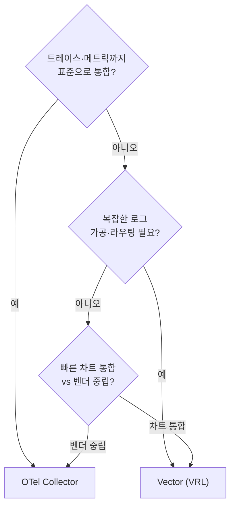

OpenTelemetry Collector와 Vector는 **둘 다 쿠버네티스 로그를 수집해 VictoriaLogs로 보내는 검증된 선택지**이고, 구조(agent + 중앙 집계)도 거의 같습니다. 갈림길은 **표준성·확장**(OTel: CNCF 표준, 트레이스·메트릭 통합)과 **가공 유연성·도입 편의**(Vector: VRL, 차트 통합)입니다. **정답은 하나가 아니며**, 우선순위가 표준·확장이면 OTel, 복잡한 가공·빠른 통합이면 Vector가 맞습니다. 이 글은 **"OTel + VictoriaLogs 로그 스택" 시리즈의 비교편**으로, [OTel 트랙](/observability/opentelemetry/otel-collector-agent-gateway-architecture/)과 [Vector 트랙](/observability/opentelemetry/kubernetes-vector-log-pipeline-concept/)을 닫으며 **선택 기준**을 정리합니다.

## 🤝 먼저, 공통점부터

**둘은 생각보다 닮았습니다.** 비교는 "무엇이 다른가"보다 "**어떻게** 다른가"의 문제입니다.

- **2단 구성** — 둘 다 노드별 DaemonSet(agent) + 중앙 집계(OTel Gateway / Vector Aggregator)가 가능합니다.
- **K8s 로그 수집** — 둘 다 파드 로그를 읽고 namespace/pod/container 메타데이터를 자동 부착합니다.
- **VictoriaLogs 적재** — 둘 다 VictoriaLogs로 보내고 Grafana·vmui로 조회합니다.
- **단일 도구 멀티 역할** — 둘 다 같은 이미지/바이너리가 수집·집계 역할을 겸하고, 모드만 다릅니다.

> 💡 **목적지는 같습니다.** 둘 다 VictoriaLogs로 잘 갑니다. 그래서 선택은 "되느냐"가 아니라 "무엇을 더 중요하게 보느냐"의 문제입니다.

---

## ⚙️ 설정 방식: preset vs customConfig

**시작하는 손맛이 다릅니다.** OTel은 preset으로 빠르게 출발하고, Vector는 설정을 직접 조립합니다.

| 항목 | OpenTelemetry Collector | Vector |
|---|---|---|
| 시작 방식 | **preset**(`logsCollection`·`kubernetesAttributes`)으로 간편 | `customConfig`에 직접 정의 |
| 구성 단위 | receivers / processors / exporters | sources / transforms / sinks |
| 부분 오버라이드 | 가능(preset + 일부 config) | **불가** — `customConfig` 쓰면 전체 명시 |
| 함정 | Helm 리스트 비병합(전체 명시 권장) | **Helm/Vector 템플릿 문법 충돌**(이스케이프 필요) |

- OTel은 preset만 켜도 `filelog`·`k8sattributes`가 자동 구성돼 **첫 수집이 빠릅니다**.
- Vector는 `customConfig`로 **모든 흐름을 명시적으로 통제**하지만, 그만큼 처음 작성량이 많습니다.

---

## 📤 VictoriaLogs 적재 경로가 다르다

**진입 프로토콜이 다릅니다.** 둘 다 클러스터 모드에서는 vmauth(8427)를 경유하지만, 적재 경로가 갈립니다.

| 수집기 | 적재 방식 | 엔드포인트 |
|---|---|---|
| **OTel** | otlphttp exporter (**OTLP 네이티브**) | `/insert/opentelemetry/v1/logs` |
| **Vector** | elasticsearch sink (전용 sink 없음) | `/insert/elasticsearch/` |

- OTel은 **OTLP 네이티브 경로**로 보냅니다(표준 그대로).
- Vector는 **VictoriaLogs 전용 sink가 없어** elasticsearch(또는 http jsonline) 호환 sink를 씁니다. 대신 Vector는 **VictoriaLogs 차트의 기본 수집기**로 포함돼 통합이 매끄럽습니다.

---

## 🧬 로그 가공: processor vs VRL

**가장 큰 차별점입니다.** 정해진 조합이냐, 자유로운 언어냐의 차이입니다.

- **OTel processor** — 정해진 processor를 조합합니다. **표준적이고 예측 가능**하지만, 복잡한 비정형 파싱에는 한계가 있습니다.
- **Vector VRL** — 표현 언어로 **파싱·필터·라우팅을 자유롭게** 작성하고, 에러 처리가 컴파일 타임에 강제돼 안전합니다. **복잡한 로그 정제가 잦다면 편합니다**.

> 💡 비정형 로그를 구조화하고 조건별로 라우팅하는 작업이 많다면 Vector VRL이 손에 잘 맞습니다. 반대로 표준 메타데이터 부착·배치 정도면 OTel processor로 충분합니다. (어느 쪽이 "우월"한 게 아니라, **가공 요구의 복잡도**가 갈림길입니다.)

---

## 🌐 표준성과 확장: CNCF vs Datadog

**미래 확장 방향이 다릅니다.**

| 관점 | OpenTelemetry Collector | Vector |
|---|---|---|
| 출신 | **CNCF 표준** | Datadog 제작(오픈소스) |
| 중립성 | 벤더 중립·이식성 | 다양한 source/sink |
| 데이터 모델 | OTLP(logs·metrics·traces 통합) | 통합 이벤트 모델(로그 중심으로 강력) |
| 확장 | **트레이스·메트릭까지 한 파이프라인** | 로그 가공 파이프라인으로 강력 |

- 나중에 **트레이스·메트릭까지 표준으로 통합**할 계획이면 OTel이 자연스럽습니다(같은 OTLP 파이프라인 확장).
- 지금 **로그 가공·라우팅**이 핵심이고 빠른 차트 통합을 원하면 Vector가 빠릅니다.

---

## ⚡ 성능·운영

**둘 다 프로덕션에서 충분히 빠릅니다.** 절대 수치로 줄 세우기보다, **자기 워크로드로 검증**하는 것이 맞습니다.

- **Vector** — Rust·단일 바이너리, GC 없는 예측 가능한 메모리. `vector top`/`vector validate` 등 운영 도구가 잘 갖춰져 있습니다.
- **OTel** — Go 기반으로 견고하고 생태계가 넓습니다. GC 오버헤드가 있지만 대부분의 프로덕션에서 병목은 아닙니다.

> ⚠️ **성능은 환경마다 다릅니다.** 로그량·필드 수·가공 복잡도에 따라 결과가 갈리므로, **대표 워크로드로 직접 벤치마크**하세요. "어느 쪽이 항상 빠르다"는 단정은 위험합니다.

---

## 🧭 그래서 뭘 골라야 하나

**우선순위를 정하면 선택이 따라옵니다.** 아래 표에 자기 상황을 대입해 보세요.

| 우선순위 | 추천 |
|---|---|
| 벤더 중립·CNCF 표준 | **OTel** |
| 향후 트레이스·메트릭 통합 | **OTel** |
| 복잡한 로그 파싱·라우팅 | **Vector** |
| 차트 통합으로 빠른 도입 | **Vector** |
| 단순 수집 → 적재 | **둘 다**(팀 친숙도로 결정) |

---

## 🚫 하지 말 것: 섞기

**한 파이프라인에서 OTel agent + Vector aggregator처럼 혼용하지 마세요.** 한 생태계로 통일하는 것이 안전합니다.

- 프로토콜·설정·데이터 모델이 달라 **운영·디버깅이 복잡**해집니다.
- 수집기를 Vector로 정하면 집계도 Vector, OTel로 정하면 집계도 OTel로 맞추세요.

---

## 📐 규모 관점

규모에 따라 무게중심이 달라지는 점만 모으면 다음과 같습니다.

| 구분 | 대규모 | 소규모/개인 |
|---|---|---|
| 결정 요인 | 표준·확장·가공 요구가 **명확** → 우선순위로 결정 | **도입 속도**가 중요 |
| 흔한 선택 | 우선순위에 따라 OTel/Vector | 차트 통합 편한 쪽 또는 **익숙한 쪽** |
| 구성 | 어느 쪽이든 2단(agent + 집계) | agent 직결로 단순화 |

> 💡 소규모에서는 "무엇이 이론적으로 우월한가"보다 **빨리 띄우고 익숙한가**가 더 중요합니다. 대규모로 가면서 표준·가공 요구가 분명해지면 그때 우선순위로 재평가하면 됩니다.

---

## ❓ 자주 묻는 질문

**Q. 둘 중 뭐가 더 빠른가요?**
환경마다 다릅니다. 둘 다 프로덕션에 충분히 빠르니, 대표 워크로드로 직접 검증하세요.

**Q. VictoriaLogs엔 뭐가 더 잘 맞나요?**
둘 다 잘 맞습니다. Vector는 차트 기본 수집기로 통합이 매끄럽고, OTel은 OTLP 네이티브 경로로 적재합니다.

**Q. 나중에 트레이스도 할 계획인데요?**
OTel이 같은 파이프라인 확장에 유리합니다(OTLP로 logs·metrics·traces 통합).

**Q. 로그 가공이 복잡한데요?**
Vector VRL이 유연합니다. 비정형 파싱·조건 라우팅이 잦다면 손에 잘 맞습니다.

**Q. 둘을 섞어 써도 되나요?**
권장하지 않습니다. 한 생태계로 통일하세요.

**Q. 이미 Grafana를 쓰는데 영향이 있나요?**
없습니다. 둘 다 VictoriaLogs → Grafana 조회 경로는 동일합니다.

---

## 🧭 시리즈: OTel + VictoriaLogs 로그 스택

이 시리즈는 같은 백엔드(VictoriaLogs)에 로그를 보내는 두 수집기 트랙과 비교편으로 구성됩니다.

**OTel 트랙**

- **1편** — [OpenTelemetry 개념과 Agent/Gateway 구조](/observability/opentelemetry/otel-collector-agent-gateway-architecture/)
- **2편** — [VictoriaLogs 클러스터 구축](/observability/opentelemetry/kubernetes-victorialogs-cluster-helm-install/)
- **3편** — [폐쇄망 OTel Collector Helm 설치](/observability/opentelemetry/kubernetes-otel-collector-offline-helm-install/)
- **4편** — [멀티클러스터 중앙집중](/observability/opentelemetry/otel-multicluster-central-logging/)

**Vector 트랙** (대안 수집기)

- **1편** — [Vector 개념과 파이프라인 구조](/observability/opentelemetry/kubernetes-vector-log-pipeline-concept/)
- **2편** — [Vector 설치: Agent/Aggregator Helm values](/observability/opentelemetry/kubernetes-vector-agent-aggregator-helm-install/)
- **3편** — [VRL로 로그 가공](/observability/opentelemetry/kubernetes-vector-vrl-log-processing/)

**비교**

- **OTel vs Vector: 어떤 걸 선택할까 (현재)**

**대시보드 트랙**

- **1편** — [조회 개요: Grafana·vmui·Perses](/observability/opentelemetry/victorialogs-log-viewing-grafana-vmui-perses/)
- **2편** — [Grafana 연결: 플러그인·Explore·대시보드](/observability/opentelemetry/grafana-victorialogs-datasource-explore-dashboard/)
- **3편** — [vmui로 LogsQL 탐색](/observability/opentelemetry/victorialogs-vmui-logsql-live-tail/)
- **4편** — [Perses로 코드형 대시보드](/observability/opentelemetry/perses-victorialogs-dashboard-gitops/)

이 편의 한 줄 요약: **"정답은 하나가 아니다 — 표준·확장이면 OTel, 가공·통합 편의면 Vector."** 적재 경로(OTLP vs elasticsearch)·가공(processor vs VRL)·설정(preset vs customConfig)이 핵심 차이이며, 섞지 말고 한 생태계로 통일하고 성능은 워크로드로 검증하세요.

---

## 📚 참고

- [OpenTelemetry Collector — 공식 문서](https://opentelemetry.io/docs/collector/)
- [Vector 공식 문서](https://vector.dev/docs/)
- [VictoriaLogs — OpenTelemetry 적재](https://docs.victoriametrics.com/victorialogs/data-ingestion/opentelemetry/)
- [VictoriaLogs — Vector 적재](https://docs.victoriametrics.com/victorialogs/data-ingestion/vector/)
- [Vector Remap Language(VRL)](https://vector.dev/docs/reference/vrl/)
- [Compare OpenTelemetry Collector vs Vector — OneUptime](https://oneuptime.com/blog/post/2026-02-06-compare-opentelemetry-collector-vs-vector-data-pipelines/view)
- [Benchmarking Kubernetes Log Collectors — VictoriaMetrics](https://victoriametrics.com/blog/log-collectors-benchmark-2026/)
- 관련 글: [OpenTelemetry 개념과 Agent/Gateway 구조 (OTel 트랙 1편)](/observability/opentelemetry/otel-collector-agent-gateway-architecture/)
- 관련 글: [Vector 개념과 파이프라인 구조 (Vector 트랙 1편)](/observability/opentelemetry/kubernetes-vector-log-pipeline-concept/)
