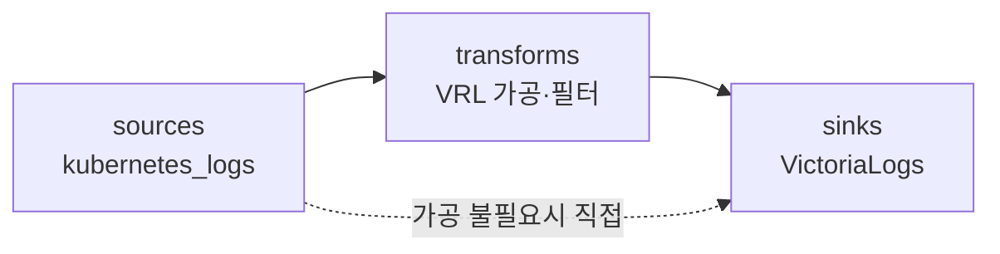
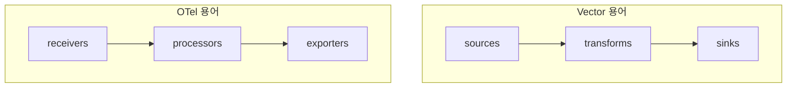

Vector는 Datadog이 만든 **Rust 기반 고성능 로그 파이프라인**으로, 데이터를 **sources → transforms → sinks의 DAG**로 처리합니다. `kubernetes_logs` source로 파드 로그를 수집하고 **elasticsearch 또는 http sink**로 VictoriaLogs에 적재하며, **agent/aggregator 모드**로 OTel과 유사한 2단 구성이 가능합니다. 이 글은 **"OTel + VictoriaLogs 로그 스택" 시리즈의 Vector 트랙 1편(개념편)** 으로, OTel 트랙([개념](/observability/opentelemetry/otel-collector-agent-gateway-architecture/)~[멀티클러스터](/observability/opentelemetry/otel-multicluster-central-logging/))과 **대칭되는 대안 수집기**를 같은 구조로 소개합니다. 설치·VRL은 다음 편으로 미루고, 여기서는 **개념·구조와 OTel과의 대응 관계**에 집중합니다.

## 🚀 Vector란 무엇인가

**Vector는 Datadog이 개발한 벤더 중립 관측 데이터 파이프라인 도구**입니다. Rust로 작성된 **단일 바이너리**로, Fluentd·Logstash보다 메모리를 적게 쓰고 처리량이 높습니다(zero-copy 파싱, adaptive concurrency, end-to-end acknowledgment 등 Rust 네이티브 설계).

- **고성능** — Rust 기반, 낮은 리소스로 높은 처리량.
- **벤더 중립** — Datadog 소유지만 VictoriaLogs·Loki·Elasticsearch·ClickHouse·S3·Kafka 등 다양한 목적지를 지원합니다.
- **검증된 연동** — VictoriaLogs 클러스터 Helm 차트에 **기본 수집기로 포함**되어 있어 연동이 검증돼 있습니다.

---

## 🔧 sources → transforms → sinks (파이프라인 구조)

**Vector는 데이터를 sources → transforms → sinks의 DAG(방향성 비순환 그래프)로 처리**합니다. 각 단계가 명확히 분리돼 있어 흐름을 직관적으로 구성할 수 있습니다.



| 단계 | 역할 | 예시 |
|---|---|---|
| **sources** | 데이터 **수집** | `kubernetes_logs`, `file`, `journald`, `kafka`, `http` |
| **transforms** | 파싱·보강·필터·라우팅·집계 | **VRL**(Vector Remap Language)로 작성 |
| **sinks** | 저장·검색 시스템으로 **전달** | VictoriaLogs, Loki, Elasticsearch, S3 |

- 설정은 **YAML**(TOML/JSON도 지원)로 작성합니다.
- 하나의 source를 **여러 sink로 동시 전송**할 수 있습니다(예: VictoriaLogs + S3 보관).
- transforms가 불필요하면 source → sink로 **바로 연결**해도 됩니다.

---

## 🔄 OTel과 어떻게 대응되나

**Vector와 OTel Collector는 구조가 거의 1:1로 대응**됩니다. OTel 트랙을 읽었다면 용어만 바꿔 이해하면 됩니다.

| 개념 | Vector | OTel Collector |
|---|---|---|
| 수집 | **sources** | receivers |
| 가공 | **transforms** (VRL) | processors |
| 전송 | **sinks** | exporters |
| 노드별 수집 | **agent 모드**(DaemonSet) | Agent(daemonset) |
| 중앙 집계 | **aggregator 모드**(Deployment) | Gateway(deployment) |



즉 Vector도 **"수집 agent + 중앙 aggregator"** 2단 구성이 가능하며, 이는 OTel의 Agent/Gateway 구조와 같은 발상입니다.

> ⚠️ **한 생태계로 통일하세요.** Vector를 쓰면 aggregator도 Vector로 둡니다. Vector agent → OTel Gateway처럼 **섞지 않는** 것이 운영·디버깅에 유리합니다. (Vector와 OTel의 우열 비교는 다음 비교편에서 다룹니다 — 이 편은 대응 관계만.)

---

## 📥 Kubernetes 로그는 어떻게 수집하나

**`kubernetes_logs` source가 노드의 파드 로그를 수집**합니다. OTel의 `filelog` + `k8sattributes`에 해당하는 역할을 한 source가 처리합니다.

- **DaemonSet 배포** — 노드마다 1개씩 떠서 자기 노드의 파드 로그를 읽습니다.
- **메타데이터 자동 부착** — 파드명·네임스페이스·컨테이너명·라벨·노드 정보를 Kubernetes API로 자동 보강합니다.
- **체크포인트** — 읽은 위치를 저장해, 재시작해도 중복 없이 이어 읽습니다(at-least-once의 기반).

특정 로그를 제외하려면 어노테이션·라벨을 사용합니다.

```yaml
# 파드의 특정 컨테이너만 제외
annotations:
  vector.dev/exclude-containers: "sidecar,istio-proxy"
```

```yaml
# 파드/네임스페이스 전체 제외
labels:
  vector.dev/exclude: "true"
```

---

## 📤 VictoriaLogs로 어떻게 보내나 (sink 개념)

**Vector에는 VictoriaLogs 전용 sink가 없습니다.** 대신 VictoriaLogs가 제공하는 호환 엔드포인트로 보내는 **두 가지 범용 sink** 중 하나를 씁니다.

| 방식 | sink type | 엔드포인트 |
|---|---|---|
| **Elasticsearch 호환** | `elasticsearch` | `http://<vl>:9428/insert/elasticsearch/` |
| **JSON 스트림** | `http` | `http://<vl>:9428/insert/jsonline?...` |

개념 수준의 elasticsearch sink 예시입니다(상세 설정은 설치편).

```yaml
sinks:
  vlogs:
    type: elasticsearch
    inputs: [your_input]
    endpoints:
      - http://<victorialogs>:9428/insert/elasticsearch/
    mode: bulk
    api_version: v8
    healthcheck:
      enabled: false        # 초기 셋업 시 권장
    query:
      _msg_field: message     # 메시지 필드명
      _time_field: timestamp  # 시간 필드명
      _stream_fields: host,container_name  # 스트림 필드 (카디널리티 관리)
```

- **`_stream_fields`** — 스트림 필드를 `host`/`namespace`/`container_name` 등 핵심만 지정해 **카디널리티 폭발을 방지**합니다(elasticsearch sink는 `query`에, http sink는 URI 쿼리 파라미터로).
- **`ignore_fields`** — `log.offset`·`event.original` 같은 불필요 필드를 제외합니다.
- **클러스터 모드** — vmauth(8427)를 경유해 `http://<vmauth>:8427/insert/elasticsearch/` 로 보냅니다.

---

## 🧪 Vector의 운영 도구

**Vector는 파이프라인을 다루는 CLI·관측 수단이 잘 갖춰져 있습니다.**

| 도구 | 용도 |
|---|---|
| `vector top` | 실시간 처리량·컴포넌트별 이벤트 수 확인 |
| `vector validate` | 설정 파일 사전 검증 |
| `vector graph` | 토폴로지 다이어그램(DOT) 생성 |

- **자체 메트릭** — `internal_metrics` source → `prometheus_exporter` sink로 노출. 핵심: `vector_component_received_events_total`, `vector_component_sent_events_total`, `vector_component_errors_total`, `vector_buffer_byte_size`.
- **신뢰성** — `buffer.type: disk` + sink별 `acknowledgments`로 다운스트림 장애 시에도 **at-least-once** 전달을 보장합니다.

---

## 📐 대규모 vs 소규모, 무엇이 다른가

규모에 따라 달라지는 점만 한곳에 모으면 다음과 같습니다. 이 글의 기본 전제는 **대규모(agent + aggregator)** 입니다.

| 구분 | 대규모(기본) | 소규모/개인 |
|---|---|---|
| 모드 | agent + aggregator **2단** | agent **직결** |
| sink 목적지 | agent → aggregator → VictoriaLogs | agent → VictoriaLogs 직결 |
| 배포 | DaemonSet + 중앙 Deployment | DaemonSet만 |

> 💡 **소규모라면 aggregator 없이** `kubernetes_logs` source → VictoriaLogs sink **직결**로 충분합니다. 규모가 커지면 중앙에 Vector aggregator를 추가해 2단으로 확장하면 됩니다.

---

## 🤔 언제 Vector를, 언제 OTel을?

**결론부터: 이 편에서는 단정하지 않습니다.** 두 수집기 모두 "수집 → 가공 → 전송" 구조가 같아, 선택은 우선순위에 달려 있습니다. 상세한 우열·선택 기준은 **다음 비교편**에서 다룹니다.

간단한 힌트만 남깁니다.

- **Vector** — 차트 통합 편의, **VRL을 통한 강력한 로그 가공**이 필요할 때.
- **OTel** — **CNCF 벤더 중립 표준**, 트레이스·메트릭까지 한 수집기로 확장이 중요할 때.

---

## ❓ 자주 묻는 질문

**Q. Vector는 OTel과 뭐가 다른가요?**
구조는 유사합니다(수집→가공→전송). Vector는 **VRL 가공**이 강력하고, OTel은 **CNCF 표준**이라는 점이 대표적 차이입니다. 상세 비교는 비교편에서 다룹니다.

**Q. VictoriaLogs 전용 sink가 있나요?**
없습니다. `elasticsearch` sink(`/insert/elasticsearch/`) 또는 `http` sink(`/insert/jsonline`)로 보냅니다.

**Q. 스트림 필드는 왜 중요한가요?**
카디널리티 폭발을 막기 위해서입니다. `_stream_fields`로 `host`/`namespace`/`app` 등 핵심만 스트림 필드로 지정하세요.

**Q. agent와 aggregator를 둘 다 써야 하나요?**
대규모는 권장하지만, 소규모는 agent가 VictoriaLogs로 직결해도 충분합니다.

**Q. Vector와 OTel Gateway를 섞어도 되나요?**
권장하지 않습니다. Vector를 쓰면 aggregator도 Vector로 통일하는 편이 운영·디버깅에 유리합니다.

---

## 🧭 시리즈: OTel + VictoriaLogs 로그 스택

이 시리즈는 같은 백엔드(VictoriaLogs)에 로그를 보내는 두 수집기 트랙으로 구성됩니다.

**OTel 트랙**

- **1편** — [OpenTelemetry 개념과 Agent/Gateway 구조](/observability/opentelemetry/otel-collector-agent-gateway-architecture/)
- **2편** — [VictoriaLogs 클러스터 구축](/observability/opentelemetry/kubernetes-victorialogs-cluster-helm-install/)
- **3편** — [폐쇄망 OTel Collector Helm 설치](/observability/opentelemetry/kubernetes-otel-collector-offline-helm-install/)
- **4편** — [멀티클러스터 중앙집중](/observability/opentelemetry/otel-multicluster-central-logging/)

**Vector 트랙** (대안 수집기)

- **1편 (현재)** — Vector 개념과 파이프라인 구조
- **2편** — [Vector 설치: Agent/Aggregator Helm values](/observability/opentelemetry/kubernetes-vector-agent-aggregator-helm-install/)
- **3편** — [VRL로 로그 가공](/observability/opentelemetry/kubernetes-vector-vrl-log-processing/)

**비교**

- **OTel vs Vector** — [어떤 걸 선택할까](/observability/opentelemetry/kubernetes-otel-collector-vs-vector/)

**대시보드 트랙**

- **1편** — [조회 개요: Grafana·vmui·Perses](/observability/opentelemetry/victorialogs-log-viewing-grafana-vmui-perses/)
- **2편** — [Grafana 연결: 플러그인·Explore·대시보드](/observability/opentelemetry/grafana-victorialogs-datasource-explore-dashboard/)
- **3편** — [vmui로 LogsQL 탐색](/observability/opentelemetry/victorialogs-vmui-logsql-live-tail/)
- **4편** — [Perses로 코드형 대시보드](/observability/opentelemetry/perses-victorialogs-dashboard-gitops/)

이 편의 한 줄 요약: **"Vector는 sources → transforms → sinks의 DAG이고, OTel과 1:1로 대응된다."** `kubernetes_logs`로 수집해 elasticsearch/http sink로 VictoriaLogs에 적재하며, `_stream_fields`로 카디널리티를 관리하고 대규모는 agent + aggregator 2단으로 구성합니다.

---

## 📚 참고

- [Vector 공식 문서](https://vector.dev/docs/)
- [Vector — kubernetes_logs source](https://vector.dev/docs/reference/configuration/sources/kubernetes_logs/)
- [Vector on Kubernetes — 설치](https://vector.dev/docs/setup/installation/platforms/kubernetes/)
- [Vector Remap Language(VRL)](https://vector.dev/docs/reference/vrl/)
- [VictoriaLogs — Vector 데이터 적재](https://docs.victoriametrics.com/victorialogs/data-ingestion/vector/)
- 관련 글: [OpenTelemetry 개념과 Agent/Gateway 구조 (OTel 트랙 1편)](/observability/opentelemetry/otel-collector-agent-gateway-architecture/)
- 관련 글: [VictoriaLogs 클러스터 구축 (백엔드)](/observability/opentelemetry/kubernetes-victorialogs-cluster-helm-install/)
