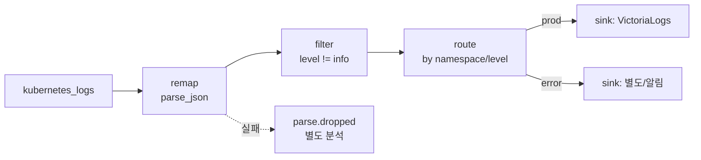

VRL(Vector Remap Language)은 Vector의 핵심 강점으로, **remap 트랜스폼에서 로그를 파싱·보강·필터·정제**합니다. **강타입·에러 안전** 설계라 잘못된 로그 하나가 파이프라인을 망가뜨리지 않으며, `parse_json`·`del`·조건문으로 적재 전 데이터를 원하는 형태로 다듬습니다. 불필요한 **고카디널리티 필드를 제거**해 VictoriaLogs 적재 효율과 쿼리 성능을 함께 끌어올릴 수 있습니다. 이 글은 **"OTel + VictoriaLogs 로그 스택" 시리즈의 Vector 트랙 3편(VRL 심화)** 으로, [1편(개념)](/observability/opentelemetry/kubernetes-vector-log-pipeline-concept/)·[2편(설치)](/observability/opentelemetry/kubernetes-vector-agent-aggregator-helm-install/)에서 다룬 **transforms 단계**를 깊게 파고듭니다.

## 🧬 VRL이란 무엇인가

**VRL(Vector Remap Language)은 관측 데이터(로그·메트릭) 변환 전용으로 설계된 표현 지향 언어**입니다. `remap` 트랜스폼의 `source`에 작성하며, **단일 이벤트 단위**로 동작합니다.

- **강타입·메모리 안전** — 네이티브 Rust 코드로 컴파일되어 런타임 GC 없이 빠르고, 컴파일 타임 타입 검사로 안전합니다.
- **자유로운 가공** — 필드 추가/삭제/변경, 포맷 파싱(JSON 등), 보강, 라우팅·필터 조건 정의까지 "프로그래밍하듯" 다룰 수 있습니다.
- **안전 보장** — Lua 같은 범용 런타임의 유연성을, 성능·안전을 잃지 않고 제공하는 것이 목표입니다.

> 💡 VRL은 OTel Collector의 정해진 processor 조합과 달리 **표현 언어로 자유롭게** 가공한다는 점이 특징입니다. (두 방식의 우열 비교는 다음 비교편에서 다룹니다.)

---

## ✍️ 기본 문법 빠르게 익히기

**VRL의 출발점은 `.`(현재 이벤트)와 `.field`(필드 접근)** 입니다. 중첩 필드는 `.kubernetes.pod_name`처럼 점으로 내려갑니다.

```yaml
transforms:
  modify:
    type: remap
    inputs: [k8s_logs]
    source: |
      del(.user_info)        # 필드 삭제
      .timestamp = now()     # 필드 추가
      .env = "prod"          # 정적 라벨
      .status = to_int!(.status)   # 타입 변환
```

- **할당** — `.new_field = "value"`
- **삭제** — `del(.field)` (삭제와 동시에 값 반환도 가능: `.x = del(.old)`)
- **조건** — `if .duration_ms > 1000 { .slow = true }`
- **불리언 표현식**(필터·라우팅 조건) — `.severity != "info" && .status_code < 400 && exists(.host)`

---

## 🧩 JSON 로그 파싱 (가장 흔한 작업)

**앱이 JSON 로그를 `message`에 문자열로 넣는 경우, `parse_json`으로 구조화**하는 것이 가장 흔한 VRL 작업입니다. 에러 처리 방식이 두 가지인데, 이 차이가 VRL 이해의 핵심입니다.

```yaml
source: |
  # 방식 1: 데이터가 확실하면 ! (실패 시 프로그램 중단)
  . = parse_json!(.message)

  # 방식 2: 안전하게 에러 분기 (권장)
  parsed, err = parse_json(.message)
  if err == null {
    . = merge(., parsed) ?? .
  }

  .status = to_int!(.status)
  .duration = parse_duration!(.duration, "s")
```

- `parse_json!(...)` — `!`는 **실패 시 즉시 중단**(abort). 형식이 보장된 데이터에만 씁니다.
- `parsed, err = parse_json(...)` — **에러를 변수로 받아 분기**. 형식이 들쭉날쭉한 실서비스 로그에 권장합니다.

---

## 🛡️ 에러 안전성 (VRL의 정체성)

**VRL의 가장 큰 차별점은 fallible(실패 가능) 함수의 에러 처리를 컴파일 타임에 강제한다는 것**입니다. 처리하지 않으면 아예 컴파일되지 않아, "런타임에 터지는" 사고를 원천 차단합니다.

핵심 안전 규칙은 다음과 같습니다.

- **`!` 붙이기** — 실패 시 프로그램 중단(abort).
- **에러 캡처** — `result, err = fn(...)`로 받아 안전하게 분기.
- **실패 시 롤백** — VRL 프로그램이 끝까지 실행되지 못하면, **그때까지의 변경은 모두 버려지고 이벤트는 원본 상태로 유지**됩니다.

`remap` 트랜스폼의 에러 옵션으로 실패 이벤트의 행방을 제어합니다.

| 옵션 | 동작 |
|---|---|
| `drop_on_error` | 처리 중 에러난 이벤트를 **드롭** |
| `drop_on_abort` | `abort`된 이벤트를 **드롭** |
| `reroute_dropped` | 드롭된 이벤트를 `<transform_id>.dropped` 출력으로 보내 **별도 분석** |

```yaml
transforms:
  parse:
    type: remap
    inputs: [k8s_logs]
    drop_on_error: false
    reroute_dropped: true   # 실패 이벤트를 parse.dropped로 보냄
    source: |
      ., err = parse_json(.message)
```

---

## 🚦 필터링과 라우팅

**가공만큼 중요한 것이 "무엇을 버리고 어디로 보낼지"** 입니다. 전용 트랜스폼이 따로 있습니다.

**filter** — 조건으로 이벤트를 통과/차단합니다(예: `info` 로그 버리기).

```yaml
transforms:
  drop_info:
    type: filter
    inputs: [parse]
    condition: '.level != "info"'
```

**route** — 조건별로 여러 출력으로 분기해 서로 다른 sink로 보냅니다(예: 에러는 별도 처리·알림).



> 💡 그 외 `throttle`(rate limit), `reduce`(여러 줄 병합 — 스택트레이스 등), `sample`(샘플링), `dedupe`(중복 제거) 트랜스폼도 자주 함께 씁니다.

---

## 🧹 카디널리티 관리 (적재 효율 직결)

**고유값 필드(pod_ip, file 경로, 컨테이너 해시, replicaset id 등)는 스트림 카디널리티를 폭발시킵니다.** VRL의 `del`로 적재 전에 제거하면 VictoriaLogs 적재 효율과 쿼리 성능이 함께 올라갑니다.

```yaml
source: |
  del(.kubernetes.pod_ip)
  del(.file)
  del(.kubernetes.pod_labels)   # 라벨 통째로 무겁다면 제거
  # 꼭 필요한 것만 남김: namespace, pod, container, env
```

이렇게 정제한 필드 중 `namespace`/`container`/`env`처럼 **핵심만 sink의 `_stream_fields`로 지정**합니다(2편 연계). VRL로 제거 → `_stream_fields`로 제한, **2단으로 카디널리티를 관리**하는 것이 정석입니다.

---

## 🧪 VRL 테스트 (배포 전 필수)

**VRL은 대표 샘플 로그로 먼저 검증한 뒤 배포**하는 것이 정석입니다. 운영 파이프라인에 잘못된 VRL을 올리면 대량 이벤트가 드롭될 수 있기 때문입니다.

```bash
# 샘플 로그로 VRL 검증 (CLI)
vector vrl --input sample.json --program transform.vrl --print-object

# 설정 전체 검증
vector validate /etc/vector/vector.yaml
```

- **VRL Playground** — 웹(`playground.vrl.dev`)에서 즉시 실험.
- **`vector vrl` REPL** — 인자 없이 실행해 대화형으로 테스트.
- **unit tests** — Vector 설정에 테스트를 정의해 회귀 방지.

---

## 🏗️ 어디서 가공할까 (agent vs aggregator)

**VRL 문법은 규모와 무관하지만, "어디서 가공하느냐"는 규모에 따라 달라집니다.**

| 가공 위치 | 장점 | 주의 |
|---|---|---|
| **agent**(노드별) | 노드 단계에서 일찍 정제 → **전송량 감소** | 노드 수만큼 실행되어 **무거운 가공은 부하** |
| **aggregator**(중앙) | 중앙 집중 → **일관성·관리 용이** | 전송 후 가공이라 네트워크는 더 씀 |

- **가벼운 라벨링**(`env` 부착 등)은 **agent**에서.
- **무거운 파싱·라우팅**은 **aggregator**에서.

> 💡 소규모(agent 직결)면 가공도 agent에서 합니다. 규모가 커지면 무거운 VRL을 aggregator로 옮기세요. 문법은 그대로라 **위치만 이동**하면 됩니다.

---

## ❓ 자주 묻는 질문

**Q. `parse_json!`의 `!`는 무슨 뜻인가요?**
fallible 함수의 에러를 "실패 시 중단(abort)"으로 처리하라는 표시입니다. 안전하게 하려면 `result, err = parse_json(...)`로 에러를 받아 분기하세요.

**Q. 파싱에 실패한 로그는 어떻게 되나요?**
기본은 **원본 그대로 유지**됩니다. `drop_on_error`/`reroute_dropped`로 드롭하거나 별도 출력으로 보낼 수 있습니다.

**Q. VRL과 OTel processor의 차이는?**
VRL은 **표현 언어로 자유롭게** 가공하고, OTel은 정해진 processor 조합으로 처리합니다. 상세 비교는 비교편에서 다룹니다.

**Q. 카디널리티를 줄이려면?**
`del`로 고유값 필드를 제거하고, sink의 `_stream_fields`를 핵심 필드로 제한하세요(2단 관리).

**Q. 가공은 agent와 aggregator 중 어디서 하나요?**
가벼운 라벨링은 agent, 무거운 파싱·라우팅은 aggregator에서 하는 것이 일반적입니다.

**Q. 배포 전 테스트는 어떻게 하나요?**
`vector vrl` REPL·CLI(`--input`/`--program`)·VRL Playground로 샘플 로그를 먼저 검증하세요.

---

## 🧭 시리즈: OTel + VictoriaLogs 로그 스택

이 시리즈는 같은 백엔드(VictoriaLogs)에 로그를 보내는 두 수집기 트랙으로 구성됩니다.

**OTel 트랙**

- **1편** — [OpenTelemetry 개념과 Agent/Gateway 구조](/observability/opentelemetry/otel-collector-agent-gateway-architecture/)
- **2편** — [VictoriaLogs 클러스터 구축](/observability/opentelemetry/kubernetes-victorialogs-cluster-helm-install/)
- **3편** — [폐쇄망 OTel Collector Helm 설치](/observability/opentelemetry/kubernetes-otel-collector-offline-helm-install/)
- **4편** — [멀티클러스터 중앙집중](/observability/opentelemetry/otel-multicluster-central-logging/)

**Vector 트랙** (대안 수집기)

- **1편** — [Vector 개념과 파이프라인 구조](/observability/opentelemetry/kubernetes-vector-log-pipeline-concept/)
- **2편** — [Vector 설치: Agent/Aggregator Helm values](/observability/opentelemetry/kubernetes-vector-agent-aggregator-helm-install/)
- **3편 (현재)** — VRL로 로그 가공

**비교**

- **OTel vs Vector** — [어떤 걸 선택할까](/observability/opentelemetry/kubernetes-otel-collector-vs-vector/)

**대시보드 트랙**

- **1편** — [조회 개요: Grafana·vmui·Perses](/observability/opentelemetry/victorialogs-log-viewing-grafana-vmui-perses/)
- **2편** — [Grafana 연결: 플러그인·Explore·대시보드](/observability/opentelemetry/grafana-victorialogs-datasource-explore-dashboard/)
- **3편** — [vmui로 LogsQL 탐색](/observability/opentelemetry/victorialogs-vmui-logsql-live-tail/)
- **4편** — Perses 연결 *(예정)*

이 편의 한 줄 요약: **"VRL은 안전하게(에러 강제 처리) 자유롭게 로그를 가공하는 Vector의 핵심 도구다."** `parse_json`으로 구조화하고, `filter`/`route`로 분기하며, `del`로 카디널리티를 관리합니다. 배포 전 `vector vrl`로 반드시 테스트하고, 무거운 가공은 aggregator에서 수행합니다.

---

## 📚 참고

- [Vector Remap Language(VRL)](https://vector.dev/docs/reference/vrl/)
- [remap transform — Vector](https://vector.dev/docs/reference/configuration/transforms/remap/)
- [VRL examples — Vector](https://vector.dev/docs/reference/vrl/examples/)
- [VRL functions — Vector](https://vector.dev/docs/reference/vrl/functions/)
- [VictoriaLogs — Vector 데이터 적재](https://docs.victoriametrics.com/victorialogs/data-ingestion/vector/)
- 관련 글: [Vector 설치: Agent/Aggregator Helm values (Vector 트랙 2편)](/observability/opentelemetry/kubernetes-vector-agent-aggregator-helm-install/)
- 관련 글: [Vector 개념과 파이프라인 구조 (Vector 트랙 1편)](/observability/opentelemetry/kubernetes-vector-log-pipeline-concept/)
