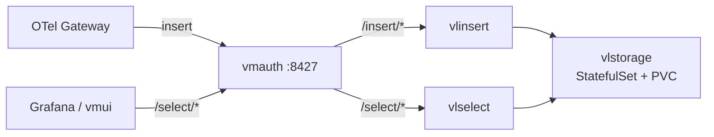

VictoriaLogs 클러스터는 **vlinsert(수집)·vlstorage(저장)·vlselect(쿼리)** 와 진입점 **vmauth** 로 구성되며, 앞의 셋은 **같은 바이너리의 역할 분리**입니다. Helm 차트로 **retention·PVC 크기·vlstorage replica·vmauth** 네 가지만 정하면 대규모 로그 백엔드가 완성됩니다. 모든 적재·쿼리·vmui 접근은 **vmauth(8427) 단일 진입점**으로 통하며, 백엔드 포트는 외부에 직접 노출하지 않습니다. 이 글은 **"OTel + VictoriaLogs 로그 스택" 시리즈 2편(백엔드편)** 으로, [1편(개념편)](/observability/opentelemetry/otel-collector-agent-gateway-architecture/)이 "VictoriaLogs로 보낸다"고 전제했던 **바로 그 백엔드를 실제로 세우는** 글입니다. **백엔드를 먼저 세우고 수집기를 붙이는** 순서이므로, [3편(OTel 설치편)](/observability/opentelemetry/kubernetes-otel-collector-offline-helm-install/) 직전에 읽으면 좋습니다.

## 🧱 VictoriaLogs 클러스터는 무엇으로 구성되나

**VictoriaLogs 클러스터는 3개 컴포넌트 + 프록시로 이뤄집니다.** 핵심은 vlinsert·vlselect·vlstorage가 **동일한 `victoria-logs` 바이너리**이고, 시작 플래그(`-storageNode` 등)로 역할이 갈린다는 점입니다.



| 컴포넌트 | 역할 | 배포 형태 |
|---|---|---|
| **vlinsert** | 적재 요청을 받아 vlstorage들에 **고르게 분산(샤딩)** | Deployment |
| **vlstorage** | 로그를 **저장**(PVC 보유) | StatefulSet |
| **vlselect** | 쿼리를 모든 vlstorage에 **fan-out 후 병합** | Deployment |
| **vmauth** | 적재→vlinsert, 쿼리→vlselect **라우팅·LB·인증** (8427) | Deployment |

> ⚠️ **vlinsert는 로그를 복제(replication)하지 않고 샤딩만 합니다.** 저장 노드에 고르게 분산해 선형 확장은 쉽지만, 노드 장애 시 해당 샤드 데이터는 보호되지 않습니다. HA 복제가 필요하면 `vlagent`로 다중 클러스터에 replicate하는 별도 구성을 씁니다.

---

## 📦 폐쇄망 이미지 준비

**필요한 이미지는 단 두 개** — `victoria-logs`(vlinsert/vlselect/vlstorage 공통 본체)와 `vmauth`입니다. 둘 다 Docker Hub에 있으니 사내 레지스트리로 미러한 뒤 values에서 덮어씁니다.

```bash
docker pull docker.io/victoriametrics/victoria-logs:v1.5x.x
docker pull docker.io/victoriametrics/vmauth:v1.1xx.x

docker tag docker.io/victoriametrics/victoria-logs:v1.5x.x <사내레지스트리>/victoria-logs:v1.5x.x
docker tag docker.io/victoriametrics/vmauth:v1.1xx.x        <사내레지스트리>/vmauth:v1.1xx.x

docker push <사내레지스트리>/victoria-logs:v1.5x.x
docker push <사내레지스트리>/vmauth:v1.1xx.x
```

> ⚠️ `victoria-logs`와 `vmauth`는 **버전 라인이 다릅니다**(victoria-logs는 `v1.5x`대, vmauth는 `v1.1xx`대). 차트가 요구하는 정확한 태그를 `helm template ... | grep 'image:'`로 추출해 **누락·오타 없이 고정**하세요. `latest`는 금지입니다. 차트 tgz도 `helm pull` 또는 GitHub release로 사내망에 반입합니다.

---

## ⚙️ values.yaml (클러스터, 대규모·보안 포함)

**대규모 기준 핵심 설정**입니다. 차트는 `oci://ghcr.io/victoriametrics/helm-charts/victoria-logs-cluster`이며, 폐쇄망은 `global.image.registry`로 사내 레지스트리를 전역 지정합니다.

```yaml
# === vlcluster-values.yaml ===
nameOverride: vlc            # 리소스 이름 63자 제한 회피 (공식 권장)

# 이미지 전역 덮어쓰기 (폐쇄망)
global:
  image:
    registry: <사내레지스트리>

vlstorage:
  replicaCount: 3            # 대규모는 2~3+, 용량·IO 보고 증설
  retentionPeriod: 30d       # 보존기간 (단위 h/d/w/y, 미지정 시 month, 최소 24h)
  persistentVolume:
    enabled: true
    storageClassName: <사내-storageclass>   # 꼭 지정
    size: 100Gi              # 산정은 아래 사이징 섹션 참고
  resources:
    requests: { cpu: "1", memory: 2Gi }
    limits:   { cpu: "2", memory: 4Gi }
  # 저장 노드는 노드/zone 분산 배치 권장
  topologySpreadConstraints: []

vlinsert:
  replicaCount: 2
  resources:
    requests: { cpu: 200m, memory: 256Mi }
    limits:   { cpu: "1", memory: 1Gi }

vlselect:
  replicaCount: 2
  resources:
    requests: { cpu: 200m, memory: 512Mi }
    limits:   { cpu: "2", memory: 2Gi }

vmauth:
  enabled: true              # 진입점/LB/인증 (8427)
  # 인증을 붙이려면 auth config를 Secret/extraArgs로 주입 (아래 보안 섹션)
```

> 💡 `vmauth.enabled: true`로 두면 차트가 vlinsert/vlselect 서비스를 backend discovery(`discover_backend_ips`)로 자동 구성합니다. vlstorage는 StatefulSet으로 떠서 **파드당 PVC 1개**(`{persistentVolume.name}-{podName}`)를 가집니다. HPA `scaleDown`은 데이터 유실 방지를 위해 기본 비활성입니다.

---

## 💾 vlstorage 사이징·retention은 어떻게 잡나

**디스크 크기는 대략 "일일 압축 후 적재량 × retention일수 + 여유"** 로 산정합니다. VictoriaLogs는 압축률이 높지만, 처음엔 보수적으로 잡고 vmui·메트릭으로 실제 증가율을 보며 조정하는 편이 안전합니다.

- **retention** — 환경별 차등이 필요하면 중요 로그는 길게, 디버그는 짧게(고급은 multilevel 또는 별도 인스턴스). 기본은 단일 `retentionPeriod`.
- **PVC 확장** — 사후 확장 가능 여부는 StorageClass의 `allowVolumeExpansion`에 달려 있으니 **미리 확인**하세요.
- **축소 불가** — StatefulSet PVC는 줄이기 어렵습니다.

> 💡 적재량을 모를 땐 **작게 시작 → vmui에서 스트림별 볼륨 확인 → 증설**이 정석입니다. 과대 산정보다 점진 증설이 PVC 특성에 맞습니다.

---

## 🔐 vmauth 인증·TLS

**외부(클러스터 간) 진입이라면 vmauth에 인증·TLS가 필수**입니다. 내부 전용이라도 최소 인증을 권장합니다. **인증 토큰·비밀번호는 Secret으로** 만들어 주입하고, 명령행 인자로 직접 넘기지 않습니다(프로세스 목록 노출 위험).

```bash
kubectl create secret generic vmauth-auth \
  --from-literal=token='<적재·쿼리용-토큰>' -n logging
```

- **TLS** — 보통 vmauth에만 TLS를 적용하고 내부 컴포넌트는 평문으로 둡니다. vmauth의 http 리스너에 인증서 경로를 지정합니다.
- **원칙** — 외부 노출은 **vmauth만**. vlinsert/vlselect/vlstorage는 **외부에 직접 노출 금지**(공식 보안 권장). 모든 외부 진입은 vmauth로 단일화해 인증·HTTPS를 적용합니다.

---

## 🚀 설치

```bash
kubectl create namespace logging

helm install vlc ./victoria-logs-cluster-<차트버전>.tgz \
  -f vlcluster-values.yaml -n logging

# 상태 확인
kubectl -n logging get statefulset,deploy,svc,pvc
kubectl -n logging get pods -o wide
```

**vlstorage StatefulSet의 PVC가 `Bound`이고 파드가 `Running`인지** 확인합니다. PVC가 `Pending`이면 대개 StorageClass 문제입니다.

---

## 🔎 vmui로 동작 확인

**VictoriaLogs 내장 UI인 vmui로 Grafana 없이 즉시 확인**할 수 있습니다.

```bash
kubectl -n logging port-forward svc/vlc-victoria-logs-cluster-vmauth 8427
# 브라우저: http://localhost:8427/select/vmui/
```

아직 수집기를 안 붙였으면 비어 있는 게 정상입니다. LogsQL 맛보기:

```logsql
*
```

```logsql
env:prod
```

> ⚠️ 실제 서비스명은 `nameOverride`에 따라 달라지므로 `kubectl get svc -n logging`으로 최종 확인하세요. 위 예시는 `nameOverride: vlc` 기준입니다.

---

## 🔗 수집기·Grafana 연결 지점

**이 백엔드가 뜨면, 다음은 수집기(OTel)와 Grafana가 붙는 지점만 알면 됩니다.** 모두 vmauth(8427) 단일 진입점을 씁니다.

| 연결 대상 | 주소 |
|---|---|
| OTel Gateway exporter `logs_endpoint` | `http://vlc-victoria-logs-cluster-vmauth.logging.svc:8427/insert/opentelemetry/v1/logs` |
| Grafana 데이터소스 URL (VictoriaLogs 플러그인) | `http://vlc-victoria-logs-cluster-vmauth.logging.svc:8427` |
| vmui | `http://<vmauth>:8427/select/vmui/` |

수집기 설치는 [OTel 설치편](/observability/opentelemetry/kubernetes-otel-collector-offline-helm-install/), Grafana 플러그인 연결은 [VictoriaLogs 데이터소스 설치 글](/observability/grafana/grafana-offline-victorialogs-plugin-install/)에서 이어집니다.

---

## 🧪 검증 / 트러블슈팅

```bash
# 차트가 끌어오는 이미지가 사내 레지스트리로 바뀌었는지
helm template x ./victoria-logs-cluster-<차트버전>.tgz -f vlcluster-values.yaml | grep 'image:' | sort -u

# PVC 바인딩 문제 진단
kubectl -n logging describe pvc

# 저장 노드 로그
kubectl -n logging logs sts/vlc-victoria-logs-cluster-vlstorage
```

| 증상 | 원인 | 해결 |
|---|---|---|
| PVC `Pending` | StorageClass 미지정·부재 | `storageClassName` 확인 |
| 이름 63자 초과 에러 | `nameOverride` 미설정 | `nameOverride: vlc` |
| `ImagePullBackOff` | 사내 레지스트리 미덮어씀 | `global.image.registry` 확인 |
| vmui 접근 불가 | 포트포워딩 대상 서비스명 오류 | `kubectl get svc`로 실제 이름 확인 |

---

## 📐 대규모 vs 소규모, 무엇이 다른가

규모에 따라 달라지는 점만 한곳에 모으면 다음과 같습니다. 이 글의 기본 전제는 **대규모(클러스터 모드)** 입니다.

| 구분 | 대규모(클러스터, 기본) | 소규모/개인 |
|---|---|---|
| 차트 | `victoria-logs-cluster` | `victoria-logs-single` |
| 컴포넌트 | vlinsert/vlstorage/vlselect + vmauth | 단일 `victoria-logs` 1개 |
| 적재/조회 진입 | vmauth `:8427` | victoria-logs `:9428` 직접 |
| 확장 | vlstorage replica 증설 | 단일 노드, 커지면 cluster로 승격 |

> 💡 **소규모는 `victoria-logs-single` 차트로 충분**합니다. 단일 노드 인스턴스는 나중에 cluster의 vlstorage로 **승격(마이그레이션)이 비교적 쉬우니**, 작게 시작했다가 규모가 커지면 클러스터로 전환하면 됩니다.

---

## ❓ 자주 묻는 질문

**Q. vlinsert/vlselect/vlstorage 이미지를 따로 받아야 하나요?**
아닙니다. 전부 `victoria-logs` **한 이미지**이고, 역할은 시작 플래그로 갈립니다. 받을 이미지는 `victoria-logs`와 `vmauth` 둘뿐입니다.

**Q. 적재 주소가 뭔가요?**
vmauth `8427`의 `/insert/opentelemetry/v1/logs`(OTLP) 입니다.

**Q. 로그를 Grafana 없이 보고 싶어요.**
vmui(vmauth `8427`의 `/select/vmui/`)로 바로 조회됩니다.

**Q. 복제(replication)는 되나요?**
vlinsert는 복제하지 않고 샤딩만 합니다. HA 복제가 필요하면 `vlagent`로 다중 클러스터에 replicate하는 구성을 씁니다.

**Q. retention을 환경별로 다르게 줄 수 있나요?**
기본은 단일 retention입니다. 차등이 필요하면 multilevel 또는 별도 인스턴스(고급)로 분리합니다.

**Q. PVC를 나중에 줄일 수 있나요?**
StatefulSet PVC는 축소가 어렵습니다. **점진 증설을 전제로 보수적으로 시작**하세요.

---

## 🧭 시리즈: OTel + VictoriaLogs 로그 스택

**OTel 트랙**

- **1편** — [OpenTelemetry 개념과 Agent/Gateway 구조](/observability/opentelemetry/otel-collector-agent-gateway-architecture/)
- **2편 (현재)** — VictoriaLogs 클러스터 구축
- **3편** — [폐쇄망 OTel Collector Helm 설치](/observability/opentelemetry/kubernetes-otel-collector-offline-helm-install/)
- **4편** — [멀티클러스터 중앙집중](/observability/opentelemetry/otel-multicluster-central-logging/)

**Vector 트랙** (대안 수집기)

- **1편** — [Vector 개념과 파이프라인 구조](/observability/opentelemetry/kubernetes-vector-log-pipeline-concept/)
- **2편** — [Vector 설치: Agent/Aggregator Helm values](/observability/opentelemetry/kubernetes-vector-agent-aggregator-helm-install/)
- **3편** — [VRL로 로그 가공](/observability/opentelemetry/kubernetes-vector-vrl-log-processing/)

**비교**

- **OTel vs Vector** — [어떤 걸 선택할까](/observability/opentelemetry/kubernetes-otel-collector-vs-vector/)

**대시보드 트랙**

- **1편** — [조회 개요: Grafana·vmui·Perses](/observability/opentelemetry/victorialogs-log-viewing-grafana-vmui-perses/)
- **2편** — [Grafana 연결: 플러그인·Explore·대시보드](/observability/opentelemetry/grafana-victorialogs-datasource-explore-dashboard/)
- **3편** — [vmui로 LogsQL 탐색](/observability/opentelemetry/victorialogs-vmui-logsql-live-tail/)
- **4편** — Perses 연결 *(예정)*

이 편의 한 줄 요약: **"vlinsert·vlselect·vlstorage는 같은 이미지의 역할 분리이고, 진입은 vmauth 단일점이다."** 핵심 파라미터는 `retentionPeriod`·PVC `size`·vlstorage `replicaCount`·`vmauth` 넷이며, 백엔드 포트는 직접 노출하지 않고 PVC는 점진 증설을 전제로 잡습니다.

---

## 📚 참고

- [VictoriaLogs cluster Helm chart](https://docs.victoriametrics.com/helm/victoria-logs-cluster/)
- [VictoriaLogs cluster](https://docs.victoriametrics.com/victorialogs/cluster/)
- [VictoriaLogs — Security and load balancing](https://docs.victoriametrics.com/victorialogs/security-and-lb/)
- [vmauth — VictoriaMetrics](https://docs.victoriametrics.com/victoriametrics/vmauth/)
- [VictoriaLogs 공식 문서](https://docs.victoriametrics.com/victorialogs/)
- 관련 글: [폐쇄망 OTel Collector Helm 설치 (수집기 설치편)](/observability/opentelemetry/kubernetes-otel-collector-offline-helm-install/)
- 관련 글: [Grafana에 VictoriaLogs 데이터소스 플러그인 설치하기](/observability/grafana/grafana-offline-victorialogs-plugin-install/)
