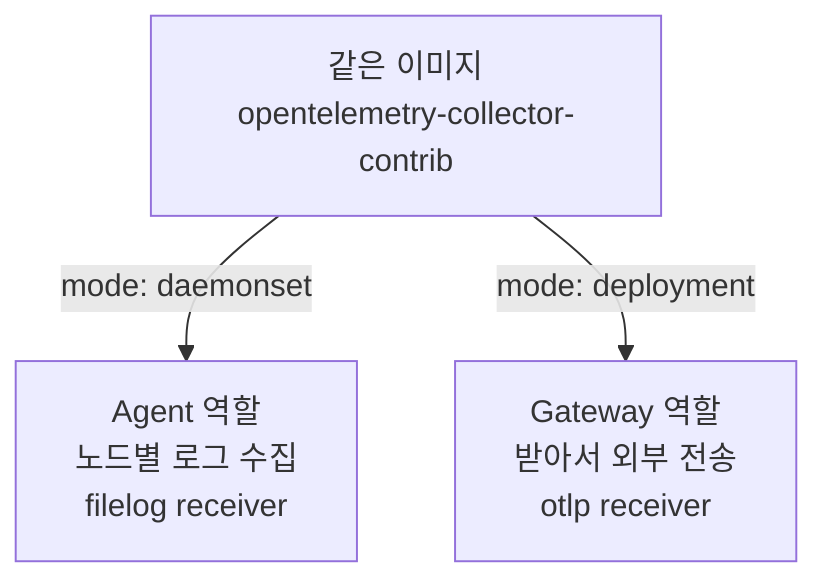
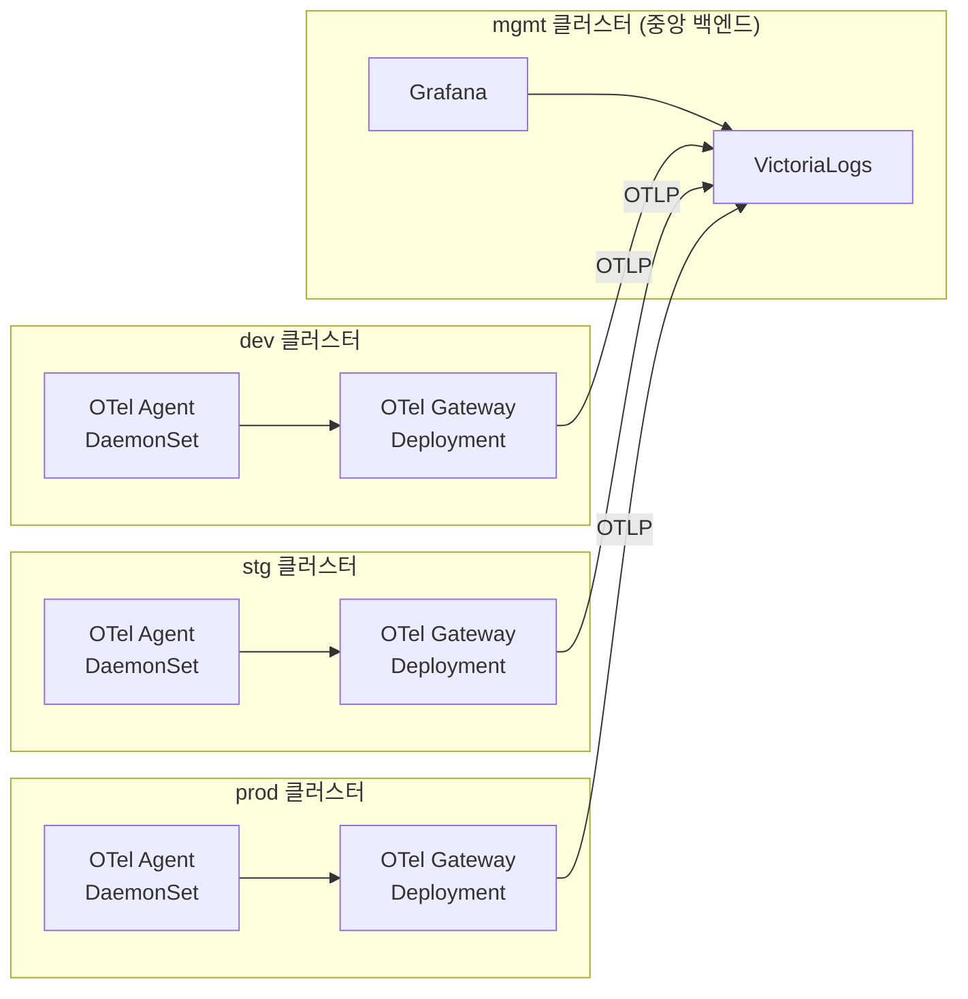
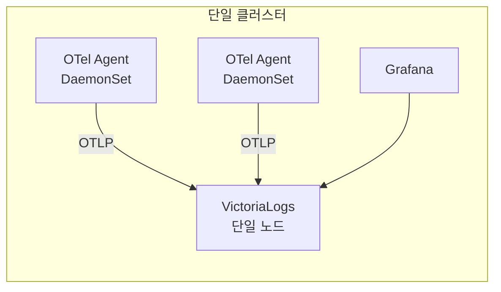

OpenTelemetry Collector는 CNCF 표준 로그 수집기로, **Agent(DaemonSet)와 Gateway(Deployment)는 별개 제품이 아니라 같은 이미지의 다른 실행 모드**입니다. 노드별 Agent가 로그를 수집하고 Gateway가 모아 백엔드로 내보내는 2단 구조가 대규모의 표준이며, 소규모에서는 Gateway를 생략하고 Agent가 백엔드로 직접 전송하면 충분합니다. 이 글은 **"OTel + VictoriaLogs 로그 스택" 시리즈 1편(개념편)** 으로, 설치·설정은 다음 편으로 미루고 **개념과 구조 이해**에 집중합니다.

## 🎯 OpenTelemetry Collector란

**OpenTelemetry(OTel) Collector는 로그·메트릭·트레이스를 하나의 파이프라인으로 수집·가공·전송하는 CNCF 표준 텔레메트리 수집기**입니다. 특정 벤더나 백엔드에 묶이지 않는 **벤더 중립**이 가장 큰 특징입니다.

파이프라인은 세 단계로 단순합니다.

- **receivers** — 데이터를 **받기**(예: 파드 로그 파일을 읽는 `filelog`, OTLP로 받는 `otlp`)
- **processors** — 받은 데이터를 **가공**(예: k8s 메타데이터 부착, 배치)
- **exporters** — 가공한 데이터를 **보내기**(예: VictoriaLogs·Loki 등 백엔드로 전송)

이 글은 그중 **로그 수집**에 집중합니다. 메트릭·트레이스도 같은 Collector가 같은 구조로 처리합니다.

---

## 🔁 Agent와 Gateway는 뭐가 다른가

**가장 흔한 오해부터 풀면, Agent와 Gateway는 서로 다른 프로그램이 아닙니다.** **동일 이미지·동일 바이너리**(`opentelemetry-collector-contrib`)를 Helm `mode` 값과 파이프라인만 다르게 띄운 것입니다. "Gateway"라는 별도 제품은 존재하지 않습니다 — **deployment 모드로 띄운 OTel Collector가 곧 Gateway**입니다.

| 모드 | 역할 | 배치 | 하는 일 |
|---|---|---|---|
| `mode: daemonset` | **Agent** | 노드마다 1개 | 자기 노드의 파드 로그(`/var/log/pods`)를 `filelog` receiver로 읽음 |
| `mode: deployment` | **Gateway** | 클러스터당 소수(2~3개) | Agent들이 OTLP로 보낸 로그를 `otlp` receiver로 받아 백엔드로 전송 |

### 왜 굳이 두 역할로 나눌까?

- **Agent** — 노드마다 떠서 **수집 부하를 분산**합니다. 노드가 늘면 DaemonSet 특성상 자동으로 따라 늘어납니다.
- **Gateway** — 여러 Agent의 로그를 한곳에 모아 외부로 내보내는 **"출구"** 입니다. 재시도·배치·버퍼링을 이 지점에 집중시킵니다.
- **이점** — 외부로 나가는 연결 수가 *노드 수만큼*에서 *Gateway 2~3개*로 줄어, **네트워크·방화벽·인증 관리가 단순**해집니다.

---

## 🏢 대규모 아키텍처는 어떻게 생겼나

**대규모(멀티클러스터)의 표준은 Agent → Gateway → 중앙 백엔드의 2단 구조**입니다. dev/stg/prod 각 클러스터에서 Agent가 로그를 모아 클러스터 내 Gateway로 보내고, Gateway가 중앙(mgmt) 백엔드로 내보냅니다.

핵심은 **외부 출구가 Gateway로 단일화**된다는 점입니다. 클러스터 간 통신 지점이 명확해져, 방화벽 규칙·인증 정보·엔드포인트를 Gateway 한 곳에서만 관리하면 됩니다.

---

## 🏠 소규모는 더 단순하다

**소규모/개인 환경에서는 Gateway를 생략하고, 단일 클러스터의 Agent가 백엔드로 직접 전송**합니다. 중간 집계 단계가 없어 구성·운영이 한결 가볍습니다.

노드가 한 자릿수이고 로그량이 크지 않다면, Gateway가 주는 "출구 단일화" 이점보다 **단순함**이 더 큽니다.

---

## 📐 대규모 vs 소규모, 무엇이 다른가

규모에 따라 달라지는 점만 한곳에 모으면 다음과 같습니다.

| 구분 | 대규모(기본) | 소규모/개인 |
|---|---|---|
| Gateway | 사용(클러스터당 2~3개) | 생략 |
| 전송 경로 | Agent → Gateway → 백엔드 | Agent → 백엔드 직결 |
| 백엔드 | VictoriaLogs 클러스터 모드 | VictoriaLogs 단일 노드 |
| 외부 통신 | 클러스터 간, endpoint 노출 필요 | 단일 클러스터 내부 |
| 적합 기준 | 다중 클러스터·노드 수십 개 이상·로그량 큼 | 단일 클러스터·노드 한 자릿수 |

> 💡 **작게 시작해 확장하세요.** 처음엔 Gateway 없이 Agent 직결로 흐름을 익히고, 규모가 커지면 Gateway를 추가하는 순서를 권장합니다. OTel은 **Agent 구성을 그대로 둔 채 Gateway만 끼워 넣을 수 있어** 확장이 매끄럽습니다.

---

## 🏷️ 여러 환경의 로그를 어떻게 구분하나

**`k8sattributes` processor가 각 로그에 쿠버네티스 메타데이터를 자동으로 부착**합니다. `k8s.namespace.name`, `k8s.pod.name`, `k8s.container.name` 등이 별도 설정 없이 붙습니다.

여기에 **환경 라벨(dev/stg/prod)** 을 추가하면, **하나의 백엔드·하나의 Grafana에서 환경별로 로그를 필터해 조회**할 수 있습니다. 멀티클러스터라도 백엔드를 중앙 하나로 모으고 `env` 라벨로 구분하는 식입니다.

---

## 🤔 Alloy랑 뭐가 다른가

**Grafana Alloy는 Grafana가 만든 OpenTelemetry Collector 배포판**이고, **업스트림 OTel Collector는 CNCF 표준 그 자체**입니다.

| 구분 | OTel Collector (업스트림) | Grafana Alloy |
|---|---|---|
| 정체 | CNCF 표준 수집기 | OTel Collector 기반 Grafana 배포판 |
| 설정 문법 | 표준 YAML | 독자 문법(Alloy/River) |
| 지향점 | 벤더 중립·이식성 | Grafana 생태계 통합 편의 |

표준·이식성을 중시하면 업스트림 OTel Collector를, Grafana 생태계 통합 편의를 중시하면 Alloy를 고르면 됩니다.

> ⚠️ 참고로 기존 로그 수집기인 **Promtail은 2026년 3월 2일 EOL**입니다. 신규 구축이라면 OTel Collector 또는 Alloy로 가는 흐름이 자연스럽습니다. (이미 Alloy를 쓰고 있다면 [Alloy Helm 설치 글](/observability/grafana-loki/kubernetes-install-alloy-v1-7-1-using-helm/)을 참고하세요.)

---

## ❓ 자주 묻는 질문

**Q. Agent와 Gateway는 다른 프로그램인가요?**
아닙니다. **같은 이미지·같은 바이너리**이고 Helm `mode` 값(daemonset/deployment)과 파이프라인만 다릅니다.

**Q. Gateway는 꼭 있어야 하나요?**
대규모에서는 권장하지만, 소규모에서는 생략하고 Agent가 백엔드로 직접 전송해도 충분합니다.

**Q. 로그에 네임스페이스·앱 이름은 어떻게 붙나요?**
`k8sattributes` processor가 `k8s.namespace.name`·`k8s.pod.name`·`k8s.container.name` 등을 자동으로 부착합니다.

**Q. OTel을 쓰면 나중에 백엔드를 바꿀 수 있나요?**
네. **exporter 목적지만 바꾸면** 됩니다. Agent/Gateway 수집 구성은 그대로 두고 VictoriaLogs ↔ Loki 등으로 교체할 수 있습니다.

**Q. Promtail에서 넘어와야 하나요?**
Promtail은 2026년 3월 EOL이라 신규 구축은 OTel Collector 또는 Alloy를 권장합니다.

---

## 🧭 시리즈: OTel + VictoriaLogs 로그 스택

**OTel 트랙**

- **1편 (현재)** — OpenTelemetry 개념과 Agent/Gateway 구조
- **2편** — [VictoriaLogs 클러스터 구축](/observability/opentelemetry/kubernetes-victorialogs-cluster-helm-install/)
- **3편** — [폐쇄망 OTel Collector Helm 설치](/observability/opentelemetry/kubernetes-otel-collector-offline-helm-install/)
- **4편** — [멀티클러스터 중앙집중](/observability/opentelemetry/otel-multicluster-central-logging/)

**Vector 트랙** (대안 수집기)

- **1편** — [Vector 개념과 파이프라인 구조](/observability/opentelemetry/kubernetes-vector-log-pipeline-concept/)
- **2편** — [Vector 설치: Agent/Aggregator Helm values](/observability/opentelemetry/kubernetes-vector-agent-aggregator-helm-install/)
- **3편** — [VRL로 로그 가공](/observability/opentelemetry/kubernetes-vector-vrl-log-processing/)

**비교**

- **OTel vs Vector** — [어떤 걸 선택할까](/observability/opentelemetry/kubernetes-otel-collector-vs-vector/)

**대시보드 트랙**

- **1편** — [조회 개요: Grafana·vmui·Perses](/observability/opentelemetry/victorialogs-log-viewing-grafana-vmui-perses/)
- **2편** — [Grafana 연결: 플러그인·Explore·대시보드](/observability/opentelemetry/grafana-victorialogs-datasource-explore-dashboard/)
- **3편** — [vmui로 LogsQL 탐색](/observability/opentelemetry/victorialogs-vmui-logsql-live-tail/)
- **4편** — [Perses로 코드형 대시보드](/observability/opentelemetry/perses-victorialogs-dashboard-gitops/)

이 편의 한 줄 요약: **"Agent와 Gateway는 같은 이미지의 두 모드다."** 대규모는 Gateway를 경유하는 2단 구조, 소규모는 직결이며, 규모로 판단해 작게 시작해 확장하면 됩니다. OTel의 진짜 가치는 **수집 표준화 → 백엔드 교체·확장의 자유**에 있습니다.

---

## 📚 참고

- [OpenTelemetry Collector — 공식 문서](https://opentelemetry.io/docs/collector/)
- [Collector Deployment: Agent — OpenTelemetry](https://opentelemetry.io/docs/collector/deployment/agent/)
- [Collector Deployment: Gateway — OpenTelemetry](https://opentelemetry.io/docs/collector/deployment/gateway/)
- [Kubernetes Collector Components — OpenTelemetry](https://opentelemetry.io/docs/kubernetes/collector/components/)
- [Grafana Alloy — 공식 문서](https://grafana.com/docs/alloy/latest/)
- [VictoriaLogs — 공식 문서](https://docs.victoriametrics.com/victorialogs/)
- [Promtail End-Of-Life (EOL) March 2026 — Grafana Community](https://community.grafana.com/t/promtail-end-of-life-eol-march-2026-how-to-migrate-to-grafana-alloy-for-existing-loki-server-deployments/159636)
- 관련 글: [Kubernetes에서 OTel Collector로 로그 수집하기](/observability/opentelemetry/kubernetes-otel-collector-logging/)
