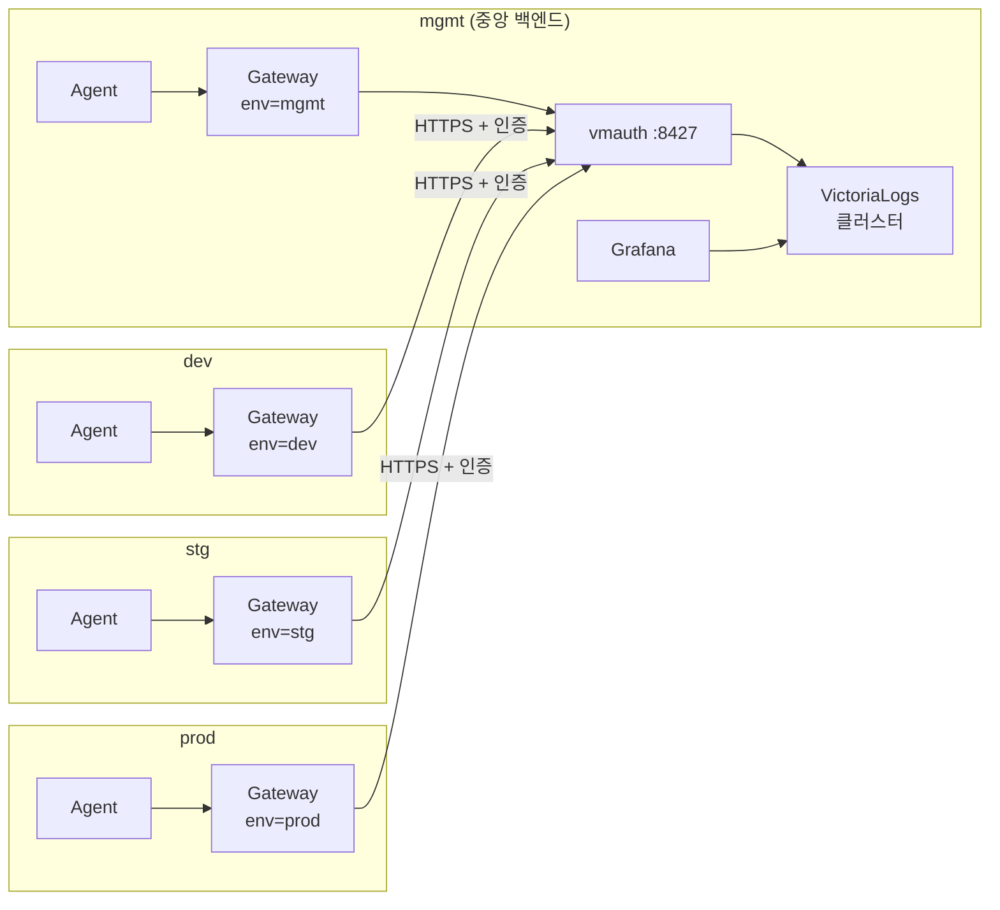

단일 클러스터에서 검증한 OpenTelemetry 로그 파이프라인을 멀티클러스터로 펼치는 것은, 의외로 **구성을 그대로 복제하고 값 두 개(env 라벨, Gateway endpoint)만 바꾸는 작업**입니다. 새로 등장하는 유일한 난관은 **클러스터 간 통신** — mgmt vmauth 노출, TLS, 인증, 네트워크 경로입니다. 각 클러스터의 Gateway가 중앙(mgmt) VictoriaLogs로 push하고, Grafana·vmui에서 `env` 라벨로 환경별 로그를 분리 조회합니다. 이 글은 **"OTel + VictoriaLogs 로그 스택" 시리즈 4편(확장·운영편)** 으로, [1편(개념)](/observability/opentelemetry/otel-collector-agent-gateway-architecture/)·[3편(설치)](/observability/opentelemetry/kubernetes-otel-collector-offline-helm-install/)에서 만든 단일 클러스터 구성을 여러 클러스터로 확장합니다.

## 🗺️ 멀티클러스터에서 무엇이 달라지나

**결론부터 말하면, 단일 클러스터 구성을 각 클러스터에 똑같이 복제하고 딱 두 값만 바꿉니다.**

1. **Agent의 `env` 라벨 값** — `dev`/`stg`/`prod`/`mgmt`
2. **Gateway exporter의 목적지 endpoint** — 자기 클러스터가 아니라 **mgmt의 VictoriaLogs(vmauth)** 로

각 클러스터 내부 흐름(Agent → Gateway → 백엔드)은 앞선 편들과 동일합니다. 즉 **"구성은 복제, 값 2개만 변경"** 이 멀티클러스터 확장의 본질입니다.

중앙집중 토폴로지는 다음과 같습니다.



- **mgmt 클러스터** = 중앙 백엔드(VictoriaLogs 클러스터 + vmauth + Grafana).
- **dev/stg/prod 클러스터** = 수집만(Agent + Gateway), 로그를 mgmt로 push.
- **mgmt 자체 로그**도 같은 방식으로 수집하되, 목적지가 같은 클러스터 내부라 외부로 나가지 않습니다.
- **외부로 나가는 주체는 각 클러스터의 Gateway 하나뿐** — 클러스터 간 통신 지점이 명확해집니다.

---

## 🏷️ 클러스터별 env 라벨 설정

**환경 구분은 Agent의 `resource` processor에서 `env` 값만 클러스터마다 다르게 주는 것**으로 끝납니다. 나머지 Agent 설정은 3편과 완전히 동일하니, 복제 후 이 값만 바꿉니다.

```yaml
config:
  processors:
    resource:
      attributes:
        - key: env
          value: dev     # 클러스터마다 stg / prod / mgmt 로 변경
          action: upsert
```

이 라벨 덕분에 **하나의 mgmt 백엔드에 모든 환경 로그가 모여도** Grafana·vmui에서 `env:prod` 같은 LogsQL로 환경별 분리 조회가 가능합니다.

> 💡 환경을 **계정 단위로 강하게 격리**해야 한다면, vmauth에서 `AccountID`/`ProjectID` 헤더로 테넌트를 나누는 멀티테넌시도 가능합니다(고급·선택). 단순 환경 구분이면 `env` 라벨로 충분합니다.

---

## 🎯 Gateway endpoint 변경 (자기 클러스터 → mgmt)

**dev/stg/prod의 Gateway exporter 목적지를 mgmt vmauth의 외부 주소 + HTTPS로 바꿉니다.** 3편의 Gateway values에서 `logs_endpoint`와 `tls`만 외부용으로 교체하면 됩니다.

```yaml
config:
  exporters:
    otlphttp/victorialogs:
      logs_endpoint: https://<mgmt-vmauth-외부주소>/insert/opentelemetry/v1/logs
      compression: gzip
      headers:
        Authorization: "Bearer ${VL_AUTH_TOKEN}"   # Secret에서 주입
        VL-Stream-Fields: "k8s.namespace.name,k8s.pod.name,env"
      tls:
        insecure: false
        ca_file: /etc/otel/certs/ca.crt            # 사내 CA 신뢰가 필요할 때
      sending_queue: { enabled: true, queue_size: 5000 }
      retry_on_failure: { enabled: true, initial_interval: 5s, max_interval: 30s, max_elapsed_time: 300s }
```

> 💡 **mgmt 자체 Gateway는 바꿀 필요가 없습니다.** 같은 클러스터 내부 vmauth(`svc:8427`)로 보내므로 외부 주소·TLS가 불필요합니다 — 3편 설정 그대로 둡니다.

---

## 🌐 mgmt vmauth를 외부 클러스터에 노출하기

**다른 클러스터에서 mgmt vmauth(8427)에 닿으려면 노출이 필요합니다.** 클러스터 내부 Service 주소(`*.svc`)로는 다른 클러스터에서 도달할 수 없기 때문입니다.

| 방식 | 적합 상황 | 주의점 |
|---|---|---|
| **LoadBalancer** | 사내 L4 LB 사용 가능 | IP 관리, 방화벽 허용 필요 |
| **Ingress** | HTTP(S) 노출 표준 | TLS 종단 위치 결정 |
| **Gateway API(HTTPRoute)** | 최신 표준, 세밀한 라우팅 | 컨트롤러 사전 설치 필요 |

이 시리즈는 Gateway → mgmt 전송이 **`otlphttp`(HTTP) 기반**이라 Ingress·HTTPRoute로 충분합니다. (gRPC가 아니므로 3편에서 언급한 **h2c 고민이 불필요**합니다.)

> ⚠️ **노출은 vmauth만 합니다.** `vlinsert`/`vlselect`/`vlstorage` 같은 내부 컴포넌트는 **외부에 직접 노출하지 마세요.** VictoriaLogs 공식 보안 권장 사항은 "모든 컴포넌트는 신뢰된 내부망에서 동작하고, 외부 진입은 vmauth로 단일화해 인증·HTTPS를 적용"하는 것입니다.

---

## 🔐 클러스터 간 인증·TLS

**클러스터 경계를 넘는 순간, 단일 클러스터엔 없던 세 가지(노출·TLS·인증)가 새로 필요합니다.** 그중 인증과 TLS를 vmauth에서 처리합니다.

**1) vmauth 인증 + 토큰 Secret 주입**

vmauth에 Basic Auth 또는 Bearer 토큰 인증을 설정하고, 각 클러스터 Gateway가 `Authorization` 헤더로 인증합니다. **토큰·비밀번호는 Secret으로 만들어 환경변수로 주입**하고, 명령행 인자로 직접 넘기지 않습니다(프로세스 목록 노출 위험).

```bash
kubectl create secret generic victorialogs-auth \
  --from-literal=token='<적재용-토큰>' -n logging
```

이 Secret은 Gateway values의 `extraEnvs`로 주입되어 exporter `headers`의 `Authorization: "Bearer ${VL_AUTH_TOKEN}"`에서 쓰입니다. vmauth 설정 파일도 `%{ENV_VAR}` 치환을 지원하므로, vmauth 쪽 시크릿도 동일하게 환경변수로 안전하게 넘길 수 있습니다.

**2) 전송 구간 TLS(HTTPS)**

클러스터 경계를 넘으므로 평문(`insecure`) 대신 **HTTPS를 권장**합니다. 사내 CA로 서명된 vmauth라면 `ca.crt`를 ConfigMap/Secret으로 마운트해 Gateway exporter의 `tls.ca_file`로 신뢰시킵니다.

**3) 네트워크 경로**

클러스터 간 라우팅·방화벽이 열려 있어야 합니다. 사내망이라도 클러스터가 분리돼 있으면 mgmt vmauth 주소·포트(8427)에 대한 **별도 허용 규칙**이 필요할 수 있습니다.

---

## 🧪 확장 검증 (환경별로 단계적)

**한 번에 4개를 다 켜지 말고, dev부터 연결성을 확인한 뒤 stg·prod 순으로 확장**합니다. 문제 발생 지점을 좁히기 위해서입니다.

```bash
# 1) mgmt vmauth 외부 주소가 dev에서 닿는지 (네트워크/방화벽)
kubectl -n logging run nettest --image=<사내-curl이미지> --rm -it -- \
  curl -k https://<mgmt-vmauth-외부주소>/select/vmui/ -o /dev/null -w "%{http_code}\n"

# 2) dev Gateway 로그에서 export 성공/실패 확인
kubectl -n logging logs deploy/otel-gateway-opentelemetry-collector | grep -i export

# 3) mgmt vmui에서 env:dev 로그 확인
# 브라우저: https://<mgmt-vmauth-외부주소>/select/vmui/  →  LogsQL: env:dev
```

각 환경이 vmui에서 `env` 라벨로 구분돼 보이면 확장 성공입니다.

```logsql
env:dev
```

---

## 🛠️ 멀티클러스터 운영 트러블슈팅

멀티클러스터에서 새로 겪는 문제는 대부분 **클러스터 간 통신** 계층에서 발생합니다.

| 증상 | 원인 | 점검 |
|---|---|---|
| `401/403` | vmauth 인증 토큰/헤더 누락·불일치 | Secret·`Authorization` 헤더 확인 |
| `connection timeout` | 클러스터 간 네트워크·방화벽 미개방, vmauth 미노출 | 경로·노출·방화벽 |
| TLS 오류(`x509`) | 사내 CA 미신뢰 | `ca_file` 마운트 확인(테스트 한정 `insecure`로 격리 진단) |
| 특정 env만 안 들어옴 | 해당 클러스터 Agent `env` 라벨·Gateway endpoint 오타 | 두 값 재확인 |
| 로그 지연/유실 | 큐·재시도 설정, 백엔드 용량 | `sending_queue`/`retry`·mgmt 용량 |

---

## 📐 이 편은 사실상 대규모 전용입니다

**멀티클러스터 확장은 본질적으로 대규모 주제**입니다. 단일 클러스터인 소규모·개인 환경은 3편까지로 충분합니다.

> 💡 **소규모가 나중에 커진다면**: 이미 Agent + Gateway 구성이면 Gateway의 endpoint만 mgmt로 바꾸면 됩니다. Agent가 백엔드로 직결돼 있던 구성이라면, Gateway 릴리스를 추가하고 Agent exporter를 Gateway로 돌리면 점진적으로 확장됩니다. OTel은 **수집 구성을 그대로 둔 채 출구만 바꿀 수 있어** 확장이 매끄럽습니다.

---

## ❓ 자주 묻는 질문

**Q. 클러스터마다 백엔드를 따로 둬야 하나요?**
중앙집중이면 mgmt 한 곳이면 됩니다. 환경 격리가 규정상 강제라면 환경별 백엔드 분리도 가능하지만, 운영 비용·조회 분산이라는 트레이드오프가 있습니다.

**Q. 여러 환경 로그가 섞이지 않나요?**
`env` 라벨로 구분됩니다. Grafana·vmui에서 `env:prod`처럼 필터해 조회하면 됩니다.

**Q. dev에서 mgmt로 안 닿습니다.**
네트워크 경로 → vmauth 노출 → 방화벽 순으로 점검하세요. 대부분 클러스터 간 통신 계층 문제입니다.

**Q. 전송 구간 암호화는 꼭 해야 하나요?**
클러스터 간은 HTTPS를 권장합니다. 사내 CA면 Gateway에 `ca_file`로 신뢰를 설정하세요.

**Q. 인증 없이 열어도 되나요?**
안 됩니다. 외부 진입 vmauth는 인증·TLS를 적용하고, 백엔드 컴포넌트는 직접 노출하지 마세요.

---

## 🧭 시리즈: OTel + VictoriaLogs 로그 스택

**OTel 트랙**

- **1편** — [OpenTelemetry 개념과 Agent/Gateway 구조](/observability/opentelemetry/otel-collector-agent-gateway-architecture/)
- **2편** — [VictoriaLogs 클러스터 구축](/observability/opentelemetry/kubernetes-victorialogs-cluster-helm-install/)
- **3편** — [폐쇄망 OTel Collector Helm 설치](/observability/opentelemetry/kubernetes-otel-collector-offline-helm-install/)
- **4편 (현재)** — 멀티클러스터 확장 + 운영·검증

**Vector 트랙** (대안 수집기)

- **1편** — [Vector 개념과 파이프라인 구조](/observability/opentelemetry/kubernetes-vector-log-pipeline-concept/)
- **2편** — [Vector 설치: Agent/Aggregator Helm values](/observability/opentelemetry/kubernetes-vector-agent-aggregator-helm-install/)
- **3편** — [VRL로 로그 가공](/observability/opentelemetry/kubernetes-vector-vrl-log-processing/)

**비교**

- **OTel vs Vector** — [어떤 걸 선택할까](/observability/opentelemetry/kubernetes-otel-collector-vs-vector/)

**대시보드 트랙**

- **1편** — [조회 개요: Grafana·vmui·Perses](/observability/opentelemetry/victorialogs-log-viewing-grafana-vmui-perses/)
- **2편** — [Grafana 연결: 플러그인·Explore·대시보드](/observability/opentelemetry/grafana-victorialogs-datasource-explore-dashboard/)
- **3편** — [vmui로 LogsQL 탐색](/observability/opentelemetry/victorialogs-vmui-logsql-live-tail/)
- **4편** — [Perses로 코드형 대시보드](/observability/opentelemetry/perses-victorialogs-dashboard-gitops/)

이 편의 한 줄 요약: **"멀티클러스터 = 구성 복제 + 값 2개(`env`, endpoint) 변경, 새 난관은 클러스터 간 통신뿐."** 외부 진입은 vmauth로 단일화해 TLS·인증을 적용하고 백엔드 컴포넌트는 직접 노출하지 않으며, 확장은 dev부터 단계적으로 검증하며 펼칩니다.

---

## 📚 참고

- [VictoriaLogs — Security and load balancing](https://docs.victoriametrics.com/victorialogs/security-and-lb/)
- [vmauth — VictoriaMetrics](https://docs.victoriametrics.com/victoriametrics/vmauth/)
- [VictoriaLogs cluster](https://docs.victoriametrics.com/victorialogs/cluster/)
- [VictoriaLogs cluster Helm chart](https://docs.victoriametrics.com/helm/victoria-logs-cluster/)
- [Collector Configuration — OpenTelemetry](https://opentelemetry.io/docs/collector/configuration/)
- 관련 글: [OpenTelemetry 개념과 Agent/Gateway 구조 (시리즈 1편)](/observability/opentelemetry/otel-collector-agent-gateway-architecture/)
- 관련 글: [폐쇄망 OTel Collector Helm 설치 (시리즈 3편)](/observability/opentelemetry/kubernetes-otel-collector-offline-helm-install/)
