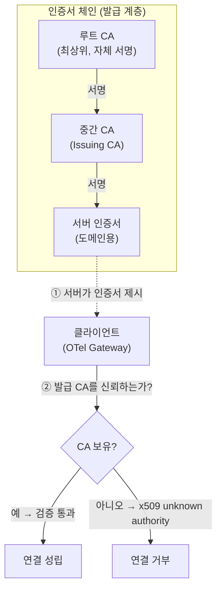
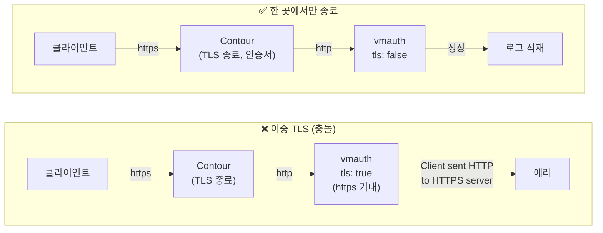
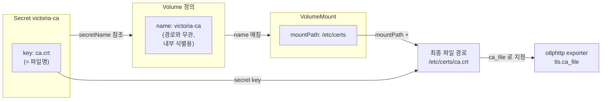

다른 클러스터의 OTel Gateway가 중앙(mgmt) VictoriaLogs로 로그를 **HTTPS로 보내기 시작하면** TLS 에러가 줄줄이 납니다. 대부분은 "**TLS를 두 곳에서 종료**해 프로토콜이 꼬였거나", "**사설 CA를 클라이언트가 신뢰하지 않아서**"입니다. 이 글은 실제로 겪은 에러 메시지 5종을 증상→원인→해결로 짚고, 그 과정에서 정리하게 된 인증서 개념(`ca`·`cert`·`crt` 차이, `.pfx` 변환)을 openssl 실습과 함께 다룹니다. 같은 시리즈의 [멀티클러스터 중앙집중편](/observability/opentelemetry/otel-multicluster-central-logging/)에서 세운 구조에 **HTTPS를 입히는** 후속편입니다.

> 전제: 멀티클러스터(dev/stg/prod = 로그 생성, mgmt = 중앙 VictoriaLogs cluster), 각 클러스터 OTel Gateway → mgmt 앞단 **Contour**(Gateway API 구현체) → **vmauth**, 폐쇄망 + **사내 사설 CA**(공인 CA 아님).

---

## 🎯 1. 상황: 다른 클러스터에서 mgmt VictoriaLogs로 HTTPS 전송

각 애플리케이션 클러스터(dev/stg/prod)의 **OTel Gateway**가 로그를 mgmt 클러스터로 보냅니다. mgmt 앞단에는 **Contour**가 있어 외부 진입을 받고, 그 뒤로 **vmauth**가 적재/조회를 라우팅합니다. 클러스터 내부 통신이던 것을 **클러스터 경계를 넘겨 HTTPS로** 바꾸는 순간, 새로 세 가지가 필요해집니다 — **노출·TLS·인증**. 이 글은 그중 **TLS/인증서**에서 막힌 지점들입니다.

핵심 난관은 두 부류입니다. **① TLS를 어디서 종료하느냐**(프로토콜 꼬임)와 **② 사설 CA를 클라이언트가 신뢰하게 만드는 법**(인증서 체인). 순서대로 풀어봅니다.

---

## 🧩 2. 헷갈리는 용어부터: ca vs cert vs crt

세 단어가 비슷해 보이지만 **같은 층위가 아닙니다.**

- **crt** — **파일 확장자**일 뿐입니다(`.crt`·`.pem`·`.cer`). "인증서를 담은 파일"이라는 뜻이지 내용물 종류를 지정하지 않습니다. 서버 인증서든 CA 인증서든 `.crt` 파일에 담길 수 있습니다.
- **cert**(certificate) — **인증서 일반**을 가리킵니다. 문맥상 보통 서버 인증서를 뜻할 때가 많습니다.
- **ca**(Certificate Authority) — 다른 인증서를 **발급·서명한 상위 인증서**입니다. 서버 인증서가 진짜인지 검증하는 기준이 됩니다.

한 줄로 정리하면, **crt**는 "그릇(파일)", **ca·cert**는 "내용물의 종류"입니다. `crt = ca`가 아니라 "**ca 인증서가 crt 파일에 담긴다**"가 맞습니다.

### 인증서 체인이란?

TLS 인증서는 보통 **루트 CA → (중간 CA) → 서버 인증서**의 체인 구조입니다. 서버 인증서는 서버가 "나 이 도메인 맞다"고 제시하는 것이고, CA 인증서는 그 서버 인증서를 발급·서명한 상위입니다. **클라이언트는 서버 인증서를 받아 → 그것을 발급한 CA를 신뢰하는지 확인 → 신뢰하면 통과**시킵니다.



> ⚠️ **중간 CA만 있으면 검증에 실패할 수 있습니다.** 신뢰 사슬을 완성하려면 루트까지 필요할 수 있으니, CA 파일에는 **체인 전체**(중간+루트)를 담는 게 안전합니다(6번에서 확인법을 다룹니다).

---

## 🔀 3. 첫 번째 벽: "Client sent an HTTP request to an HTTPS server"

가장 먼저 만난 에러입니다.

```text
Client sent an HTTP request to an HTTPS server
```

**의미**: 요청은 http인데 받는 쪽은 https를 기다립니다. 프로토콜 불일치입니다.

**원인**: TLS가 **두 곳(Contour + vmauth)에 이중으로** 걸려 꼬였습니다. Contour가 TLS를 종료한 뒤 내부로는 http를 보내는데, vmauth가 `tls: true`라 https를 기대하니 거부합니다.

**해결**: **TLS는 경로상 한 곳에서만 종료**합니다. Contour가 이미 TLS를 처리하면 vmauth의 TLS는 끄고(`tls: false`) Contour에 맡깁니다. 즉 **클라이언트→Contour는 https, Contour→vmauth는 http**입니다.



```yaml
# Contour가 TLS를 종료하면 vmauth는 http로
vmauth:
  http:
    tls: false
```

> ⚠️ 반대로 **vmauth의 tls를 켜면**(`true`) 기존에 http로 붙던 것들(내부 Gateway·Grafana·기존 클라이언트)이 **전부 https로 바뀌어야** 끊기지 않습니다. 그래서 진입점(Contour) 한 곳으로 TLS를 일원화하는 편이 관리가 쉽습니다. 참고로 반대 방향 불일치 에러 `http: server gave HTTP response to HTTPS client`는 "클라이언트는 https인데 서버가 http로 응답"한 경우이며, **목적지의 실제 프로토콜에 endpoint를 맞추면** 됩니다.

---

## 🔒 4. 두 번째 벽: "x509: certificate signed by unknown authority"

프로토콜을 맞췄더니 이번엔 인증서 신뢰 문제입니다.

```text
x509: certificate signed by unknown authority
```

**의미**: 클라이언트가 서버 인증서를 발급한 **CA를 신뢰하지 않습니다.** 공인 CA가 아닌 **사설 CA**일 때 흔합니다(시스템 기본 신뢰 스토어에 없으니까요).

**해결**: 서버 인증서를 발급한 **CA 인증서를 클라이언트에 넣어** 신뢰하게 만듭니다. 여기서 중요한 건 **서버 인증서 전체가 아니라 "발급 CA"만** 넣는다는 점입니다(이유는 8번). 클라이언트(OTel Gateway) exporter의 `tls.ca_file`로 그 CA를 지정합니다.

> 💡 **원인 격리 팁**: "경로·프로토콜은 맞는데 CA 신뢰만 문제"인지 빠르게 확인하려면 임시로 검증을 건너뛰어 봅니다. 연결이 되면 원인은 CA 신뢰가 맞습니다.
>
> ```yaml
> tls:
>   insecure_skip_verify: true   # ⚠️ 원인 격리용. 운영 금지(중간자 공격 취약), CA 확보 후 제거
> ```

---

## 📁 5. 세 번째 벽: "no such file: /etc/certs/ca.crt"

CA를 지정했더니 exporter가 아예 시작을 못 합니다.

```text
failed to load CA CertPool File: ... open /etc/certs/ca.crt: no such file or directory
```

**의미**: exporter 설정의 `ca_file` 경로에 **파일이 실제로 없습니다.** 지정만 하고 마운트를 안 했을 때 납니다.

**원인/해결**: CA 인증서를 **secret으로 만들어 그 경로에 실제로 마운트**해야 합니다. 이때 자주 헷갈리는 게 **volume 이름 / mountPath / secret key**의 관계입니다.

- **최종 파일 경로 = mountPath + secret의 key 이름**입니다. volume 이름은 경로와 무관한 **내부 식별용**입니다.
- secret 생성 시 `--from-file=ca.crt=./ca.crt`의 **왼쪽(`ca.crt`)이 key = 파일명**이 됩니다. 이 key 이름과 `ca_file`의 파일명이 **일치**해야 합니다.



```bash
# CA secret 생성 (각 클러스터마다) — 왼쪽 ca.crt가 key=파일명
kubectl -n <ns> create secret generic victoria-ca --from-file=ca.crt=./ca.crt
```

```yaml
extraVolumes:
  - name: victoria-ca            # volume 이름(경로와 무관, 내부 식별용)
    secret:
      secretName: victoria-ca    # 위에서 만든 CA secret
extraVolumeMounts:
  - name: victoria-ca
    mountPath: /etc/certs        # 이 폴더에 secret의 key들이 파일로 펼쳐짐
    readOnly: true

config:
  exporters:
    otlphttp/victorialogs:
      endpoint: https://<vlc-domain>/insert/opentelemetry   # endpoint 키면 /v1/logs 자동 부착
      tls:
        ca_file: /etc/certs/ca.crt    # = mountPath + secret key
      headers:
        VL-Stream-Fields: "env,k8s.namespace.name"
```

```bash
# 마운트 확인
kubectl -n <ns> exec <gateway-pod> -- ls -l /etc/certs/
kubectl -n <ns> exec <gateway-pod> -- cat /etc/certs/ca.crt | head -1   # -----BEGIN CERTIFICATE-----
kubectl -n <ns> get secret victoria-ca -o jsonpath='{.data}' | tr ',' '\n'   # 실제 key 이름 확인
```

> 💡 SAN 불일치 에러 `x509: certificate is valid for X, not Y`는 **인증서의 도메인(SAN)과 접속 주소가 다를 때** 납니다. 올바른 도메인으로 접속하거나, 인증서에 해당 주소를 SAN으로 추가하세요(확인법은 6번).

---

## 🔑 6. .pfx에서 필요한 것만 뽑기 (openssl)

사내에서 인증서를 `.pfx`(PKCS#12) 하나로 받는 경우가 많습니다. **`.pfx`는 여러 요소를 한 봉투에 담은 형식**입니다 — 개인키 + 서버 인증서 + (CA 체인이 포함될 수도). 필요한 것만 openssl로 분리해 씁니다.

```bash
# 0) 봉투 안에 뭐가 들었는지 먼저 확인 (서버 + CA 체인이 몇 개인지)
openssl pkcs12 -in cert.pfx -nokeys -info

# 1) 개인키 추출 (-nodes: 암호화 안 함. k8s secret에 넣을 땐 보통 이 형태)
openssl pkcs12 -in cert.pfx -nocerts -out tls.key -nodes

# 2) 서버 인증서만 (-clcerts: 최종 엔티티 인증서)
openssl pkcs12 -in cert.pfx -clcerts -nokeys -out tls.crt

# 3) CA 인증서(체인)만  ← 클라이언트 검증용
openssl pkcs12 -in cert.pfx -cacerts -nokeys -out ca.crt
```

CA 파일에는 **CA만** 담겨야 합니다(개인키·서버 인증서가 섞이면 안 됩니다). 그래서 `-cacerts -nokeys`로 뽑습니다. 그다음 **체인이 완전한지** 확인합니다.

```bash
# CA 체인 개수 확인
grep -c "BEGIN CERTIFICATE" ca.crt
# 2 이상: 중간+루트 포함(좋음)
# 1: 중간 CA만 → 루트 CA를 별도로 이어붙여야 검증될 수 있음
```

같은 CA로 발급됐는지, 접속 주소·유효기간·SAN이 맞는지도 openssl로 확인합니다.

```bash
# 서버가 제시하는 발급 CA(issuer) 확인
echo | openssl s_client -connect <domain>:443 2>/dev/null | openssl x509 -noout -issuer

# secret 안 인증서의 발급 CA 확인 (issuer가 같으면 같은 CA → 하나로 공용 가능)
kubectl -n <ns> get secret <tls-secret> -o jsonpath='{.data.tls\.crt}' | base64 -d | openssl x509 -noout -issuer

# 서버가 제시하는 전체 체인 뽑기 (pfx가 없을 때 대안)
openssl s_client -connect <domain>:443 -showcerts </dev/null 2>/dev/null

# 인증서 내용/유효기간/SAN
openssl x509 -in tls.crt -noout -text        # 전체
openssl x509 -in tls.crt -noout -dates       # 유효기간
openssl x509 -in tls.crt -noout -ext subjectAltName   # SAN(도메인)
```

---

## 🗂️ 7. 서버 인증서 secret과 CA secret은 다르다

여기서 많이 실수합니다. **두 secret은 내용도 용도도 다릅니다.**

| 구분 | 서버 인증서 secret | CA secret |
|---|---|---|
| 내용 | `tls.crt` + `tls.key` | `ca.crt`만 (개인키 없음) |
| 타입 | `kubernetes.io/tls` | generic(Opaque) |
| 용도 | 그 클러스터가 **서버로 제시** | 클라이언트가 **서버를 검증** |

**기존 서버 tls secret의 이름만 `ca.crt`로 바꾼다고 CA가 되지 않습니다** — 내용물이 서버 인증서지 CA가 아니기 때문입니다. **CA를 담은 새 secret을 따로** 만들어야 하고, 둘은 공존합니다(서버용 유지 + CA용 추가). 그리고 **secret은 클러스터 간 공유가 안 되므로 각 클러스터마다** 별도로 생성해야 합니다.

---

## ♻️ 8. 관리 포인트 줄이기: CA만, 그리고 재사용

왜 서버 인증서 전체가 아니라 **CA만** 넣을까요? **갱신에 강하기 때문**입니다.

- CA는 서버 인증서보다 훨씬 오래 유효합니다(루트 CA는 수년~십수년). 서버 인증서가 갱신돼도 **같은 CA로 재발급되면 클라이언트의 CA는 그대로** 둬도 됩니다.
- 반대로 서버 인증서(`tls.crt`+`tls.key`)를 클라이언트에 복사해두면, **갱신 때마다 모든 클라이언트를 다 바꿔야** 합니다. 그래서 비권장입니다.
- 여러 서버가 **같은 사내 루트 CA**로 발급됐다면, CA 하나로 공용할 수 있습니다(6번의 issuer 비교로 확인).

| 시나리오 | 클라이언트 CA 변경? |
|---|---|
| 서버 인증서 갱신(같은 CA로 재발급) | **불필요** — 그대로 |
| 발급 CA 자체가 교체됨 | 필요 — 새 CA로 교체 |

> 💡 규모가 커지면 **사내 루트 CA를 노드 신뢰 스토어에 배포**하거나, `trust-manager` 같은 도구로 **CA 번들을 네임스페이스에 자동 배포**(GitOps)하면 클러스터마다 수동으로 secret 만드는 부담을 줄일 수 있습니다.

---

## ✅ 9. 정리: 에러별 원인·해결 요약표

| 에러 메시지 | 원인 | 해결 |
|---|---|---|
| `Client sent an HTTP request to an HTTPS server` | 이중 TLS(Contour+vmauth) 프로토콜 꼬임 | TLS는 한 곳만 종료. vmauth `tls: false` |
| `http: server gave HTTP response to HTTPS client` | 반대 방향 프로토콜 불일치 | endpoint를 목적지 실제 프로토콜에 맞춤 |
| `x509: certificate signed by unknown authority` | 사설 CA를 클라이언트가 불신 | 발급 **CA**를 `ca_file`로 넣어 신뢰 |
| `no such file: /etc/certs/ca.crt` | `ca_file` 경로에 파일 미마운트 | CA secret 생성 + mountPath에 마운트(경로 = mountPath+key) |
| `x509: certificate is valid for X, not Y` | 인증서 SAN과 접속 주소 불일치 | 올바른 도메인 접속 또는 SAN 추가 |

핵심 원칙 두 가지만 기억하면 됩니다 — **TLS는 경로상 한 곳에서만 종료**하고, 클라이언트에는 **서버 인증서가 아니라 발급 CA(체인 전체)만** 넣습니다.

---

## ❓ 자주 묻는 질문

**Q. 클라이언트에 서버 인증서(tls.crt)를 넣으면 안 되나요?**
동작은 할 수 있지만 비권장입니다. 서버 인증서가 갱신될 때마다 모든 클라이언트를 바꿔야 합니다. **발급 CA만** 넣으면 같은 CA로 재발급되는 한 클라이언트는 손댈 필요가 없습니다.

**Q. `.crt`면 CA인가요?**
아니요. `.crt`는 파일 확장자일 뿐입니다. 서버 인증서도 CA 인증서도 `.crt`에 담깁니다. 내용물이 무엇인지는 `openssl x509 -in file.crt -noout -text`로 확인하세요.

**Q. `ca.crt`에 인증서가 1개만 보이는데 검증이 안 됩니다.**
중간 CA만 있고 루트가 빠졌을 수 있습니다(`grep -c "BEGIN CERTIFICATE"`로 개수 확인). 루트 CA를 이어붙여 **체인 전체**를 담으세요.

**Q. `insecure_skip_verify: true`로 두면 안 되나요?**
원인 격리용 임시로만 쓰고 운영에서는 금지입니다. 인증서 검증을 건너뛰어 중간자 공격에 취약해집니다. CA를 확보하면 반드시 제거하세요.

---

## 📚 참고

- [OpenTelemetry Collector — TLS 설정(configtls: `ca_file`·`insecure_skip_verify`)](https://github.com/open-telemetry/opentelemetry-collector/blob/main/config/configtls/README.md)
- [OpenTelemetry Collector — otlphttp exporter](https://github.com/open-telemetry/opentelemetry-collector/tree/main/exporter/otlphttpexporter)
- [VictoriaLogs — Cluster](https://docs.victoriametrics.com/victorialogs/cluster/)
- [vmauth — VictoriaMetrics(TLS 옵션)](https://docs.victoriametrics.com/victoriametrics/vmauth/)
- [Kubernetes Gateway API — TLS Configuration(Terminate)](https://gateway-api.sigs.k8s.io/guides/tls/)
- [Contour 공식 문서](https://projectcontour.io/docs/)
- [Kubernetes — TLS Secret(kubernetes.io/tls)](https://kubernetes.io/docs/concepts/configuration/secret/#tls-secrets)
- [OpenSSL 매뉴얼(pkcs12·x509·s_client)](https://docs.openssl.org/master/man1/)
- [cert-manager trust-manager — CA 번들 배포](https://cert-manager.io/docs/trust/trust-manager/)
- 관련 글: [멀티클러스터 중앙집중](/observability/opentelemetry/otel-multicluster-central-logging/) · [트러블슈팅 총정리](/observability/opentelemetry/victorialogs-otel-troubleshooting/) · [cert-manager로 PKI·TLS](/kubernetes/networking/kubernetes-cert-manager-pki-tls/)
