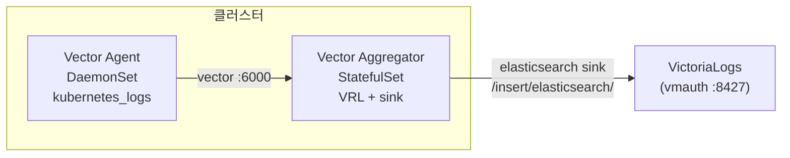

Vector는 Helm 차트의 **`role` 값(Agent=DaemonSet, Aggregator=StatefulSet)으로 워크로드가 결정**되며, **`customConfig`에 sources/transforms/sinks를 직접 정의**합니다. Agent가 `kubernetes_logs`로 파드 로그를 수집해 `type: vector` sink로 Aggregator(6000)에 보내고, Aggregator가 **elasticsearch sink로 VictoriaLogs에 적재**합니다. 소규모는 Aggregator 없이 Agent가 VictoriaLogs로 직결할 수 있습니다. 이 글은 **"OTel + VictoriaLogs 로그 스택" 시리즈의 Vector 트랙 2편(설치편)** 으로, [1편(Vector 개념)](/observability/opentelemetry/vector/kubernetes-vector-log-pipeline-concept/)에서 다룬 파이프라인 구조를 **실제 Helm values**로 구현합니다.

## 🧭 설치 전 정리: role이 워크로드를 결정한다

**Vector Helm 차트는 하나지만, `role` 값에 따라 생성되는 워크로드가 달라집니다.** OTel이 차트는 같고 `mode`로 갈리는 것과 같은 발상입니다.

| `role` | 워크로드 | 용도 |
|---|---|---|
| `Agent` | DaemonSet | 노드별 로그 수집 |
| `Aggregator` | StatefulSet | 중앙 집계(PVC 사용) |
| `Stateless-Aggregator` | Deployment | 상태 없는 집계 |

> ⚠️ **기본 role은 `Aggregator`** 입니다. Agent로 쓰려면 반드시 `role: Agent`를 명시해야 합니다.

대규모는 **Agent + Aggregator** 2단, 소규모는 **Agent 직결**입니다.



---

## 📦 폐쇄망 이미지 준비

**Vector 이미지는 `timberio/vector` 하나**입니다. Docker Hub에서 받아 사내 레지스트리로 미러합니다.

```bash
docker pull docker.io/timberio/vector:0.5x.0-debian
docker tag docker.io/timberio/vector:0.5x.0-debian <사내레지스트리>/vector:0.5x.0-debian
docker push <사내레지스트리>/vector:0.5x.0-debian
```

> ⚠️ `nightly` 태그는 금지하고 **안정 버전 태그를 고정**하세요(`-debian` 또는 `-distroless-libc` variant). 차트 tgz도 `helm pull`로 사내망에 반입합니다. Helm repo는 `helm repo add vector https://helm.vector.dev` 입니다.

---

## ⚙️ Agent values.yaml (DaemonSet)

**Agent는 `kubernetes_logs` source로 노드의 파드 로그를 수집해, `type: vector` sink로 Aggregator(6000)에 전달**합니다.

```yaml
# === vector-agent-values.yaml ===
role: Agent

image:
  repository: <사내레지스트리>/vector
  tag: "0.5x.0-debian"

resources:
  requests: { cpu: 100m, memory: 128Mi }
  limits:   { cpu: 500m, memory: 512Mi }

# customConfig 사용 시 모든 설정을 여기서 명시 (부분 오버라이드 아님)
customConfig:
  data_dir: /vector-data-dir
  api:
    enabled: true
    address: 127.0.0.1:8686
  sources:
    k8s_logs:
      type: kubernetes_logs
      # 시스템 네임스페이스 제외 (노이즈 감소)
      exclude_paths_glob_patterns:
        - "/var/log/pods/kube-system_*/**"
  transforms:
    add_env:
      type: remap
      inputs: [k8s_logs]
      source: |
        .env = "prod"   # 클러스터마다 dev/stg/prod
  sinks:
    to_aggregator:
      type: vector
      inputs: [add_env]
      address: "vector-aggregator:6000"   # 같은 클러스터 aggregator svc
      # 디스크 버퍼 + ack로 유실 방지
      buffer:
        type: disk
        max_size: 268435488   # 약 256Mi
      healthcheck:
        enabled: false
```

> 💡 차트가 `kubernetes_logs`에 필요한 **RBAC(ClusterRole/Binding/ServiceAccount)** 를 기본 제공합니다. Vector가 `/api/v1/pods`에 접근해 메타데이터를 붙이려면 이 권한이 필요합니다. 읽기 위치는 `data_dir`의 체크포인트에 저장돼 재시작 시 중복 없이 이어 읽습니다.

---

## ⚙️ Aggregator values.yaml (StatefulSet)

**Aggregator는 Agent들이 보낸 로그를 `type: vector` source(6000)로 받아, VRL로 가공한 뒤 elasticsearch sink로 VictoriaLogs에 적재**합니다.

```yaml
# === vector-aggregator-values.yaml ===
role: Aggregator
replicas: 2

image:
  repository: <사내레지스트리>/vector
  tag: "0.5x.0-debian"

resources:
  requests: { cpu: 200m, memory: 256Mi }
  limits:   { cpu: "1", memory: 1Gi }

# Aggregator는 PVC 사용(StatefulSet)
persistence:
  enabled: true
  storageClassName: <사내-storageclass>
  size: 10Gi

# VictoriaLogs 인증 토큰 등 자격증명 (Secret으로 주입, git 커밋 금지)
secrets:
  generic:
    vl_token: "<적재용-토큰>"

customConfig:
  data_dir: /vector-data-dir
  api:
    enabled: true
    address: 0.0.0.0:8686
  sources:
    from_agents:
      type: vector
      address: 0.0.0.0:6000
      version: "2"
  transforms:
    cleanup:
      type: remap
      inputs: [from_agents]
      source: |
        # 불필요 필드 정리 (카디널리티 관리)
        del(.kubernetes.pod_ip)
        del(.file)
  sinks:
    vlogs:
      type: elasticsearch
      inputs: [cleanup]
      endpoints:
        - http://vlc-victoria-logs-cluster-vmauth.logging.svc:8427/insert/elasticsearch/
      mode: bulk
      api_version: v8
      compression: gzip
      healthcheck:
        enabled: false
      query:
        _msg_field: message
        _time_field: timestamp
        _stream_fields: kubernetes.pod_namespace,kubernetes.container_name,env
      # 적재 시 무시할 필드
      ignore_fields: log.offset,event.original
      # 인증이 필요하면 헤더로 토큰(또는 vmauth basic auth)
      request:
        headers:
          Authorization: "Bearer ${VL_TOKEN}"   # secrets.generic 주입값
```

핵심은 **적재 sink**입니다. VictoriaLogs 전용 sink가 없으므로 **elasticsearch sink로 `/insert/elasticsearch/`** 에 보내고, 클러스터 모드는 **vmauth(8427)** 를 경유합니다.

---

## ⚠️ 흔한 함정: Helm vs Vector 템플릿 충돌

**Vector의 템플릿 문법 `{{ ... }}`이 Helm 템플릿과 겹쳐, `customConfig` 안에서 그대로 쓰면 Helm이 먼저 해석해 깨집니다.** 이게 Vector 차트에서 가장 자주 막히는 지점입니다.

Vector 템플릿(동적 필드 참조)을 쓰려면 **이스케이프**해야 합니다.

```yaml
path: /var/log/k8s/{{ "{{" }} .folder {{ "}}" }}/{{ "{{" }} .filename {{ "}}" }}.log
```

> 💡 `env = "prod"`처럼 **정적 값은 문제없지만**, 경로·필드명에 Vector 동적 참조(`{{ .field }}`)를 넣을 때는 반드시 위처럼 이스케이프하세요.

---

## 🚀 설치 (Aggregator 먼저)

**Agent가 보낼 대상(6000)이 살아 있어야 하므로 Aggregator를 먼저 설치**합니다. OTel에서 Gateway를 먼저 띄우는 것과 같은 원리입니다.

```bash
kubectl create namespace logging

# 1) Aggregator 먼저 (agent가 보낼 6000이 살아있어야 함)
helm install vector-aggregator ./vector-<차트버전>.tgz \
  -f vector-aggregator-values.yaml -n logging
kubectl -n logging rollout status statefulset/vector-aggregator

# 2) Agent 나중
helm install vector-agent ./vector-<차트버전>.tgz \
  -f vector-agent-values.yaml -n logging
kubectl -n logging get pods -o wide
```

---

## 🔎 vmui로 적재 확인

```bash
kubectl -n logging port-forward svc/vlc-victoria-logs-cluster-vmauth 8427
# 브라우저: http://localhost:8427/select/vmui/  →  LogsQL: env:prod
```

로그가 보이면 Agent → Aggregator → VictoriaLogs 파이프라인이 정상입니다.

```logsql
env:prod
```

---

## 🧪 검증 / 트러블슈팅

Vector 자체 도구로 설정·처리량을 점검합니다.

```bash
# 설정 검증 (Vector 자체 도구)
kubectl -n logging exec -it <vector-pod> -- vector validate /etc/vector/vector.yaml

# 실시간 처리량
kubectl -n logging exec -it <vector-pod> -- vector top

# 렌더링 이미지 확인
helm template x ./vector-<차트버전>.tgz -f vector-agent-values.yaml | grep 'image:'
```

| 증상 | 원인 | 해결 |
|---|---|---|
| 설정 일부 무시됨 | `customConfig`를 부분만 작성 | **전체 명시**(부분 오버라이드 아님) |
| 경로의 `{{ }}`가 깨짐 | Helm/Vector 템플릿 충돌 | 이스케이프(`{{ "{{" }}`) |
| 적재 안 됨 | elasticsearch sink 경로 오타 | `/insert/elasticsearch/` 확인 |
| 조회 급격히 느려짐 | `_stream_fields` 미지정 | 스트림 필드 제한 |
| 메타데이터 누락·권한 오류 | RBAC 부족 | `/api/v1/pods` 접근 권한 확인 |

> 💡 **신뢰성**: `buffer.type: disk` + sink `acknowledgments`로 다운스트림 장애 시에도 at-least-once 전달을 보장합니다. 자체 메트릭은 `internal_metrics` source + `prometheus_exporter` sink로 노출하고, `podMonitor`로 Prometheus Operator와 연동합니다(핵심: `vector_component_sent_events_total`, `vector_component_errors_total`, `vector_buffer_byte_size`).

---

## 📐 대규모 vs 소규모, 무엇이 다른가

규모에 따라 달라지는 점만 한곳에 모으면 다음과 같습니다. 이 글의 기본 전제는 **대규모(Agent + Aggregator)** 입니다.

| 구분 | 대규모(기본) | 소규모/개인 |
|---|---|---|
| 구성 | Agent + Aggregator | Agent만 |
| Agent sink | `type: vector` → Aggregator | `elasticsearch` → VictoriaLogs 직결 |
| Aggregator | StatefulSet, PVC | 없음 |
| VRL 가공 위치 | Aggregator | Agent |

> 💡 **소규모라면 Aggregator를 만들지 말고**, Agent의 sink를 바로 elasticsearch(VictoriaLogs)로 두면 됩니다. transform(VRL)도 Agent에서 처리합니다.

```yaml
# 소규모 agent 직결 예 (sinks만 교체)
sinks:
  vlogs:
    type: elasticsearch
    inputs: [add_env]
    endpoints:
      - http://<victorialogs>:9428/insert/elasticsearch/
    api_version: v8
    healthcheck: { enabled: false }
    query:
      _stream_fields: kubernetes.pod_namespace,kubernetes.container_name,env
```

---

## ❓ 자주 묻는 질문

**Q. `role`을 안 정하면 어떻게 되나요?**
기본값은 `Aggregator`입니다. Agent로 쓰려면 `role: Agent`를 명시해야 합니다.

**Q. `customConfig`를 일부만 써도 되나요?**
안 됩니다. `customConfig`를 사용하면 sources/transforms/sinks 등 **전체를 명시**해야 합니다(부분 오버라이드가 아닙니다).

**Q. VictoriaLogs sink 타입이 뭔가요?**
전용 sink가 없습니다. `elasticsearch`(`/insert/elasticsearch/`) 또는 `http`(jsonline) sink를 씁니다.

**Q. 경로에 `{{ }}`를 넣으니 깨집니다.**
Helm 템플릿과 충돌해서입니다. `{{ "{{" }} .field {{ "}}" }}` 형태로 이스케이프하세요.

**Q. Agent와 Aggregator는 어떤 포트로 연결되나요?**
`type: vector` 전용 프로토콜, 기본 **6000번** 포트입니다.

**Q. 로그 유실을 막으려면?**
`buffer.type: disk` + sink `healthcheck`/`acknowledgments`로 at-least-once 전달을 구성하세요.

---

## 🧭 시리즈: OTel + VictoriaLogs 로그 스택

이 시리즈는 같은 백엔드(VictoriaLogs)에 로그를 보내는 두 수집기 트랙으로 구성됩니다.

**OTel 트랙**

- **1편** — [OpenTelemetry 개념과 Agent/Gateway 구조](/observability/opentelemetry/collector/otel-collector-agent-gateway-architecture/)
- **2편** — [VictoriaLogs 클러스터 구축](/observability/victorialogs/kubernetes-victorialogs-cluster-helm-install/)
- **3편** — [폐쇄망 OTel Collector Helm 설치](/observability/opentelemetry/collector/kubernetes-otel-collector-offline-helm-install/)
- **4편** — [멀티클러스터 중앙집중](/observability/opentelemetry/otel-multicluster-central-logging/)

**Vector 트랙** (대안 수집기)

- **1편** — [Vector 개념과 파이프라인 구조](/observability/opentelemetry/vector/kubernetes-vector-log-pipeline-concept/)
- **2편 (현재)** — Vector 설치: Agent/Aggregator Helm values
- **3편** — [VRL로 로그 가공](/observability/opentelemetry/vector/kubernetes-vector-vrl-log-processing/)

**비교**

- **OTel vs Vector** — [어떤 걸 선택할까](/observability/opentelemetry/collector/kubernetes-otel-collector-vs-vector/)

**대시보드 트랙**

- **1편** — [조회 개요: Grafana·vmui·Perses](/observability/victorialogs/victorialogs-log-viewing-grafana-vmui-perses/)
- **2편** — [Grafana 연결: 플러그인·Explore·대시보드](/observability/victorialogs/grafana-victorialogs-datasource-explore-dashboard/)
- **3편** — [vmui로 LogsQL 탐색](/observability/victorialogs/victorialogs-vmui-logsql-live-tail/)
- **4편** — [Perses로 코드형 대시보드](/observability/victorialogs/perses-victorialogs-dashboard-gitops/)

이 편의 한 줄 요약: **"`role`이 워크로드를 정하고, `customConfig`는 전체를 명시한다."** Agent는 `kubernetes_logs`로 수집해 `type: vector`(6000)로 Aggregator에 보내고, Aggregator는 elasticsearch sink로 VictoriaLogs(vmauth 8427)에 적재합니다. Helm/Vector 템플릿 충돌 이스케이프와 `_stream_fields` 카디널리티 관리가 핵심 주의점입니다.

---

## 📚 참고

- [Vector — Helm 설치](https://vector.dev/docs/setup/installation/package-managers/helm/)
- [Vector on Kubernetes](https://vector.dev/docs/setup/installation/platforms/kubernetes/)
- [Vector Helm chart values.yaml — GitHub](https://github.com/vectordotdev/helm-charts/blob/develop/charts/vector/values.yaml)
- [Vector — kubernetes_logs source](https://vector.dev/docs/reference/configuration/sources/kubernetes_logs/)
- [VictoriaLogs — Vector 데이터 적재](https://docs.victoriametrics.com/victorialogs/data-ingestion/vector/)
- 관련 글: [Vector 개념과 파이프라인 구조 (Vector 트랙 1편)](/observability/opentelemetry/vector/kubernetes-vector-log-pipeline-concept/)
- 관련 글: [VictoriaLogs 클러스터 구축 (백엔드)](/observability/victorialogs/kubernetes-victorialogs-cluster-helm-install/)
