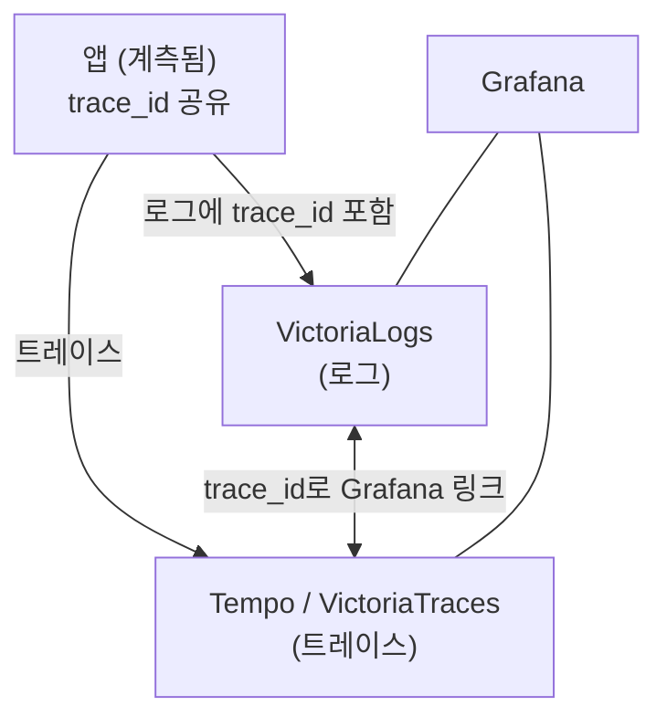

로그와 트레이스를 따로 보면 가치의 절반이고, **`trace_id`로 연결**하면 에러 로그에서 그 요청의 전체 트레이스로, 느린 스팬에서 그 시점의 로그로 **한 번에 점프**할 수 있습니다. 연결의 대전제는 **앱 계측 시 `trace_id`가 로그에도 포함되는 것**이며, 이것만 되면 Grafana 설정은 어렵지 않습니다. VictoriaLogs는 **OpenTelemetry preset**으로 `trace_id` Derived Field를 자동 설정하고, 트레이스→로그는 Tempo의 `tracesToLogsV2`나 Jaeger 데이터소스 설정으로 구성합니다. 이 글은 **"OTel 트레이스 확장" 시리즈 4편(연결)이자 마지막 편**으로, 로그와 트레이스를 모두 구축한 사람을 위한 **"보상"** 편입니다.

## 🔗 왜 연결이 관측성의 핵심인가

**로그와 트레이스를 따로 보면 디버깅이 반쪽짜리**입니다. 연결하면 다음이 가능해집니다.

- **로그 → 트레이스** — 에러 로그 한 줄에서 그 요청이 거친 **전체 트레이스**로 점프.
- **트레이스 → 로그** — 느린 스팬에서 그 순간 발생한 **로그**로 점프.

이 양방향 점프가 근본 원인 분석 시간을 크게 줄입니다. **트레이스를 추가한 진짜 이유**가 바로 이 연결입니다.



---

## 🔑 대전제: trace_id가 로그에 있어야 한다

**연결의 기반은 로그와 트레이스가 같은 `trace_id`를 공유하는 것**입니다. 이게 안 되면 어떤 Grafana 설정도 무의미합니다.

- **앱 계측 시 `trace_id`(와 `span_id`)를 로그에도 출력**해야 합니다 — OTel SDK의 로그-트레이스 상관 기능이나 로깅 라이브러리에 trace context를 주입합니다.
- **OTel 시맨틱 컨벤션**(`trace_id`, `span_id`)을 따르면 자동 연결이 쉬워집니다.

> ⚠️ **로그에 `trace_id`가 없으면 연결은 불가능**합니다. 연결이 안 될 때 가장 흔한 원인이 바로 이것이니, **계측 단계에서 반드시 확보**하세요.

아래는 언어별로 **로그에 `trace_id`(와 `span_id`)를 싣는 법**입니다. VictoriaLogs OTel preset이 자동 인식하도록 **필드명을 `trace_id`(snake_case)로 맞추는 것**을 권장합니다(camelCase `traceId`도 감지되지만, 라이브러리 기본 필드명이 `otelTraceID` 등으로 다르면 수동 Derived Field로 보정).

**언어별 바로가기:** [Java](#java-logback-mdc) · [Python](#python) · [Node.js](#nodejs-pino) · [.NET](#net) · [Go](#go-slog)

#### Java (Logback MDC)

`opentelemetry-spring-boot-starter`(또는 자동 계측 에이전트)가 MDC에 `trace_id`·`span_id`·`trace_flags`를 넣어줍니다. 로그 패턴에서 꺼내 쓰면 됩니다.

```xml
<!-- logback-spring.xml -->
<pattern>%d %-5level [trace_id=%mdc{trace_id} span_id=%mdc{span_id}] %logger - %msg%n</pattern>
```

#### Python

`opentelemetry-instrumentation-logging`이 로그 레코드에 trace context를 자동 주입합니다.

```python
from opentelemetry.instrumentation.logging import LoggingInstrumentor

# otelTraceID / otelSpanID / otelServiceName 를 로그 포맷에 주입
LoggingInstrumentor().instrument(set_logging_format=True)
```

> 필드명이 `otelTraceID`라 preset 자동 인식이 안 되면, 구조화 로깅에서 `trace_id` 키로 다시 실거나 수동 Derived Field로 매핑하세요.

#### Node.js (pino)

`@opentelemetry/instrumentation-pino`를 켜면 로그에 `trace_id`·`span_id`·`trace_flags`가 자동으로 붙습니다.

```javascript
// 자동 계측(instrumentation-pino) 활성 상태에서
const logger = require('pino')();
logger.info('order placed');
// → {"level":30,"trace_id":"...","span_id":"...","msg":"order placed"}
```

#### .NET

`ILogger` 로그를 OTLP로 내보내면 활성 `Activity`의 `TraceId`·`SpanId`가 LogRecord에 자동으로 실려 상관됩니다.

```csharp
builder.Logging.AddOpenTelemetry(o => {
  o.IncludeScopes = true;
  o.AddOtlpExporter();   // 로그도 OTLP로 → trace_id 자동 상관
});
```

#### Go (slog)

Go는 자동 주입이 없어, 스팬 컨텍스트에서 `trace_id`를 꺼내 구조화 로그 필드로 직접 넣습니다.

```go
import (
    "log/slog"
    "go.opentelemetry.io/otel/trace"
)

sc := trace.SpanContextFromContext(ctx)
slog.InfoContext(ctx, "order placed",
    slog.String("trace_id", sc.TraceID().String()),
    slog.String("span_id", sc.SpanID().String()))
```

---

## ➡️ 로그 → 트레이스 (VictoriaLogs OTel preset)

**가장 쉬운 길은 VictoriaLogs 데이터소스의 "OpenTelemetry preset" 토글**입니다(플러그인 v0.27.1+). 켜면 `trace_id` Derived Field와 severity용 Log level 규칙을 **자동 생성**합니다.

설정 절차는 다음과 같습니다.

1. VictoriaLogs 데이터소스 **URL을 먼저 저장**합니다(**Save & test**). preset이 필드 형식을 감지하려면 도달 가능한 백엔드가 필요합니다.
2. **OpenTelemetry preset** 토글을 켭니다.
3. **Traces 데이터소스**(Tempo 또는 Jaeger)를 지정하면, 생성된 `trace_id` Derived Field가 **해당 트레이스로 직접 링크**됩니다.

> 💡 preset은 최근 로그를 쿼리해 **자동 감지**합니다: `trace_id` 형식(snake_case `trace_id` / camelCase `traceId`), severity 필드(`severity_text`/`SeverityText` 등), severity 값의 대소문자. 형식이 특이해 인식이 안 되면 **수동 Derived Fields**로 보정할 수 있습니다.

결과적으로 로그 라인의 `trace_id`를 클릭하면 해당 트레이스로 점프합니다.

---

## ⬅️ 트레이스 → 로그 (백엔드별)

**스팬에서 로그로 가는 길은 트레이스 백엔드에 따라 갈립니다.**

**Tempo** — Tempo 데이터소스의 `tracesToLogsV2`를 설정합니다. 로그 데이터소스(VictoriaLogs)를 지정하고 태그 매핑·시간 시프트·쿼리를 줍니다.

```yaml
# Tempo 데이터소스 provisioning 발췌
jsonData:
  tracesToLogsV2:
    datasourceUid: <victorialogs-datasource-uid>
    spanStartTimeShift: "-1h"
    spanEndTimeShift: "1h"
    tags:
      - key: "service.name"
        value: "service_name"
    filterByTraceID: true
    customQuery: true
    query: '_time:$__range trace_id:"$${__trace.traceId}"'   # LogsQL 예(환경에 맞게)
```

**VictoriaTraces** — Grafana에서 **Jaeger 데이터소스**로 연결되므로, **Jaeger 데이터소스의 trace-to-logs 설정**을 활용합니다.

> 공통 원리는 같습니다: 스팬의 `trace_id`(또는 태그)로 로그 데이터소스를 쿼리해 해당 로그를 찾아 링크합니다. 결과적으로 스팬의 "Logs for this span" 링크로 로그에 점프합니다.

---

## ⚙️ 데이터소스 구성 한눈에

**두 데이터소스가 같은 Grafana에 있고 서로 `datasourceUid`를 참조**해야 상호 링크가 됩니다.

| 방향 | 설정 위치 | 핵심 옵션 |
|---|---|---|
| **로그 → 트레이스** | VictoriaLogs 데이터소스 | **OTel preset(자동)** 또는 Derived Fields |
| **트레이스 → 로그** | Tempo / Jaeger 데이터소스 | `tracesToLogsV2` / trace-to-logs |

- **로그**: VictoriaLogs 데이터소스(`victoriametrics-logs-datasource`).
- **트레이스**: Tempo면 **Tempo 데이터소스**, VictoriaTraces면 **Jaeger 데이터소스**.

---

## 🧪 검증

연결이 됐는지 양방향으로 확인합니다.

1. **로그 → 트레이스**: Explore에서 로그 조회 → 에러 로그의 `trace_id` 클릭 → 트레이스가 열리는지.
2. **트레이스 → 로그**: 트레이스 뷰에서 스팬의 "Logs for this span" → 로그가 열리는지.

안 되면 다음을 점검합니다.

| 증상 | 점검 |
|---|---|
| 아무 링크도 없음 | **로그에 `trace_id`가 있나**(가장 흔한 원인) |
| Derived Field 인식 안 됨 | 필드 형식(snake/camel) 맞나 |
| 링크는 있는데 안 열림 | 두 데이터소스 **UID 참조**가 맞나 |
| 트레이스→로그에서 로그 못 찾음 | 태그 매핑(`service.name`)·시간 시프트·쿼리 |

---

## 📐 규모 관점

**연결 설정 자체는 규모와 무관**합니다 — 데이터소스 설정은 클러스터든 단일 노드든 동일합니다. 규모에 따라 다른 것은 그 아래 **로그·트레이스 백엔드의 구성**(앞 편들에서 다룸)뿐입니다.

> 💡 소규모라도 로그·트레이스를 둘 다 운영한다면 이 연결은 반드시 켜두세요. 설정 비용은 거의 없는데 디버깅 효율은 크게 올라갑니다.

---

## ❓ 자주 묻는 질문

**Q. 연결이 안 됩니다. 가장 흔한 이유는?**
로그에 `trace_id`가 없어서입니다. 앱 계측에서 `trace_id`를 로그에 출력하는지 먼저 확인하세요.

**Q. VictoriaLogs에서 가장 쉬운 설정은?**
**OpenTelemetry preset 토글**입니다. `trace_id` Derived Field를 자동 생성합니다.

**Q. VictoriaTraces는 어떤 데이터소스인가요?**
**Jaeger 데이터소스**입니다. 그 데이터소스의 trace-to-logs 설정을 씁니다.

**Q. `trace_id` 형식이 달라 인식이 안 됩니다.**
snake_case/camelCase 차이입니다. preset이 자동 감지하지만, 틀리면 수동 Derived Fields로 조정하세요.

**Q. 트레이스→로그에서 로그를 못 찾습니다.**
태그 매핑(`service.name`)·시간 시프트(`spanStartTimeShift`/`spanEndTimeShift`)·쿼리를 확인하세요.

---

## 🏁 시리즈를 마치며: 통합 관측성 완성

**여기까지가 "OTel 트레이스 확장" 시리즈의 마지막**입니다. 트레이스 경로를 되짚으면:

1. **개요** — 트레이스 개념과 두 가지 구축 경로(통합/독립),
2. **백엔드** — Tempo 또는 VictoriaTraces,
3. **연결** — `trace_id`로 로그↔트레이스 점프.

그리고 이 트레이스 확장은 [**"OTel + VictoriaLogs 로그 스택" 시리즈**(완결)](/observability/opentelemetry/collector/otel-collector-agent-gateway-architecture/) 위에 얹힌 것입니다. 둘을 합치면 **로그(수집·저장·조회) + 트레이스(수집·저장·조회) + 연결 = 통합 관측성**이 됩니다.

핵심 교훈 3줄:

- **수집은 OTel 표준으로** — 로그·트레이스를 같은 파이프라인(같은 Gateway)으로 모읍니다.
- **저장은 신호별 전용 백엔드로** — 로그는 VictoriaLogs, 트레이스는 Tempo/VictoriaTraces.
- **`trace_id`로 연결해야 진짜 가치** — 따로 둔 신호를 이어야 디버깅이 빨라집니다.

---

## 🧭 시리즈: OTel 트레이스 확장 *(완결)*

- **1편** — [분산 트레이스 개요: 두 가지 길](/observability/tracing/kubernetes-distributed-tracing-otel-overview/)
- **2편** — [Grafana Tempo 백엔드 구축](/observability/tracing/kubernetes-grafana-tempo-distributed-helm-install/)
- **3편** — [VictoriaTraces 백엔드 구축](/observability/tracing/kubernetes-victoriatraces-cluster-helm-install/)
- **4편 (현재)** — 로그 ↔ 트레이스 연결

이 편의 한 줄 요약: **"로그와 트레이스는 `trace_id`로 연결해야 진짜 가치가 난다."** 대전제는 로그에 `trace_id`가 들어가는 것이고, 로그→트레이스는 VictoriaLogs **OTel preset**, 트레이스→로그는 Tempo `tracesToLogsV2`(또는 Jaeger trace-to-logs)로 구성합니다.

> 🔗 함께 보기: [**"OTel + VictoriaLogs 로그 스택" 시리즈**(완결)](/observability/opentelemetry/collector/otel-collector-agent-gateway-architecture/) — 로그 스택 전체.

---

## 📚 참고

- [VictoriaLogs — Grafana 통합(OpenTelemetry preset)](https://docs.victoriametrics.com/victorialogs/integrations/grafana/)
- [victoriametrics-logs-datasource — Grafana 플러그인](https://grafana.com/grafana/plugins/victoriametrics-logs-datasource/)
- [Grafana — Tempo trace to logs 설정](https://grafana.com/docs/grafana/latest/datasources/tempo/configure-tempo-data-source/configure-trace-to-logs/)
- [Grafana — Tempo trace correlations](https://grafana.com/docs/grafana/latest/datasources/tempo/traces-in-grafana/trace-correlations/)
- [VictoriaTraces 공식 문서](https://docs.victoriametrics.com/victoriatraces/)
- 관련 글: [분산 트레이스 개요 (트레이스 확장 1편)](/observability/tracing/kubernetes-distributed-tracing-otel-overview/)
- 관련 글: [Grafana에 VictoriaLogs 연결하기 (로그 스택 대시보드 트랙)](/observability/victorialogs/grafana-victorialogs-datasource-explore-dashboard/)
