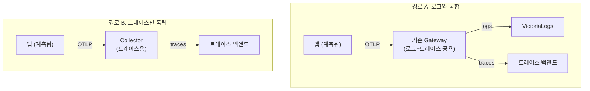
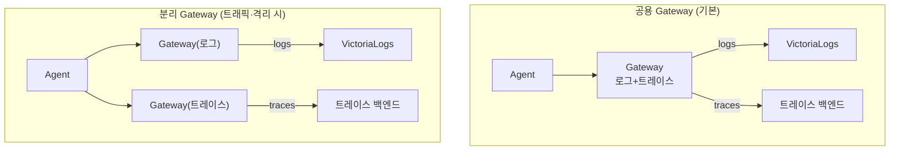

분산 트레이스는 **하나의 요청이 여러 서비스를 거치는 경로를 추적**해, 로그·메트릭만으로 보기 어려운 "요청의 여정"을 보여줍니다. 로그와 달리 트레이스는 **파일로 남지 않아 앱 계측(instrumentation)이 선행**되어야 하고, OpenTelemetry는 **전달만** 하므로 Tempo나 VictoriaTraces 같은 **전용 저장소**가 필요합니다. 이미 OTel 로그 파이프라인이 있으면 **Gateway를 재사용해 통합**할 수 있고(공용 또는 분리), 없으면 **트레이스만 독립적으로** 구축할 수도 있습니다. 이 글은 **"OTel 트레이스 확장" 시리즈 1편(개요)** 으로, 개념과 두 가지 구축 경로의 큰 그림을 잡습니다.

## 🧭 트레이스란 무엇인가

**분산 트레이스(distributed trace)는 하나의 요청이 여러 서비스를 거쳐간 경로를 추적하는 신호**입니다. 각 구간(서비스의 한 작업)이 **span**이고, 같은 **`trace_id`** 를 공유하는 span들이 모여 하나의 **trace**가 됩니다.

세 가지 신호(로그·메트릭·트레이스)는 역할이 다릅니다.

| 신호 | 답하는 질문 | 형태 |
|---|---|---|
| **로그** | 무슨 일이 있었나 | 이벤트 기록 |
| **메트릭** | 얼마나 | 수치 추세 |
| **트레이스** | 요청이 **어디를 어떻게** 거쳤나 | 흐름(span 트리) |

마이크로서비스에서 **어느 서비스가 느린지·어디서 실패했는지를 end-to-end로 파악**하는 데 트레이스가 핵심입니다. 로그·메트릭만으로는 "이 요청이 A→B→C를 거치며 B에서 800ms를 썼다" 같은 흐름을 보기 어렵습니다.

---

## 🔍 왜 로그처럼 그냥 못 긁나

**가장 큰 차이는 "트레이스는 파일로 남지 않는다"는 점**입니다.

- **로그** — 파드가 stdout으로 출력하면 노드의 `/var/log/pods`에 파일로 남고, Agent가 `filelog`로 긁습니다. **앱 수정이 거의 필요 없습니다.**
- **트레이스** — 어디에도 파일로 남지 않습니다. **앱이 실행 중에 직접 생성해 OTLP로 내보내야** 합니다. 즉 **앱 계측이라는 새 단계가 반드시 선행**됩니다.

> 💡 공통점도 있습니다: 둘 다 결국 OTel Collector의 **`otlp` receiver(4317/4318)** 로 받을 수 있습니다. 차이는 "트레이스는 누가 만들어 보내느냐(앱)"에 있습니다.

---

## 🛠️ 앱 계측: 트레이스를 만드는 단계

**트레이스는 앱이 직접 만들어야 하므로, 계측이 출발점**입니다. 두 방식이 있습니다.

- **OTel SDK로 코드 계측** — 언어별 SDK로 Tracer를 초기화하고 span을 만듭니다. 가장 정밀하지만 코드 변경이 따릅니다.
- **자동 계측(auto-instrumentation)** — 에이전트·오퍼레이터가 런타임에 주입해 **코드 수정을 최소화**합니다. 빠른 도입에 유리합니다.

계측된 앱은 **OTLP로 Collector(같은 클러스터 Agent/Gateway 또는 백엔드로 직접)** 에 트레이스를 보냅니다. 이때 **`service.name` 등 리소스 속성**을 반드시 지정해야 조회·상관관계에서 서비스를 식별할 수 있습니다. 아래 예시의 `<collector>`는 경로에 따라 Agent/Gateway 또는 백엔드 주소(예: `otel-collector.observability:4317`)로 바꾸면 됩니다.

> 💡 **언어 불문 공통**: 모든 OTel SDK는 코드 대신 **환경변수**로도 설정됩니다. `OTEL_SERVICE_NAME=checkout-api`, `OTEL_EXPORTER_OTLP_ENDPOINT=http://<collector>:4317`, `OTEL_EXPORTER_OTLP_PROTOCOL=grpc` 세 개만 주면 엔드포인트·서비스명이 잡혀, 코드보다 간단할 때가 많습니다(쿠버네티스에선 Deployment `env`로 주입).

**언어별 바로가기:** [.NET](#net-aspnet-core) · [Java](#java-spring-boot) · [Python](#python) · [Node.js](#nodejs) · [Go](#go)

#### .NET (ASP.NET Core)

`OpenTelemetry.Extensions.Hosting` + `OpenTelemetry.Exporter.OpenTelemetryProtocol` 패키지를 사용합니다.

```csharp
// Program.cs
builder.Services.AddOpenTelemetry()
  .ConfigureResource(r => r.AddService("checkout-api"))
  .WithTracing(t => t
    .AddAspNetCoreInstrumentation()
    .AddHttpClientInstrumentation()
    .AddOtlpExporter(o => {
      o.Endpoint = new Uri("http://<collector>:4317");
      o.Protocol = OtlpExportProtocol.Grpc;
    }));
```

#### Java (Spring Boot)

`opentelemetry-spring-boot-starter`를 추가하면 코드 변경 없이 환경변수만으로 동작합니다.

```properties
# application.properties (또는 동일 이름의 환경변수)
otel.service.name=checkout-api
otel.exporter.otlp.endpoint=http://<collector>:4317
otel.exporter.otlp.protocol=grpc
```

```bash
# 또는 빌드/코드 수정 없이 자동 계측 에이전트로:
java -javaagent:opentelemetry-javaagent.jar \
  -Dotel.service.name=checkout-api \
  -Dotel.exporter.otlp.endpoint=http://<collector>:4317 \
  -jar app.jar
```

#### Python

`pip install opentelemetry-distro opentelemetry-exporter-otlp` 후 zero-code로 감싸 실행합니다.

```bash
opentelemetry-bootstrap -a install
OTEL_SERVICE_NAME=checkout-api \
OTEL_EXPORTER_OTLP_ENDPOINT=http://<collector>:4317 \
opentelemetry-instrument python app.py
```

```python
# SDK로 직접 초기화하려면:
from opentelemetry import trace
from opentelemetry.sdk.resources import Resource
from opentelemetry.sdk.trace import TracerProvider
from opentelemetry.sdk.trace.export import BatchSpanProcessor
from opentelemetry.exporter.otlp.proto.grpc.trace_exporter import OTLPSpanExporter

provider = TracerProvider(resource=Resource.create({"service.name": "checkout-api"}))
provider.add_span_processor(BatchSpanProcessor(OTLPSpanExporter(endpoint="http://<collector>:4317")))
trace.set_tracer_provider(provider)
```

#### Node.js

`@opentelemetry/sdk-node` + 자동 계측 + gRPC exporter를 앱 진입 전에 시작합니다.

```javascript
// tracing.js — `node -r ./tracing.js app.js` 로 먼저 로드
const { NodeSDK } = require('@opentelemetry/sdk-node');
const { getNodeAutoInstrumentations } = require('@opentelemetry/auto-instrumentations-node');
const { OTLPTraceExporter } = require('@opentelemetry/exporter-trace-otlp-grpc');
const { resourceFromAttributes } = require('@opentelemetry/resources');
const { ATTR_SERVICE_NAME } = require('@opentelemetry/semantic-conventions');

const sdk = new NodeSDK({
  resource: resourceFromAttributes({ [ATTR_SERVICE_NAME]: 'checkout-api' }),
  traceExporter: new OTLPTraceExporter({ url: 'http://<collector>:4317' }),
  instrumentations: [getNodeAutoInstrumentations()],
});
sdk.start();
```

#### Go

SDK로 TracerProvider를 구성합니다(Go는 자동 계측이 없어 SDK 코드가 기본).

```go
import (
    "context"
    "go.opentelemetry.io/otel"
    "go.opentelemetry.io/otel/exporters/otlp/otlptrace/otlptracegrpc"
    "go.opentelemetry.io/otel/sdk/resource"
    sdktrace "go.opentelemetry.io/otel/sdk/trace"
    semconv "go.opentelemetry.io/otel/semconv/v1.26.0"
)

func initTracer(ctx context.Context) (*sdktrace.TracerProvider, error) {
    exp, err := otlptracegrpc.New(ctx,
        otlptracegrpc.WithEndpoint("<collector>:4317"),
        otlptracegrpc.WithInsecure())
    if err != nil {
        return nil, err
    }
    res, _ := resource.New(ctx, resource.WithAttributes(semconv.ServiceName("checkout-api")))
    tp := sdktrace.NewTracerProvider(sdktrace.WithBatcher(exp), sdktrace.WithResource(res))
    otel.SetTracerProvider(tp)
    return tp, nil
}
```

> 💡 **코드 수정 없이 가려면** [OTel Operator 자동 계측](https://opentelemetry.io/docs/kubernetes/operator/automatic/)을 쓰세요. `Instrumentation` 리소스와 파드 어노테이션만으로 **Java·Python·Node.js·.NET**에 SDK를 런타임 주입합니다(Go는 컴파일 언어라 미지원 — 위 SDK 코드 사용).

---

## 📦 OTel은 전달만, 저장은 따로 (로그와 같은 원리)

**OTel Collector는 트레이스를 받아 전달만 하고 저장하지 않습니다.** 로그에서 VictoriaLogs가 저장소였던 것처럼, 트레이스도 **전용 저장소**가 필요합니다.

- **VictoriaLogs에는 트레이스를 넣을 수 없습니다** — 로그 전용입니다.
- 트레이스 백엔드는 크게 두 갈래입니다(상세는 다음 편들):
  - **Grafana Tempo** — Grafana 생태계 통합·안정성.
  - **VictoriaTraces** — VictoriaLogs와 같은 계열의 트레이스 전용 저장소(별개 제품). OTLP 수신(HTTP `:10428/insert/opentelemetry/v1/traces`, gRPC `:4317`).

이 글에서는 "**별도 저장소가 필요하다**"까지만 잡고, 백엔드별 설치는 각 편에서 다룹니다.

---

## 🔀 두 가지 길: 통합 vs 독립

**트레이스를 붙이는 길은 두 갈래**입니다. 어느 쪽이든 "앱 계측"은 공통 선행입니다.



- **경로 A — 로그와 통합**: 이미 [OTel 로그 파이프라인(Agent→Gateway)](/observability/opentelemetry/otel-collector-agent-gateway-architecture/)이 있으면, Gateway의 `otlp` receiver가 트레이스도 공용으로 받습니다. **`traces` 파이프라인 + 트레이스 exporter만 추가**하면 됩니다(인프라 재사용).
- **경로 B — 트레이스만 독립**: 로그가 없거나 트레이스만 원하면, **앱 → Collector(또는 앱 → 백엔드 직접) → 트레이스 백엔드**의 최소 구성으로 단독 설치합니다.

---

## 🔁 통합한다면: Gateway는 공용 vs 분리

**경로 A(통합)를 택하면 한 단계 더 결정**이 남습니다 — 로그 Gateway에 트레이스를 함께 태울지(공용), 트레이스 전용 Gateway를 따로 둘지(분리).



- **공용 Gateway (기본·권장)** — `otlp` receiver가 공용이라 **`traces` 파이프라인만 추가**하면 됩니다. 구성이 단순하고 관리 지점이 하나입니다.
- **별도 Gateway (선택)** — 트레이스 전용 Gateway를 하나 더 배포합니다(같은 OTel 이미지, traces 전용 파이프라인). 다음 상황에 유효합니다:
  - 트레이스 트래픽이 크거나 **버스트가 심해** 로그 처리에 영향을 줄 때
  - **샘플링·리소스를 트레이스만 독립 튜닝**하고 싶을 때
  - 트레이스 백엔드 장애가 로그 파이프라인에 번지지 않도록 **격리**할 때

> 💡 **처음엔 공용으로 단순하게**, 트레이스량이 커지거나 격리가 필요해지면 분리하세요. 대규모에서 트레이스 볼륨이 로그만큼 커지면 분리가 유효합니다.

---

## 🏢 통합 경로에서 traces 파이프라인 추가

**공용 Gateway 기준으로는, 기존 로그 Gateway에 `traces` 파이프라인 한 줄만 더하면 됩니다.** `otlp` receiver는 로그·트레이스 공용이고, exporter만 트레이스 백엔드로 보냅니다.

```yaml
service:
  pipelines:
    logs:   { receivers: [otlp], exporters: [otlphttp/victorialogs] }   # 기존
    traces: { receivers: [otlp], exporters: [<트레이스백엔드>] }          # 추가
```

[멀티클러스터](/observability/opentelemetry/otel-multicluster-central-logging/)라면 트레이스도 Gateway가 중앙(mgmt)으로 push합니다 — 로그와 동일한 경로 원리입니다. (구체 values는 백엔드 편에서 다룹니다.)

---

## 🧭 어떤 경로/백엔드를 고를까

**자기 상황을 아래 표에 대입**하면 다음에 읽을 편이 정해집니다.

| 상황 | 길 |
|---|---|
| 로그 이미 있고 트레이스 추가 | **통합(경로 A)** → 백엔드 편 → 연결 편 |
| 트레이스만 새로 | **독립(경로 B)** → 백엔드 편 |
| 통합하되 트래픽 크거나 격리 필요 | **분리 Gateway** |
| 통합하되 단순하게 | **공용 Gateway** |
| Grafana 생태계 선호 | **Tempo 편** |
| VictoriaLogs 생태계 일관성 | **VictoriaTraces 편** |
| 로그·트레이스 한 화면에서 | **연결 편** |

> 다음 편 예고: **Tempo 백엔드** / **VictoriaTraces 백엔드**, 그리고 **로그↔트레이스 연결**. 백엔드 우열은 단정하지 않고 성향·성숙도로 비교합니다.

---

## 📐 규모별 변형

규모에 따라 달라지는 점만 한곳에 모으면 다음과 같습니다. 기본 전제는 **대규모(Gateway 2단)** 입니다.

| 구분 | 대규모(기본) | 소규모/개인 |
|---|---|---|
| 수집 | Agent + Gateway(공용 또는 분리) | 앱 → Collector 또는 앱 → 백엔드 직접 |
| 트레이스 백엔드 | 클러스터 구성 | 단일 노드 |
| 샘플링 | 비율/조건 샘플링으로 비용 관리 | 전량도 가능(양 적음) |

> 💡 소규모면 Gateway 없이 **앱 → Collector → 백엔드 직결**로 충분합니다. 공용/분리 Gateway 고민은 대규모 주제입니다.

---

## ❓ 자주 묻는 질문

**Q. 트레이스도 로그처럼 Agent가 긁나요?**
아닙니다. 앱이 OTLP로 직접 보냅니다(계측이 선행돼야 함).

**Q. OTel만 설정하면 끝인가요?**
전달은 됩니다. 하지만 **앱 계측(생성)** 과 **트레이스 백엔드(저장)** 가 추가로 필요합니다.

**Q. VictoriaLogs에 트레이스도 넣을 수 있나요?**
불가합니다. VictoriaLogs는 로그 전용이라 별도 트레이스 백엔드가 필요합니다.

**Q. 로그 파이프라인 없이 트레이스만 가능한가요?**
가능합니다(독립 경로). 앱 → Collector → 백엔드로 최소 구성합니다.

**Q. 기존 Gateway를 새로 만들어야 하나요?**
통합이면 기본은 기존 Gateway를 공용으로 쓰고 `traces` 파이프라인만 추가합니다. 트래픽·격리가 필요할 때만 트레이스 전용 Gateway를 분리합니다.

**Q. 공용과 분리, 무엇으로 시작하나요?**
공용으로 단순하게 시작하고, 트레이스량이 커지면 분리를 고려하세요.

**Q. 백엔드는 뭘 고르나요?**
Grafana 통합·안정성이면 Tempo, 생태계 일관성이면 VictoriaTraces입니다. 각 편을 참고하세요(우열보다 성향·성숙도 차이).

---

## 🧭 시리즈: OTel 트레이스 확장

- **1편 (현재)** — 분산 트레이스 개요: 통합 vs 독립, 공용 vs 분리 Gateway
- **2편** — [Grafana Tempo 백엔드 구축](/observability/tracing/kubernetes-grafana-tempo-distributed-helm-install/)
- **3편** — [VictoriaTraces 백엔드 구축](/observability/tracing/kubernetes-victoriatraces-cluster-helm-install/)
- **4편** — [로그 ↔ 트레이스 연결](/observability/tracing/grafana-trace-to-logs-correlation-trace-id/)

이 편의 한 줄 요약: **"트레이스는 요청의 여정이고, 로그와 달리 앱 계측이 선행되며 OTel은 전달만 한다."** 붙이는 길은 **로그와 통합(Gateway 재사용)** 또는 **트레이스만 독립**이며, 통합 시 Gateway는 **공용(기본) vs 분리(트래픽·격리 시)** 로 갈립니다.

> 🔗 이 트레이스 확장은 [**"OTel + VictoriaLogs 로그 스택" 시리즈**(완결)](/observability/opentelemetry/otel-collector-agent-gateway-architecture/) 위에 얹힙니다. 로그 파이프라인을 먼저 세웠다면 그 Gateway를 그대로 재사용하면 됩니다.

---

## 📚 참고

- [OpenTelemetry — Traces 개념](https://opentelemetry.io/docs/concepts/signals/traces/)
- [OpenTelemetry — Kubernetes 자동 계측(Operator)](https://opentelemetry.io/docs/kubernetes/operator/automatic/)
- [Grafana — OpenTelemetry 수집](https://grafana.com/docs/opentelemetry/ingest/)
- [VictoriaTraces — OpenTelemetry 적재](https://docs.victoriametrics.com/victoriatraces/data-ingestion/opentelemetry/)
- [VictoriaMetrics — OpenTelemetry](https://docs.victoriametrics.com/opentelemetry/)
- 관련 글: [OpenTelemetry 개념과 Agent/Gateway 구조 (로그 스택 시리즈)](/observability/opentelemetry/otel-collector-agent-gateway-architecture/)
