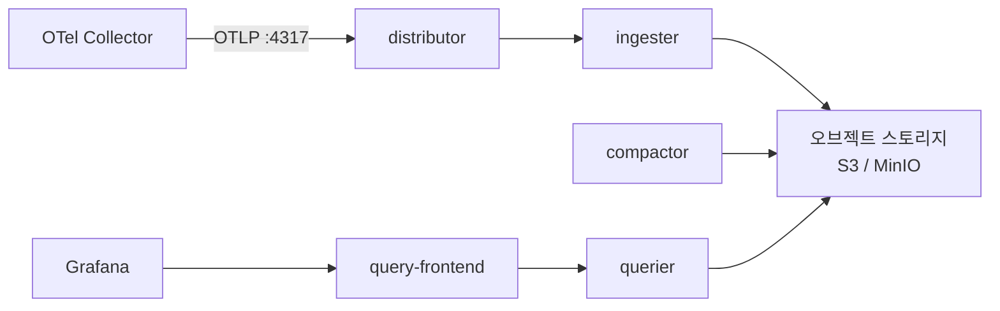

Grafana Tempo는 **인덱스 없이 오브젝트 스토리지에 트레이스를 저장하고 `trace_id`로 조회**하는 저비용·고확장 분산 추적 백엔드입니다. `tempo-distributed` 차트로 배포하며, **distributor가 OTLP(gRPC 4317)를 수신**하고 **S3/MinIO 같은 오브젝트 스토리지에 저장**합니다. OTel Collector의 `traces` 파이프라인에서 distributor로 보내기만 하면 되고, 보존은 compactor의 `block_retention`으로 제어합니다. 이 글은 **"OTel 트레이스 확장" 시리즈 2편(Tempo 백엔드)** 으로, [1편(개요)](/observability/tracing/kubernetes-distributed-tracing-otel-overview/)에서 잡은 "트레이스 백엔드가 필요하다"를 실제로 구현합니다.

## 🎯 Tempo란 무엇인가

**Grafana Tempo는 인덱스 없는(index-free) 분산 트레이스 백엔드**입니다. 트레이스를 오브젝트 스토리지에 그대로 저장하고 `trace_id`로 직접 찾아오기 때문에, 인덱스 운영 비용이 없어 **대용량을 저비용으로** 다룹니다.

- **다양한 수신 프로토콜** — OTLP·Jaeger·Zipkin·Kafka. 이 글은 **OTLP**(OpenTelemetry 네이티브) 중심입니다.
- **Grafana 통합** — 로그·메트릭·트레이스를 한 화면에서 연결해 보기 좋습니다.



내부는 역할별 컴포넌트로 나뉩니다: **distributor**(수신) → **ingester**(저장 기록) → 오브젝트 스토리지, 그리고 조회는 **query-frontend → querier**, 블록 관리는 **compactor**가 맡습니다.

---

## 🧱 어떤 차트를 쓰나

**대규모는 `tempo-distributed`(마이크로서비스 모드), 소규모·테스트는 `tempo`(single-binary)** 입니다.

| 컴포넌트 | 역할 |
|---|---|
| **distributor** | OTLP 등 트레이스 수신 |
| **ingester** | 받은 트레이스를 블록으로 저장 |
| **querier / query-frontend** | 조회 처리·분산 |
| **compactor** | 블록 압축·보존 관리 |

> ⚠️ **세 가지 버전 함정**을 먼저 알아두세요.
> - **차트 repo 이전**: `tempo-distributed`는 커뮤니티 관리로 옮겨져 **`grafana-community/helm-charts`** 에서 받습니다(받기 전 현재 repo 확인).
> - **서버 포트 변경**: 기본 서버 포트가 `3100 → 3200`으로 바뀌었습니다(문서·버전 따라 다름).
> - **메이저 breaking change**: 2.7/2.8/2.9 등 메이저 변경 시 values 호환성을 확인하세요.

---

## 📦 폐쇄망 이미지 준비

**차트가 끌어오는 이미지 전체를 추출해 사내 레지스트리로 미러**합니다(tempo 본체 + memcached, MinIO 쓰면 minio 등 의존성 포함).

```bash
helm template t ./tempo-distributed-<버전>.tgz -f tempo-values.yaml | grep 'image:' | sort -u
```

> 태그는 고정하고, 메이저 버전 변경 시 breaking change에 주의하세요.

---

## 🗄️ 저장소 설정 (오브젝트 스토리지 필수)

**Tempo는 실사용에 오브젝트 스토리지(S3/GCS/Azure)가 필수**입니다. 로컬 파일시스템 기본값은 "완전히 동작하는 구성이 아니라" CI·예시용입니다. MinIO는 차트 의존성으로 함께 띄울 수 있지만 **deprecated·데모용**이라 프로덕션에는 권장되지 않습니다.

S3 자격증명은 **Secret으로 주입**하고 평문 values에 적지 않습니다.

```bash
kubectl create secret generic tempo-s3-credentials \
  --from-literal=access_key='<key>' \
  --from-literal=secret_key='<secret>' -n tracing
```

---

## ⚙️ values.yaml (distributed, 대규모·보안)

**대규모 기준 핵심 설정**입니다. OTLP 수신, 오브젝트 스토리지, 보존, 보안 컨텍스트를 한 번에 잡습니다.

```yaml
# === tempo-values.yaml ===
storage:
  trace:
    backend: s3
    s3:
      bucket: <tempo-traces-bucket>
      endpoint: <s3-or-minio-endpoint>:9000
      # access_key/secret_key는 Secret으로 주입 (valuesFrom 권장)
      insecure: true        # 사내 MinIO 평문이면 true, 실제 S3 TLS면 false

# OTLP 수신 활성화 (gRPC는 기본 on, HTTP는 명시적으로 켜는 것이 안전)
traces:
  otlp:
    grpc:
      enabled: true         # 4317
    http:
      enabled: true         # 4318 (명시적으로 on)

# 보존 기간
compactor:
  config:
    compaction:
      block_retention: 168h         # 7일
      compacted_block_retention: 1h

# 컴포넌트 복제 (대규모)
ingester:
  replicas: 3
distributor:
  replicas: 2
querier:
  replicas: 2
queryFrontend:
  replicas: 2

# 보안 컨텍스트
tempo:
  securityContext:
    capabilities: { drop: ["ALL"] }
    readOnlyRootFilesystem: true
    runAsNonRoot: true
    runAsUser: 1000
    runAsGroup: 1000
    allowPrivilegeEscalation: false

# (선택) 서비스 그래프/스팬 메트릭
metricsGenerator:
  enabled: false            # 필요 시 true + Prometheus remote_write
```

> 💡 `readOnlyRootFilesystem: true`는 레거시 `tempo-query`(구 Grafana<7.5용)와 비호환입니다. 최신 Grafana면 `tempo-query`가 불필요하니 문제없습니다. S3 자격증명은 `--set` 평문 대신 **Secret `valuesFrom`(Flux/Argo)** 으로 `storage.trace.s3.access_key` 등에 주입하세요.

---

## 🚀 설치

```bash
kubectl create namespace tracing
helm install tempo ./tempo-distributed-<버전>.tgz -f tempo-values.yaml -n tracing
kubectl -n tracing get pods
```

distributor·ingester·querier·query-frontend·compactor가 모두 `Running`인지, 스토리지 연결이 정상인지 확인합니다.

---

## 🔗 OTel Collector에서 Tempo로 보내기

**Collector의 `traces` 파이프라인 exporter를 Tempo distributor(4317)로 향하게** 하면 됩니다. 두 경로 모두 exporter 설정은 같습니다.

- **트레이스만 독립**([개요 경로 B](/observability/tracing/kubernetes-distributed-tracing-otel-overview/)) — 트레이스용 Collector의 `traces` exporter를 Tempo로.
- **로그와 통합**(개요 경로 A) — 기존 Gateway에 `traces` 파이프라인을 추가하고 exporter만 Tempo로.

```yaml
# OTel Collector traces 파이프라인 발췌
exporters:
  otlp/tempo:
    endpoint: tempo-distributor.tracing.svc:4317
    tls:
      insecure: true        # 내부 평문 gRPC. 외부면 TLS 설정
service:
  pipelines:
    traces:
      receivers: [otlp]
      processors: [memory_limiter, batch]
      exporters: [otlp/tempo]
```

> ⚠️ **`tls.insecure: true` 누락이 가장 흔한 실수**입니다. Tempo로 내부 평문 gRPC로 보낼 때 이게 빠지면 연결이 실패합니다. (Gateway 공용/분리 구성 자체는 [개요](/observability/tracing/kubernetes-distributed-tracing-otel-overview/)를 참고하세요 — 여기서는 exporter만 다룹니다.)

---

## 📊 Grafana에서 보기 (간단)

Grafana에 **Tempo 데이터소스**를 추가하고(URL = query-frontend 서비스), **TraceQL**로 조회합니다. 로그↔트레이스 연결(`trace_id`로 점프)은 **연결 편**에서 상세히 다룹니다.

---

## 📐 규모별 변형

규모에 따라 달라지는 점만 한곳에 모으면 다음과 같습니다. 기본 전제는 **대규모(distributed)** 입니다.

| 구분 | 대규모(기본) | 소규모/개인 |
|---|---|---|
| 차트 | `tempo-distributed` | `tempo`(single-binary) |
| 저장 | S3/GCS(실서비스) | MinIO/로컬(테스트) |
| 복제 | ingester replicas 3+ | 1 |
| metricsGenerator | 필요 시 on | 보통 off |

> 💡 소규모는 **single-binary 차트 + MinIO**로 빠르게 시작하고, 규모가 커지면 distributed로 전환하세요.

---

## ❓ 자주 묻는 질문

**Q. 저장소가 꼭 S3여야 하나요?**
실사용은 오브젝트 스토리지(S3/GCS/Azure)가 필수입니다(로컬 기본값은 비실사용). 소규모 테스트는 MinIO로 합니다.

**Q. OTLP HTTP가 안 들어옵니다.**
HTTP는 명시적으로 켜야 합니다. `traces.otlp.http.enabled: true`를 확인하세요(gRPC는 기본 활성).

**Q. Collector → Tempo 연결이 실패합니다.**
`tls.insecure: true`(평문)와 distributor 주소·포트(4317)를 확인하세요.

**Q. 보존 기간은 어디서 정하나요?**
`compactor.config.compaction.block_retention`입니다(예: `168h` = 7일).

**Q. 서비스 그래프를 보고 싶어요.**
`metricsGenerator.enabled: true` + Prometheus remote_write로 service-graph·span-metrics를 생성합니다.

**Q. 포트가 문서마다 다릅니다.**
기본 서버 포트가 `3100 → 3200`으로 바뀌었습니다. 버전에 맞게 확인하세요(OTLP 수신은 4317/4318로 별개).

---

## 🧭 시리즈: OTel 트레이스 확장

- **1편** — [분산 트레이스 개요: 두 가지 길](/observability/tracing/kubernetes-distributed-tracing-otel-overview/)
- **2편 (현재)** — Grafana Tempo 백엔드 구축
- **3편** — [VictoriaTraces 백엔드 구축](/observability/tracing/kubernetes-victoriatraces-cluster-helm-install/)
- **4편** — [로그 ↔ 트레이스 연결](/observability/tracing/grafana-trace-to-logs-correlation-trace-id/)

이 편의 한 줄 요약: **"Tempo는 인덱스 없이 오브젝트 스토리지에 저장하는 저비용 분산 추적 백엔드다."** distributor가 OTLP(gRPC 4317)를 받아 S3/MinIO에 저장하고, Collector의 `traces` exporter를 distributor로 보내면 됩니다(`tls.insecure` 주의). 보존은 `block_retention`으로 제어합니다.

> 🔗 이 트레이스 확장은 [**"OTel + VictoriaLogs 로그 스택" 시리즈**(완결)](/observability/opentelemetry/otel-collector-agent-gateway-architecture/) 위에 얹힙니다.

---

## 📚 참고

- [tempo-distributed Helm chart — GitHub](https://github.com/grafana/helm-charts/tree/main/charts/tempo-distributed)
- [Tempo — Helm 시작 가이드](https://github.com/grafana/tempo/blob/main/docs/sources/helm-charts/tempo-distributed/get-started-helm-charts/_index.md)
- [Tempo — Configuration](https://grafana.com/docs/tempo/latest/configuration/)
- [Grafana — OpenTelemetry 수집](https://grafana.com/docs/opentelemetry/ingest/)
- [Grafana Tempo 공식 문서](https://grafana.com/docs/tempo/latest/)
- 관련 글: [분산 트레이스 개요 (트레이스 확장 1편)](/observability/tracing/kubernetes-distributed-tracing-otel-overview/)
