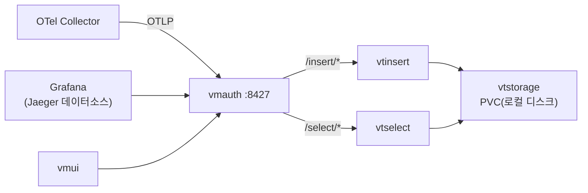

VictoriaTraces는 **VictoriaLogs 위에 만들어진 트레이스 데이터베이스**로, OTLP 스팬을 구조화 로그로 변환해 저장하고 **Jaeger API로 조회**합니다. VictoriaLogs와 같은 운영 방식(single/cluster 차트, vmauth 진입점, vmui, **로컬 디스크 저장**)이라, VictoriaLogs 스택을 쓰는 환경에 **생태계 일관성**이 큽니다. 적재는 `/insert/opentelemetry/v1/traces`(single `10428` / cluster vmauth `8427`)이고, Grafana에서는 **Jaeger 데이터소스**로 연결합니다. 이 글은 **"OTel 트레이스 확장" 시리즈 3편(VictoriaTraces 백엔드)** 으로, [2편 Tempo](/observability/tracing/kubernetes-grafana-tempo-distributed-helm-install/)와 대칭되는 또 하나의 선택지를 다룹니다.

## 🎯 VictoriaTraces란 무엇인가

**VictoriaTraces는 VictoriaMetrics 진영의 트레이스 데이터베이스**로, **VictoriaLogs 아키텍처 위에 만들어졌습니다.** OTLP 스팬을 받아 구조화 로그로 변환해 저장하고, Jaeger Query Service JSON API로 조회합니다.

- **로컬 디스크 저장** — `-storageDataPath`에 저장하며 **오브젝트 스토리지가 불필요**합니다(Tempo와 결정적으로 다른 점). 데이터는 per-day 파티션(`YYYYMMDD`)으로 저장됩니다.
- **선형 확장·운영 단순** — VictoriaLogs처럼 CPU/RAM/디스크에 선형 확장됩니다.
- **VictoriaLogs와 같은 운영** — `vmauth`·`vmui`·`vmalert`를 공유합니다.

> 💡 **VictoriaLogs를 이미 쓴다면 운영 방식이 거의 동일**해 학습·운영 비용이 최소입니다. 다만 Tempo보다 **신생**이라, 도입 시 버전·기능 성숙도를 확인하는 것이 좋습니다(빠르게 발전 중).

---

## 🧱 VictoriaLogs와 닮은 구조

**소규모는 `victoria-traces-single`(단일 노드), 대규모는 `victoria-traces-cluster`** 입니다. 클러스터는 VictoriaLogs 클러스터와 **판박이 구조**입니다.

| 컴포넌트 | 역할 |
|---|---|
| **vtinsert** | 트레이스 수신 |
| **vtstorage** | 저장(PVC, 로컬 디스크) |
| **vtselect** | 조회 |
| **vmauth** | 적재·조회 진입점·LB·인증 (8427) |

`vtinsert`/`vtselect`/`vtstorage`는 **같은 바이너리의 역할 분리**입니다(VictoriaLogs와 동일).



---

## 📦 폐쇄망 이미지 준비

**필요한 이미지는 `victoria-traces`(본체) + `vmauth`** 입니다. Docker Hub에서 받아 사내 레지스트리로 미러합니다.

```bash
docker pull docker.io/victoriametrics/victoria-traces:<버전>
docker pull docker.io/victoriametrics/vmauth:<버전>
# 사내 레지스트리로 재태깅·push 후, 차트가 끌어오는 이미지 전체 확인
helm template t ./victoria-traces-cluster-<버전>.tgz -f vt-values.yaml | grep 'image:' | sort -u
```

---

## ⚙️ values.yaml (cluster, 대규모·보안)

**핵심 설정**입니다. 차트는 `helm repo add vm https://victoriametrics.github.io/helm-charts/`로 받고, 폐쇄망은 `global.image.registry`로 사내 레지스트리를 지정합니다.

```yaml
# === vt-values.yaml ===
nameOverride: vt          # 리소스 이름 63자 제한 회피(VictoriaLogs와 동일 패턴)

global:
  image:
    registry: <사내레지스트리>

vtstorage:
  replicaCount: 3
  retentionPeriod: 7d            # 시간 기반 (최소 24h). 또는 디스크 기반 옵션
  persistentVolume:
    enabled: true
    storageClassName: <사내-storageclass>
    size: 50Gi
  resources:
    requests: { cpu: "1", memory: 2Gi }
    limits:   { cpu: "2", memory: 4Gi }

vtinsert:
  replicaCount: 2

vtselect:
  replicaCount: 2

vmauth:
  enabled: true                  # 진입점/LB/인증 (8427)
```

> 💡 retention·PVC 사이징은 [VictoriaLogs 백엔드 편](/observability/victorialogs/kubernetes-victorialogs-cluster-helm-install/)과 같은 원리입니다 — per-day 파티션이라 오래된 날짜 파티션을 통째로 지워 retention이 빠르게 적용되고, PVC는 점진 증설을 전제로 보수적으로 잡습니다.

---

## 🚀 설치

```bash
kubectl create namespace tracing
helm install vt ./victoria-traces-cluster-<버전>.tgz -f vt-values.yaml -n tracing
kubectl -n tracing get statefulset,deploy,svc,pvc
```

vtstorage(StatefulSet)의 PVC가 `Bound`이고 파드가 `Running`인지, vtinsert·vtselect·vmauth가 모두 `Running`인지 확인합니다.

---

## 🔗 OTel Collector에서 VictoriaTraces로 보내기

**Collector의 `traces` exporter를 `otlphttp`의 `traces_endpoint`로 적재 경로에 향하게** 합니다. 트레이스만 독립이든 로그와 통합이든 exporter 설정은 같습니다.

```yaml
# OTel Collector traces 파이프라인 발췌 (OTLP/HTTP)
exporters:
  otlphttp/victoriatraces:
    traces_endpoint: http://vt-victoria-traces-cluster-vmauth.tracing.svc:8427/insert/opentelemetry/v1/traces
    compression: gzip
    headers:
      # VT-Extra-Fields: "team=backend"      # 필드 추가(선택)
      # Authorization: "Bearer ${VT_TOKEN}"  # 인증(선택)
service:
  pipelines:
    traces:
      receivers: [otlp]
      processors: [memory_limiter, batch]
      exporters: [otlphttp/victoriatraces]
```

> ⚠️ **적재 경로가 Tempo와 다릅니다.** VictoriaTraces는 `otlphttp`의 **`traces_endpoint`** 에 `/insert/opentelemetry/v1/traces`를 줍니다. gRPC로 보내려면 VictoriaTraces에서 `-otlpGRPCListenAddr`(예: `:4317`)로 gRPC 리스너를 켠 뒤 `otlp` exporter를 씁니다(기본 비활성). Gateway 공용/분리 구성은 [개요](/observability/tracing/kubernetes-distributed-tracing-otel-overview/)를 참고하세요.

### `endpoint` vs `traces_endpoint` — 경로를 어디까지 쓰나

**`otlphttp` exporter는 어떤 키를 쓰느냐에 따라 `/v1/traces` 경로를 자동으로 붙이기도, 안 붙이기도 합니다.** 로그(`logs_endpoint`)와 똑같은 규칙이라 400·404가 자주 나는 지점입니다.

| 키 | 자동 경로 완성 | 적어야 하는 값(클러스터 vmauth) |
|---|---|---|
| `endpoint` | ✅ OTLP 표준대로 뒤에 **`/v1/traces` 자동 부착** | `http://<vmauth>:8427/insert/opentelemetry` 까지만 → 실제 전송은 `…/opentelemetry/v1/traces` |
| `traces_endpoint` | ❌ 자동으로 안 붙음 | **전체 경로**를 다 써야 함: `http://<vmauth>:8427/insert/opentelemetry/v1/traces` |

위 예시가 `traces_endpoint`에 전체 경로(`…/v1/traces`)를 적은 이유가 이것입니다. `endpoint` 키를 쓰면 베이스(`…/insert/opentelemetry`)까지만 적어도 됩니다. 참고로 **포트는 배포 모드에 따라 다릅니다** — single-node는 `10428`, 클러스터는 vmauth `8427`(또는 `vtinsert` 직결)입니다.

> 💡 exporter **타입**도 헷갈리지 마세요. `otlphttp` = HTTP(키 `traces_endpoint`/`endpoint`), `otlp` = gRPC(키 `endpoint`)입니다. exporter 이름 뒤의 `/victoriatraces`(예: `otlphttp/victoriatraces`)는 **별칭일 뿐** 타입 판단과 무관합니다.

---

## 🔎 조회: vmui와 Grafana(Jaeger)

**두 가지로 봅니다 — 내장 vmui, 그리고 Grafana의 Jaeger 데이터소스.**

```bash
# vmui 내장 UI
kubectl -n tracing port-forward svc/vt-victoria-traces-cluster-vmauth 8427
# 브라우저: http://localhost:8427/select/vmui   → 스팬 탐색
```

Grafana는 **Jaeger 데이터소스**로 연결합니다(VictoriaTraces가 Jaeger API 호환).

- URL: `http://vt-victoria-traces-cluster-vmauth.tracing.svc:8427/select/jaeger/`

> ⚠️ **Tempo는 "Tempo 데이터소스"였지만, VictoriaTraces는 "Jaeger 데이터소스"** 를 씁니다. 혼동하지 마세요.

---

## ⚖️ Tempo와 무엇이 다른가

**둘 다 OTLP를 받는 트레이스 백엔드지만, 저장·조회·생태계가 다릅니다.**

| 항목 | Grafana Tempo | VictoriaTraces |
|---|---|---|
| 저장 | **오브젝트 스토리지 필수**(S3 등) | **로컬 디스크(PVC)** — VictoriaLogs와 동일 |
| Grafana 데이터소스 | Tempo | **Jaeger** |
| 생태계 | Grafana 통합 | VictoriaLogs·vmauth·vmui·vmalert 통일 |
| 성숙도 | 더 검증됨 | 발전 중(신생) |

- **VictoriaTraces** — VictoriaLogs를 이미 운영한다면 **같은 방식**이라 일관성이 큽니다. 별도 오브젝트 스토리지 운영 부담이 없습니다.
- **Tempo** — Grafana 생태계 통합과 성숙도가 강점입니다.

> 어느 쪽이 "우월"한 게 아니라 **성향과 성숙도 차이**입니다. VictoriaLogs 스택으로 통일하고 싶으면 VictoriaTraces, Grafana 생태계·검증을 중시하면 Tempo입니다.

---

## 📐 규모별 변형

규모에 따라 달라지는 점만 한곳에 모으면 다음과 같습니다. 기본 전제는 **대규모(cluster)** 입니다.

| 구분 | 대규모(기본) | 소규모/개인 |
|---|---|---|
| 차트 | `victoria-traces-cluster` | `victoria-traces-single` |
| 진입 | vmauth `8427` | `10428` 직접 |
| 저장 | vtstorage replica 3+ | 단일 노드 |

> 💡 소규모는 **single 차트(`10428`)** 로 시작하고, 커지면 cluster로 전환하세요(단일 노드를 vtstorage로 승격 — VictoriaLogs와 동일 원리).

---

## ❓ 자주 묻는 질문

**Q. 트레이스 저장에 S3가 필요한가요?**
아닙니다. **로컬 디스크(PVC)** 입니다 — VictoriaLogs와 동일하며, Tempo(오브젝트 스토리지 필수)와 다른 점입니다.

**Q. 적재 경로가 뭔가요?**
`/insert/opentelemetry/v1/traces`입니다(single `10428`, cluster vmauth `8427`).

**Q. Grafana 데이터소스는 무엇인가요?**
**Jaeger 데이터소스**(`/select/jaeger/`)입니다. Tempo와 다릅니다.

**Q. gRPC로 적재하려면?**
VictoriaTraces에서 `-otlpGRPCListenAddr`로 gRPC 리스너를 켠 뒤 `otlp` exporter를 씁니다(기본 비활성).

**Q. VictoriaLogs와 같이 운영하기 쉬운가요?**
같은 생태계(vmauth·vmui·vmalert)라 일관됩니다. 단 성숙도는 Tempo보다 발전 중입니다.

**Q. 멀티테넌시는?**
`AccountID`/`ProjectID` 헤더로 테넌트를 구분합니다.

---

## 🧭 시리즈: OTel 트레이스 확장

- **1편** — [분산 트레이스 개요: 두 가지 길](/observability/tracing/kubernetes-distributed-tracing-otel-overview/)
- **2편** — [Grafana Tempo 백엔드 구축](/observability/tracing/kubernetes-grafana-tempo-distributed-helm-install/)
- **3편 (현재)** — VictoriaTraces 백엔드 구축
- **4편** — [로그 ↔ 트레이스 연결](/observability/tracing/grafana-trace-to-logs-correlation-trace-id/)

이 편의 한 줄 요약: **"VictoriaTraces는 VictoriaLogs 기반의 트레이스 DB로, 로컬 디스크에 저장하고 Jaeger API로 조회한다."** 적재는 `/insert/opentelemetry/v1/traces`, 조회는 Grafana **Jaeger 데이터소스**이며, VictoriaLogs 스택과의 운영 일관성이 강점입니다(성숙도는 Tempo보다 발전 중).

> 🔗 이 트레이스 확장은 [**"OTel + VictoriaLogs 로그 스택" 시리즈**(완결)](/observability/opentelemetry/collector/otel-collector-agent-gateway-architecture/) 위에 얹힙니다.

---

## 📚 참고

- [VictoriaTraces 공식 문서](https://docs.victoriametrics.com/victoriatraces/)
- [VictoriaTraces — 클러스터](https://docs.victoriametrics.com/victoriatraces/cluster/)
- [VictoriaTraces — OpenTelemetry 적재](https://docs.victoriametrics.com/victoriatraces/data-ingestion/opentelemetry/)
- [victoria-traces-cluster Helm chart](https://docs.victoriametrics.com/helm/victoria-traces-cluster/)
- [victoria-traces-single Helm chart](https://docs.victoriametrics.com/helm/victoria-traces-single/)
- 관련 글: [Grafana Tempo 백엔드 구축 (트레이스 확장 2편)](/observability/tracing/kubernetes-grafana-tempo-distributed-helm-install/)
- 관련 글: [VictoriaLogs 클러스터 구축 (로그 스택 시리즈)](/observability/victorialogs/kubernetes-victorialogs-cluster-helm-install/)
