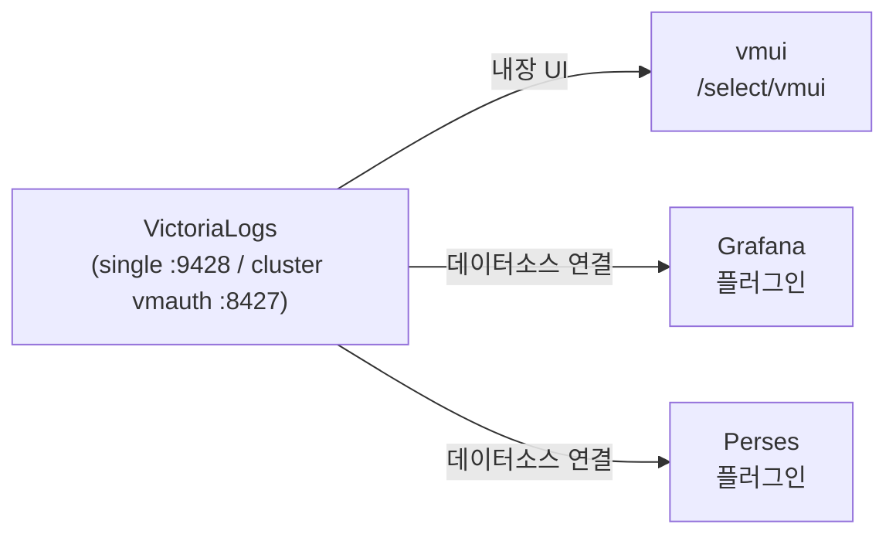

VictoriaLogs에 쌓인 로그는 **Grafana 플러그인, 내장 vmui, Perses** 세 가지로 조회할 수 있고, 모두 **LogsQL이라는 동일한 쿼리 언어**를 씁니다. 크게 보면 **외부 도구가 데이터소스로 연결하는 방식(Grafana·Perses)** 과 **저장소 자체 UI로 보는 방식(vmui)** 으로 나뉩니다. 연결 지점은 single-node면 `9428`, 클러스터면 vmauth `8427`로 동일하며, 도구만 그 위에서 갈립니다. 이 글은 **"OTel + VictoriaLogs 로그 스택" 시리즈의 대시보드 트랙 1편(조회 개요)** 으로, [수집기 비교편](/observability/opentelemetry/collector/kubernetes-otel-collector-vs-vector/)까지 끝낸 **적재된 로그를 "어떻게 볼지"** 의 토대를 잡습니다.

## 👀 로그를 보는 방법은 하나가 아니다

**수집(OTel·Vector)과 저장(VictoriaLogs)이 끝났다면, 이제 남은 건 "어떻게 보느냐"** 입니다. VictoriaLogs는 조회 수단을 하나로 강제하지 않습니다.

- **Grafana** — 가장 대중적인 데이터소스 연결 방식.
- **vmui** — VictoriaLogs 내장 UI. 설치·연결이 필요 없습니다.
- **Perses** — GitOps 친화의 신생 코드형 대시보드.

세 도구의 공통 분모는 **LogsQL** 입니다. 어떤 도구를 쓰든 쿼리 언어는 같습니다.

---

## 🔀 두 부류: 데이터소스 방식 vs 내장 UI 방식

**조회 방법을 가르는 핵심 축은 "외부 도구로 연결하느냐, 저장소 자체 UI로 보느냐"** 입니다.

- **데이터소스 방식**(Grafana·Perses) — 외부 대시보드 도구가 VictoriaLogs를 데이터소스로 연결합니다. 대시보드·알림·다른 데이터원과의 통합이 강점입니다.
- **내장 UI 방식**(vmui) — VictoriaLogs 자체 웹 UI로 직접 봅니다. 별도 도구·연결이 없어 빠른 탐색·디버깅에 적합합니다.



---

## 🔗 공통 연결 지점과 쿼리 언어

**도구가 무엇이든 연결 지점과 쿼리 언어는 같습니다.** 이것만 잡으면 나머지는 도구 선택의 문제입니다.

**연결 진입점(URL)**

| 모드 | 진입점 |
|---|---|
| single-node | `http://<victorialogs>:9428` |
| cluster | `http://<release>-vmauth.<ns>.svc:8427` (vmauth 경유) |

**LogsQL 맛보기** — 전 도구 공통입니다.

```logsql
*                              # 전체 조회
error                          # _msg에 error 포함
level:error                    # level 필드가 error
k8s.namespace.name:prod        # 특정 네임스페이스
error | limit 10               # 파이프로 개수 제한
```

> 💡 참고로 조회 API 경로는 `/select/logsql/query`(쿼리), `/select/logsql/stats_query_range`(통계 그래프), `/select/logsql/tail`(라이브 테일)입니다. 도구들이 내부적으로 이 경로를 호출합니다.

---

## 📊 방법 1: Grafana (가장 대중적)

**Grafana는 VictoriaLogs 데이터소스 플러그인(`victoriametrics-logs-datasource`)으로 연결**합니다. Explore·대시보드·알림·라이브 스트리밍·Ad Hoc 필터까지 폭넓게 지원합니다.

연결 흐름은 단순합니다.

1. 플러그인 설치(온라인은 `GF_INSTALL_PLUGINS=victoriametrics-logs-datasource` 환경변수로 자동 설치).
2. 데이터소스 추가 — `type: victoriametrics-logs-datasource`, `access: proxy`, `url`은 위 진입점.
3. Explore에서 `*`로 첫 조회.

```yaml
# datasource 프로비저닝 예시
apiVersion: 1
datasources:
  - name: VictoriaLogs
    type: victoriametrics-logs-datasource
    access: proxy
    url: http://vlc-victoria-logs-cluster-vmauth.logging.svc:8427
```

- **QueryBuilder** — Builder/Code 토글을 제공합니다(Builder→Code는 LogsQL로 안전하게 직렬화).
- **언제** — 기존에 Grafana를 운영 중이거나, 메트릭·트레이스와 **통합 대시보드**가 필요할 때.

> ⚠️ 폐쇄망에서는 백엔드 플러그인 실행 권한 문제로 자동 설치가 막힐 수 있어 **수동 설치**가 필요합니다. 상세는 [Grafana 플러그인 설치 글](/observability/victorialogs/grafana-offline-victorialogs-plugin-install/)에서 다룹니다.

---

## 🖥️ 방법 2: vmui (Grafana 없이)

**vmui는 VictoriaLogs에 내장된 웹 UI**라, 별도 설치·연결이 전혀 없습니다. 저장소가 곧 UI입니다.

```bash
# 접속 (포트포워딩 예시)
kubectl -n logging port-forward svc/<vmauth-or-victorialogs> 8427
# 브라우저: http://localhost:8427/select/vmui/   (single-node면 :9428/select/vmui)
```

- **기능** — LogsQL 쿼리, JSON 원본 보기, 라이브 테일링, 필드 탐색.
- **언제** — 적재 직후 동작 확인, 빠른 디버깅, Grafana 도입 전 검증. **"되는지부터 보고 싶을 때"** 최적입니다.

---

## 🆕 방법 3: Perses (트렌드, GitOps)

**Perses는 CNCF 진영의 신생 오픈소스 대시보드**로, 대시보드를 **코드(YAML)로 관리**하는 GitOps 친화가 특징입니다. VictoriaLogs Datasource 플러그인으로 연결합니다(v0.53.0-beta.2+).

- **연결** — 프로젝트 데이터소스에 VictoriaLogs Datasource 추가 → 패널 `Type: Logs Table` + `Query Type: VictoriaLogs Log Query` → LogsQL 입력.
- **변수** — `${var-name}`(기본), `${var:pipe}`(정규식), `${var:csv}`(CSV) 형식을 지원하며, 값은 LogsQL로 추출합니다.
- **언제** — 대시보드를 **버전 관리**하고 싶거나 Grafana 대안을 모색할 때. (성숙도는 아직 Grafana보다 낮습니다.)

---

## 🧭 어떤 걸 언제 쓰나

**세 방법은 배타적이지 않습니다.** 자기 상황에 맞게 고르거나 병행하면 됩니다.

| 방법 | 방식 | 적합 상황 | 설치 부담 |
|---|---|---|---|
| **Grafana** | 데이터소스 | 통합 대시보드·알림, 기존 운영 | 플러그인 설치 |
| **vmui** | 내장 UI | 빠른 탐색·디버깅 | 없음 |
| **Perses** | 데이터소스 | GitOps·코드형 대시보드 | 도구 + 플러그인 |

> 💡 흔한 조합은 **vmui로 빠르게 확인 → Grafana로 상시 대시보드**, 필요 시 Perses를 병행하는 것입니다. 도구 우열보다 **용도**로 나누는 게 실용적입니다.

---

## 📐 규모 관점

연결 지점만 규모에 따라 다르고, 도구 선택지는 동일합니다.

| 구분 | 대규모(클러스터) | 소규모/개인 |
|---|---|---|
| 진입점 | vmauth `:8427` | victoria-logs `:9428` |
| 흔한 조회 | Grafana 상시 + vmui 디버깅 | vmui 위주, 필요 시 Grafana |

> 💡 소규모에서는 vmui만으로도 충분한 경우가 많습니다. 대시보드·알림·공유가 필요해지면 Grafana를 얹으세요.

---

## ❓ 자주 묻는 질문

**Q. 셋 중 뭘 먼저 써야 하나요?**
적재 확인은 설치가 없는 **vmui**, 상시 운영은 **Grafana**가 무난합니다.

**Q. 쿼리 언어가 도구마다 다른가요?**
아닙니다. 전부 **LogsQL**입니다. 도구를 바꿔도 쿼리는 그대로 통합니다.

**Q. 연결 URL은 무엇인가요?**
single-node는 `9428`, 클러스터는 vmauth `8427`입니다.

**Q. Grafana 플러그인이 폐쇄망에서 안 뜹니다.**
백엔드 플러그인 실행 권한·수동 설치 문제입니다. Grafana 편에서 상세히 다룹니다.

**Q. Perses는 Grafana를 대체하나요?**
대안이지만 성숙도 차이가 있습니다. 둘 다 LogsQL로 VictoriaLogs를 조회하므로 병행도 가능합니다.

---

## 🧭 시리즈: OTel + VictoriaLogs 로그 스택

이 시리즈는 같은 백엔드(VictoriaLogs)에 로그를 보내는 두 수집기 트랙과 비교·대시보드로 구성됩니다.

**OTel 트랙**

- **1편** — [OpenTelemetry 개념과 Agent/Gateway 구조](/observability/opentelemetry/collector/otel-collector-agent-gateway-architecture/)
- **2편** — [VictoriaLogs 클러스터 구축](/observability/victorialogs/kubernetes-victorialogs-cluster-helm-install/)
- **3편** — [폐쇄망 OTel Collector Helm 설치](/observability/opentelemetry/collector/kubernetes-otel-collector-offline-helm-install/)
- **4편** — [멀티클러스터 중앙집중](/observability/opentelemetry/otel-multicluster-central-logging/)

**Vector 트랙** (대안 수집기)

- **1편** — [Vector 개념과 파이프라인 구조](/observability/opentelemetry/vector/kubernetes-vector-log-pipeline-concept/)
- **2편** — [Vector 설치: Agent/Aggregator Helm values](/observability/opentelemetry/vector/kubernetes-vector-agent-aggregator-helm-install/)
- **3편** — [VRL로 로그 가공](/observability/opentelemetry/vector/kubernetes-vector-vrl-log-processing/)

**비교**

- **OTel vs Vector** — [어떤 걸 선택할까](/observability/opentelemetry/collector/kubernetes-otel-collector-vs-vector/)

**대시보드 트랙**

- **1편 (현재)** — 조회 개요: Grafana·vmui·Perses
- **2편** — [Grafana 연결: 플러그인·Explore·대시보드](/observability/victorialogs/grafana-victorialogs-datasource-explore-dashboard/)
- **3편** — [vmui로 LogsQL 탐색](/observability/victorialogs/victorialogs-vmui-logsql-live-tail/)
- **4편** — [Perses로 코드형 대시보드](/observability/victorialogs/perses-victorialogs-dashboard-gitops/)

이 편의 한 줄 요약: **"로그 조회는 데이터소스 방식(Grafana·Perses)과 내장 UI 방식(vmui)으로 나뉘고, 모두 LogsQL을 쓴다."** 연결 지점은 single `9428` / cluster vmauth `8427`로 동일하며, 도구는 용도(빠른 디버깅·상시 대시보드·GitOps)로 고르면 됩니다.

---

## 📚 참고

- [VictoriaLogs — Grafana 통합](https://docs.victoriametrics.com/victorialogs/integrations/grafana/)
- [VictoriaLogs — Perses 통합](https://docs.victoriametrics.com/victorialogs/integrations/perses/)
- [VictoriaLogs — 쿼리(LogsQL)](https://docs.victoriametrics.com/victorialogs/querying/)
- [victoriametrics-logs-datasource — Grafana 플러그인](https://grafana.com/grafana/plugins/victoriametrics-logs-datasource/)
- [victorialogs-datasource — GitHub](https://github.com/VictoriaMetrics/victorialogs-datasource)
- 관련 글: [Grafana에 VictoriaLogs 데이터소스 플러그인 설치하기](/observability/victorialogs/grafana-offline-victorialogs-plugin-install/)
- 관련 글: [OTel vs Vector: 어떤 걸 선택할까 (비교편)](/observability/opentelemetry/collector/kubernetes-otel-collector-vs-vector/)
